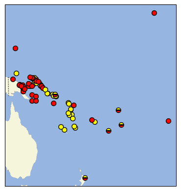

# Tutorial

## POc `tuqa-` vs. `suRi`

See vol5,

>     The areas in which reflexes of each term occur (in the meaning ‘bone’) are interlaced
across the Pacific, as follows:

_*tuqa-_                      |                _*suRi-_
--- | ---
  NGOc (= NNG, PT)          |                  Adm
  Parts of MM               |                  Parts of MM
  Mic                       |                  SES, TM, SOc (= NCV, SV, NCal)
  W and E Fijian            |                  E Fijian, Pn


```sql
from
    `cognatesetreferences.csv` as c
    join "cognatesetreferences.csv_FormTable" as csr on c.cldf_id = csr."cognatesetreferences.csv_cldf_id"
    join FormTable as f on csr.FormTable_cldf_id = f.cldf_id
    join LanguageTable as l on f.cldf_languageReference = l.cldf_id
where (c.cldf_id = '5-3-3-4-88-POc-suri-a' or c.cldf_id = '5-3-3-4-85-POc-tuqan-a'
    ) and l.cldf_glottocode is not null
union
select
    l.cldf_glottocode as 'Language_ID',
    'group' as 'Parameter_ID',
    l."Group" as 'Value'
from
     `cognatesetreferences.csv` as c
         join "cognatesetreferences.csv_FormTable" as csr on c.cldf_id = csr."cognatesetreferences.csv_cldf_id"
         join FormTable as f on csr.FormTable_cldf_id = f.cldf_id
         join LanguageTable as l on f.cldf_languageReference = l.cldf_id
 where (c.cldf_id = '5-3-3-4-88-POc-suri-a' or c.cldf_id = '5-3-3-4-85-POc-tuqan-a'
     ) and l.cldf_glottocode is not null
);
```

```shell
sqlite3 -header -csv tlopo.sqlite < q.sql > values.csv
```

```shell
cldfbench cldfviz.map --parameters tuqa_or_suri values.csv --pacific-centered --markersize 15  --glottolog ../../glottolog/glottolog
```

or

```shell
cldfbench cldfviz.map --parameters tuqa_or_suri values.csv --pacific-centered --markersize 5 --with-layers --glottolog ../../glottolog/glottolog --colormap '{"tuqa-":"red","suri":"yellow"}' --format png --output map.png --no-legend --projection Mollweide --with-ocean
```


