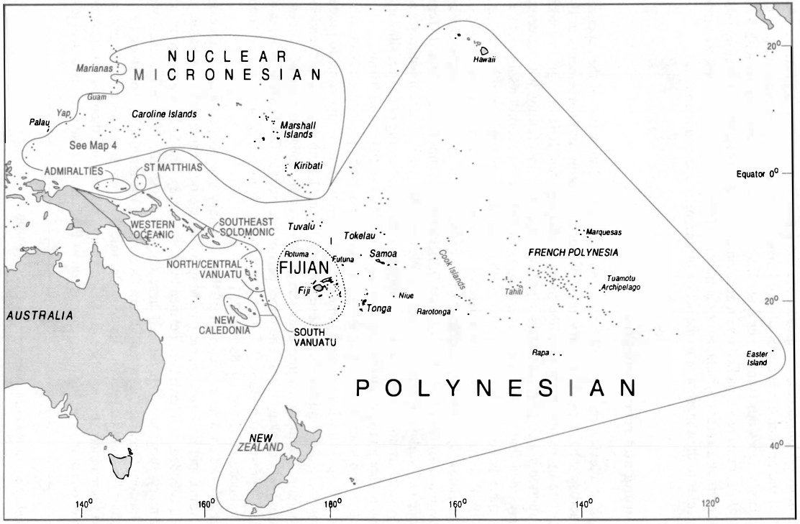
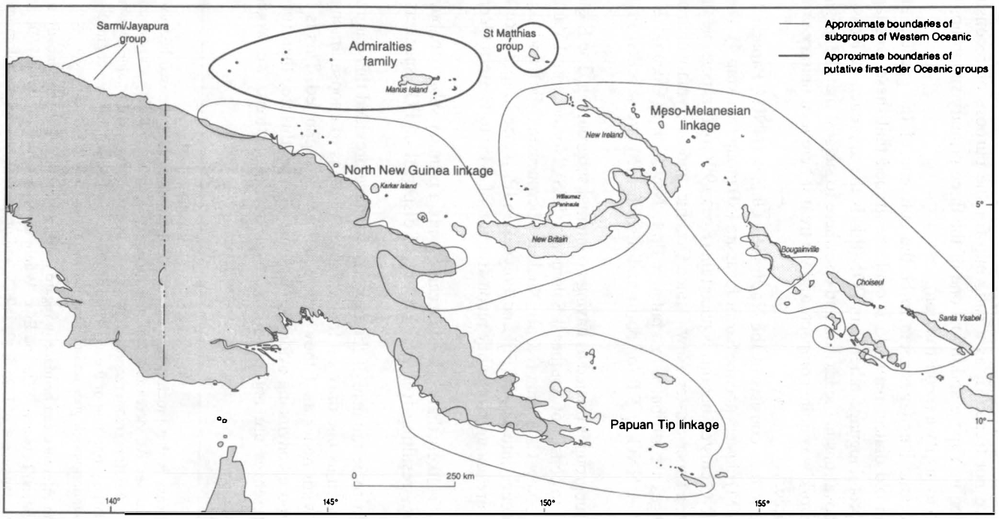

# Introduction

by Ross, M., Pawley, A. and Osmond, M.

## 1. Aims

This is the first of a set of five volumes bringing together the results of recent work on the lexicon of the Proto Oceanic (POc) language.[^1] Volume 1 deals with material culture, volume 2 with the physical world including landscape and conceptions of location, meteorology, astronomy and time, volume 3 with flora and fauna, volume 4 with terminologies centring on human beings, including the body and basic human conditions and activities, and social organisation, and volume 5 with grammatical (closed) categories including adjectives, pronouns, and number. Volume 5, as it is planned at the time of writing, will also include an index to the POc and other reconstructions presented in the whole work, as well as an English-to-POc finderlist and a list of all languages cited, together with their subgroups.

![Map 1: The Austronesian phylum and major language groups $ cldfbench cldfviz.map --language-properties Group cldf --language-properties-colormaps '{"Fma":"#FFFBD5","WMP":"#FEE391","CMP":"#FB9A29","SHWNG":"#D95F0E","Adm":"#993404","Fij":"#993404","IJ":"#993404","Mic":"#993404","MM":"#993404","NCal":"#993404","NCV":"#993404","NNG":"#993404","Pn":"#993404","PT":"#993404","SES":"#993404","SJ":"#993404","SV":"#993404","TM":"#993404","Yap":"#993404"}' --out map.svg --format svg --pacific-centered --no-legend --height 20 --width 30 --projection Mollweide --with-ocean --no-borders --padding-bottom 3 --padding-top 3 --markersize 10](../../raw/vol1/maps/map_1.png)

<table> <tr> <td>Fma</td> <td>Formosan</td> <td><svg height="1em" width="1em" style="display: block; margin: 0 auto;"><circle fill="#FFFBD5" stroke-width=".05em" stroke="black" r="0.45em" cy="0.5em" cx="0.5em"></circle></svg></td> </tr> </table>

Proto Oceanic is the immediate ancestor of the Oceanic subgroup of the Austronesian language family (see Map 1). This subgroup consists of all the Austronesian languages of Melanesia east of 136°E, together with those of Polynesia and (with two exceptions) those of Micronesia - more than 450 languages in all.[^2] Extensive arguments for the existence of Oceanic as a clearly demarcated branch of Austronesian were first put forward by Otto Dempwolff in the 1920s (cf. Ch. 2, §2.4) and the validity of the subgroup is now recognised by virtually all scholars working in Austronesian historical linguistics.

The development and break-up of the POc language and speech community were stages in a truly remarkable chapter in human prehistory - the colonisation by Austronesian speakers of the Indo-Pacific region in the period after about 3000 BC. The outcome was the largest of the world's well-established language families and (until the expansion of Indo-European after Columbus) the most widespread. The Austronesian family comprises around 1,000 distinct languages. Its eastern and western outliers, Madagascar and Easter Island, are two-thirds of a world apart, and its northernmost extensions, Hawaii and Taiwan, are separated by 70 degrees of latitude from its southernmost outpost, Stewart Island in New Zealand.

It is likely that the divergence of Oceanic from its nearest relatives, which are the Austronesian languages spoken around Cenderawasih Bay and in South Halmahera ([Blust 1978a](../references.md#source-Blust1978a)), began when Austronesian speakers from the Cenderawasih Bay area moved eastwards along the north coast of New Guinea or into the Bismarck Archipelago. There is a strong school of opinion that associates the subsequent break-up of POc with the rapid colonisation of Island Melanesia and the central Pacific by bearers of the Lapita culture between about 1500 and 1000 BC (see Map 2).[^3]

The present project aims to bring together a large corpus of lexical reconstructions for POc, together with supporting cognate sets, organised according to semantic fields and using a standard orthography for POc. The symposium entitled _Austronesian terminologies: continuity and change_ held at the Australian National University in October 1990 showed that there was considerable interest among scholars in such a project (the proceedings were published as [Pawley & Ross 1994](../references.md#source-PawleyandRoss1994)).

We hope that this thesaurus will be a useful resource for culture historians, archaeologists and others interested in the prehistory of the Pacific region.[^4] The comparative lexical material should also be a rich source of data for various kinds of purely linguistic research, e.g. on semantic change and subgrouping in the more than 400 daughter languages.

## 2. The relation of the current project to previous work

Reconstructions of POc phonology and lexicon began with Dempwolff's pioneering work in the 1920s and 1930s. Dempwolff's dictionary of reconstructions attributed to 'PAn' ([Dempwolff 1938](../references.md#source-Dempwolff1938)) - but equivalent in modern terms to 'PMP' - contains some 600 reconstructions with reflexes in Oceanic languages.

Since the 1950s, POc and other early Oceanic interstage languages have been the subject of a considerable body of research. However, relatively few new reconstructions safely attributable to POc were added to Dempwolff's material until the 1970s. In 1969 George Grace made available as a working paper a compilation of reconstructions from various sources amounting to some 700 distinct items, attributed either to POc or to early Oceanic interstages. These materials were presented in a new orthography for POc, based largely on Biggs' (1965) orthography for an interstage he called Proto Eastern Oceanic. Updated compilations of Oceanic cognate sets were produced at the University of Hawaii in the period 1977-1983 as part of a project directed by Grace and Pawley. These compilations and the supporting data are problematic in various respects and we have made only limited use of them.

Comparative lexical studies have been carried out for several lower-order subgroups of Oceanic: for Proto Polynesian by Biggs (resulting in [Walsh and Biggs](../references.md#source-WalshandBiggs1966) ([1966](../references.md#source-WalshandBiggs1966)), [Biggs et al.](../references.md#source-Biggsetal1970) ([1970](../references.md#source-Biggsetal1970)) and subsequent versions of the POLLEX file, including [Biggs](../references.md#source-Biggs1993) ([1993](../references.md#source-Biggs1993)), the version we have referred to in our work); for Proto Micronesian by scholars at the University of Hawaii ([Bender et al. 1983](../references.md#source-Benderetal1983)); for Proto North/Central Vanuatu by [Clark](../references.md#source-Clark1994) ([1994](../references.md#source-Clark1994)); for Proto Southern Vanuatu by [Lynch](../references.md#source-Lynch1978b) ([1978b](../references.md#source-Lynch1978b), [1996b](../references.md#source-Lynch1996b)); for New Caledonia by [Ozanne-Rivierre](../references.md#source-OzanneRivierre1992) ([1992](../references.md#source-OzanneRivierre1992)), [Haudricourt and Ozanne-Rivierre](../references.md#source-HaudricourtandOzanneRivierre1982) ([1982](../references.md#source-HaudricourtandOzanneRivierre1982)) and [Geraghty](../references.md#source-Geraghty1989) ([1989](../references.md#source-Geraghty1989)); for Proto Southeast Solomonic by [Levy](../references.md#source-Levy1980) ([1980](../references.md#source-Levy1980), n.d.) and [Lichtenberk](../references.md#source-Lichtenberk1988) ([1988](../references.md#source-Lichtenberk1988)); for Proto Central Pacific by [Hockett](../references.md#source-Hockett1976) ([1976](../references.md#source-Hockett1976)) and [Geraghty](../references.md#source-Geraghty1983) ([1983](../references.md#source-Geraghty1983), [1986](../references.md#source-Geraghty1986), [1994](../references.md#source-Geraghty1994) and 1996, together with a number of unpublished papers); for Proto Eastern Oceanic by [Biggs](../references.md#source-Biggs1965) ([1965](../references.md#source-Biggs1965)), [Cashmore](../references.md#source-Cashmore1969) ([1969](../references.md#source-Cashmore1969)), [Levy and Smith](../references.md#source-LevyandSmith1970) ([1970](../references.md#source-LevyandSmith1970)), and [Geraghty](../references.md#source-Geraghty1990) ([1990](../references.md#source-Geraghty1990)); and for Proto Central Papuan by [Pawley](../references.md#source-Pawley1975) ([1975](../references.md#source-Pawley1975)), [Lynch](../references.md#source-Lynch1978a) ([1978a](../references.md#source-Lynch1978a), [1980](../references.md#source-Lynch1980)), and ([Ross 1994](../references.md#source-Ross1994a)a).

Robert [Blust](../references.md#source-Blust1970) ([1970](../references.md#source-Blust1970), [1980b](../references.md#source-Blust1980b), 1983-84a, 1986, 1989) of the University of Hawaii has, in a series of papers published extensive, alphabetically ordered, lexical reconstructions (with supporting cognate sets) for interstages earlier than POc, especially for Proto Austronesian, Proto Malayo-Polynesian and Proto Eastern Malayo-Polynesian. He has also written several papers investigating specific semantic fields ([Blust 1980a](../references.md#source-Blust1980a), [1982](../references.md#source-Blust1982), [1987](../references.md#source-Blust1987), [1994](../references.md#source-Blust1994)). At the time of writing, Blust is in the process of compiling his Austronesian Comparative Dictionary (ACD) on disk at the University of Hawaii. The version to which we refer dates from 1995.

Several papers systematically investigate particular semantic domains in the lexicon of POc, e.g. [Milke](../references.md#source-Milke1958) ([1958](../references.md#source-Milke1958)), [French-Wright](../references.md#source-FrenchWright1983) ([1983](../references.md#source-FrenchWright1983)), [Pawley](../references.md#source-Pawley1982a) ([1982a](../references.md#source-Pawley1982a)), [Pawley and Green](../references.md#source-PawleyandGreen1985) ([1985](../references.md#source-PawleyandGreen1985)), [Lichtenberk](../references.md#source-Lichtenberk1986) ([1986](../references.md#source-Lichtenberk1986)), [Walter](../references.md#source-Walter1989) ([1989](../references.md#source-Walter1989)), and the various papers in [Pawley and Ross](../references.md#source-PawleyandRoss1994) ([1994](../references.md#source-PawleyandRoss1994)). [Ross](../references.md#source-Ross1988) ([1988](../references.md#source-Ross1988)) contains a substantial number of new POc lexical reconstructions, as well as proposed modifications to the reconstructed POc sound system and the orthography.

These earlier works have provided valuable points of reference, both inside and outside the Oceanic group, and we are indebted particularly to [Biggs](../references.md#source-Biggs1993) ([1993](../references.md#source-Biggs1993)), [Clark](../references.md#source-Clark1994) ([1994](../references.md#source-Clark1994)) and Blust (ACD). However, previous Oceanic lexical studies were limited both by large gaps in the data, with a distinct bias in favour of 'Eastern Oceanic' languages, and by the technical problems of collating large quantities of data. Although most languages in Melanesia remain poorly described, there are now many more dictionaries and extended word lists, particularly for Papua New Guinea, than there were ten years ago. And developments in computing hardware and software now permit much faster and more precise handling of data than was possible even five years ago. A list of sources and a summary of the Project's collation procedures is found in Appendix 1.

As the present project proceeded, we came to realise that the form in which preliminary publications were presented - namely as essays, each discussing a particular terminology at some length - would also be the best form for the presentation of our final synthesis. A discursive treatment of individual terminologies, as opposed, say, to a dictionary-type listing of reconstructions with supporting cognate sets, makes it easier to relate the linguistic comparisons to relevant issues of culture history, language change, and methodology. Hence each of the present volumes is a collection of essays, each paper presenting the reconstruction of a POc terminology. Some of these have been published or presented elsewhere, but are printed here in revised form. Sections dealing with theoretical considerations common to all the papers have been edited out and these matters are instead dealt with once, in this Introduction. Different contributors followed somewhat different conventions in their initial publications, and these have been edited to conform with the conventions outlined above. In some cases we have updated the earlier versions in the light of subsequent research, and, where appropriate, have inserted cross-references between contributions. Authorship is in some cases something of a problem, as a number of people have had a hand in collating the data, doing the reconstructions, and (re)writing for publication here. In most papers, however, one person did the research which determined the structure of the terminology, and that person appears as the first or only author, and where another or others had a substantial part in putting together the paper itself, they appear as the second and further authors. Meredith Osmond, the project's research assistant, played an important role in collating the cognate sets of most papers, and all contributions have undergone a rather greater degree of editorial adjustment by all three editors than would otherwise be normal in a composite volume.

## 3. Reconstructing the lexicon

The lexical reconstructions presented in these volumes are arrived at using the standard methods of comparative linguistics, which require as preliminaries a theory of subgrouping (§3.2) and the working out of systematic sound correspondences among cognate vocabulary in contemporary languages (§3.3). As well as cognate sets clearly attributable to Proto Oceanic, we have included some cognate sets which at this stage are attributable to various interstage languages, particularly Proto Western and Proto Eastern Oceanic (but see below for definitions). We have set out to pay more careful attention to reconstructing the semantics of Proto Oceanic forms than has generally been done in earlier work, treating words not as isolates but as parts of terminologies.

### 3.1. Terminological reconstruction

Our method of doing 'terminological reconstruction' is as follows. First, the terminologies of present-day speakers of Oceanic languages are used as the basis for constructing a hypothesis about the semantic structure of a corresponding POc terminology, taking account of (i) ethnographic evidence, i.e. descriptions of the lifestyles of Oceanic communities and (ii) the geographical and physical resources of particular regions of Oceania. For example, by comparing terms in several languages for parts of an outrigger canoe, or for growth stages of a coconut, one can see which concepts recur and so are likely to have been present in POc. Secondly, a search is made for cognate sets from which forms can be reconstructed to match each meaning in this hypothesised terminology. The search is not restricted to members of the Oceanic subgroup; if a term found in an Oceanic language proves to have external (non-Oceanic) cognates, the POc antiquity of that term will be confirmed and additional evidence concerning its meaning will be provided. Thirdly, the hypothesised terminology is re-examined to see if it needs modification in the light of the reconstructions. There are cases, highlighted in the various contributions to these volumes, where we were able to reconstruct a term where we did not expect to do so and conversely, often more significantly, where we were unable to reconstruct a term where we had believed we should be able to. In each case, we have discussed the reasons why our expectations were not met and what this may mean for Oceanic culture history.

[Blust](../references.md#source-Blust1987) ([1987](../references.md#source-Blust1987): 81) distinguishes between conventional 'semantic reconstruction', which asks, "What was the probable meaning of protomorpheme X?", and [Dyen and Aberle's](../references.md#source-DyenandAberle1974) ([1974](../references.md#source-DyenandAberle1974)) 'lexical reconstruction', where one asks, "What was the protomorpheme which probably meant 'X'?" At first sight, it might appear that terminological reconstruction is a version of lexical reconstruction. However, there are sharp differences. Lexical reconstruction applies a formal procedure: likely protomeanings are selected from among the glosses of words in available cognate sets, then an algorithm is applied to determine which meaning should be attributed to each set. This procedure may have unsatisfactory results, as Blust points out. Several reconstructions may end up with the same meaning; or no meaning may be reconstructed for a form because none of the glosses of its reflexes is its protomeaning.

Terminological reconstruction is instead similar to the semantic reconstruction approach. In terminological reconstruction the meanings of protomorphemes are not determined in advance. Instead, cognate sets are collected and their meanings are compared with regard to:

- their specific denotations, where these are known;

- the geographic and genetic distribution of these denotations (i.e. are the glosses from which the protogloss is reconstructed well distributed?);

- any derivational relationships to other reconstructions;

- their place within a working hypothesis of the relevant POc terminology (e.g., are terms complementary -'bow' implies 'arrow'; 'seine net' implies 'floats' and 'weights'? Are there different levels of classification-generic, specific, and so on?).

For example, it proved possible to reconstruct the following POc terms for tying with cords (Ch. 9, §10):

- POc _&ast;buku_ 'tie (a knot); fasten'

- POc _&ast;pʷita_ 'tie by encircling'

- POc _&ast;paqu(s)_, _&ast;paqus-i-_ 'bind, lash; construct (canoe +) by lashing together'

- POc _&ast;pisi_ 'bind up, tie up, wind round, wrap'

- POc _&ast;kiti_ 'tie, bind'

In each of the supporting cognate sets from contemporary languages there are a number of items whose glosses in the dictionaries or word lists are too vague to tell the analyst anything about the specific denotation of the item, and in the case of _&ast;kiti_ this prevents the assignment of a more specific meaning. The verb _&ast;buku_ can be identified as the generic term for tying a knot because of its derivational relationship (by zero derivation) with a noun whose denotation is clearly generic, _&ast;buku_ 'node (as in bamboo or sugarcane); joint; knuckle; knot in wood, string or rope' (Ch. 4, §3.2). Reconstruction of the meaning of _&ast;pʷita_ as 'tie by encircling' is supported by the meanings of the Lukep, Takia and Longgu reflexes, respectively 'tie by encircling', 'tie on (as grass-skirt)' and 'trap an animal's leg; tie s.t. around ankle or wrist': Lukep and Takia are North New Guinea languages, whilst Longgu is Southeast Solomonic. Reconstruction of the meaning of _&ast;paqu(s)_, _&ast;paqus-i-_ as 'bind, lash; construct (canoe +) by tying together' is supported by the meanings of the Takia, Kiribati and Samoan reflexes, respectively 'tie, bind; construct (a canoe)', 'construct (canoe, house)', and 'make, construct (wooden objects, canoes +)': Takia is a North New Guinea language, Kiribati is Micronesian, and Samoan is Polynesian. The meaning of &ast;pisi is similarly reconstructed by reference to the meanings of its Mono-Alu, Mota, Port Sandwich, Nguna and Fijian reflexes.

Often, however, the contributors of these chapters have been less fortunate in the information available to them. For example, Osmond (Ch. 8, § 9) reconstructs six POc terms broadly glossed as 'spear'. Multiple terms for implements within one language imply that these items were used extensively and possibly in specialised ways. Can we throw light on these specialised ways? Unfortunately, some of the word lists and dictionaries available give minimal glosses - 'spear' or 'net'. What we need to know is: what is the level of reference? Is it a term for all spears, or perhaps all pointed projectiles including arrows and darts? Or does it refer to a particular kind of spear? Is it noun or verb or both? If a noun, does it refer to both the instrument and the activity? Most word lists are frustratingly short on detail. For this kind of detail, ethnographies have proved a more fruitful source of information than many word lists.

../../etc/tree.txt

Figure 1: Schematic diagram of the diversification of Austronesian languages (see the text with regard to its interpretation) Note: Italics are used to indicate a group of languages or a language which have no exclusively shared common ancestor. Thus Formosan languages indicates a collection of languages descended (along with Proto Malayo-Polynesian) from Proto Austronesian. It is assumed that there was no 'Proto Formosan'.

Another problem is inherent in the dangers of sampling from over 450 languages. The greater the number of languages, the greater are the possible variations in meaning of any given term, and the greater the chances of two languages making the same semantic leaps quite independently. Does our (sometimes quite limited) cognate set provide us with a clear unambiguous gloss, or have we picked up an accidental bias, a secondary or distantly related meaning? Did etymon x refer to fishhook or the material from which the fishhook was made? Did etymon y refer to the slingshot or to the action of turning round and round?

### 3.2. Subgrouping and reconstruction

The strength of a lexical reconstruction rests crucially on the distribution of the supporting cognate sets across subgroups. The distribution of cognate forms and agreements in their meanings is much more important than the number of cognates. It is enough to make a secure reconstruction if a cognate set occurs in just two languages in a family, with agreement in meaning, provided that the two languages belong to different first-order subgroups and provided that there is no reason to suspect that the resemblances are due to borrowing or chance. The PMP term _&ast;apij_ 'twins' is reflected in several Western Malayo-Polynesian languages (e.g. Batak _apid_ 'twins, double (fused) banana') but in only a single Oceanic language (Roviana _avisi_ 'twins of the same sex'). Because Roviana belongs to a different first-order branch of Malayo-Polynesian from the Western Malayo-Polynesian witnesses and because there is virtually no chance that the agreement is due to borrowing or chance similarity, this distribution is enough to justify the reconstruction of PMP and POc _&ast;apij_ 'twins'.

Although the subgrouping of Austronesian languages and questions about which protolanguage was spoken where remain somewhat controversial, it is impossible to proceed without making some assumptions about these matters. Figure 1 is an approximate rendering of our subgrouping assumptions, and also serves as a key to abbreviations of names of language groups and protolanguages. The upper part of the tree (as far down as POc) is due to Blust, originally presented in [Blust](../references.md#source-Blust1977a) ([1977a](../references.md#source-Blust1977a)) and repeated with additional supporting evidence in subsequent publications ([Blust 1978a](../references.md#source-Blust1978a), [1982](../references.md#source-Blust1982), 1983-84b, 1993).[^5]

Within Oceanic we assume a minimum of three primary subgroups: Western Oceanic, Admiralties (Adm), and Eastern Oceanic (see Map 3). Western Oceanic and Admiralties are reasonably well founded, and have been defined by [Ross](../references.md#source-Ross1988) ([1988](../references.md#source-Ross1988)). The St Matthias group, also a possible primary subgroup (represented here only by Mussau), is here included with Admiralties.[^6] Eastern Oceanic ('Central/Eastern Oceanic' in the terminology of [Ross 1994](../references.md#source-Ross1994a)b) includes all other Oceanic languages.[^7] Eastern Oceanic does not meet normal subgrouping criteria (i.e. no shared innovations define the whole group), but treating them as a unit ensures a rigorous criterion for recognising a reconstruction as POc: it must have reflexes in at least two of the subgroups that are generally regarded as primary, or possibly primary, branches of Oceanic.[^8] Both here and at the interstages described below, no reconstruction is made if there are grounds to infer borrowing from one subgroup to another.[^9] Occasionally, we make use of data from Yapese, which may also be a single-member primary subgroup of Oceanic ([Ross 1996a](../references.md#source-Ross1996a)), but we have not treated it as a subgroup for the purpose of reconstruction (i.e. reflexes of an etymon in Yapese and in just one of the three primary subgroups listed above would not be enough to justify a reconstruction).

The Western Oceanic languages seem to be the outcome of the gradual and complex diversification of an old dialect network. It could be argued that these languages have no exclusively shared protolanguage other than POc (this is the approach of [Ross 1994](../references.md#source-Ross1994a)b), but there are enough innovations in the lexicon and elsewhere to suggest that the original Western Oceanic dialect network was quite compact, and we treat it here as a unitary protolanguage, Proto Western Oceanic.

Western Oceanic in turn consists of the North New Guinea (NNG), Papuan Tip (PT) and Meso-Melanesian (MM) clusters and the Sarmi/Jayapura (SJ) group (see Map 4). The last-named may belong to the NNG cluster, but this is uncertain ([Ross 1996b](../references.md#source-Ross1996b)). It is possible that the NNG and PT clusters form a super-cluster, New Guinea Oceanic, and so etyma which occur only in NNG and PT languages are attributed to a putative Proto New Guinea Oceanic (PNGOc), and etyma found in either NNG or PT (or both) and also in MM are labelled Proto Western Oceanic (PWOc).

The Admiralties subgroup is treated as having no internal subgrouping. The Eastern Oceanic subgroup is assumed to consist of Southeast Solomonic (SES), North/Central Vanuatu (NCV), South Vanuatu (SV), New Caledonia (NCal), Nuclear Micronesian (Mic), and Central Pacific (divided for convenience into Fijian [Fij] and Polynesian [Pn]) (see Map 3). Reflexes in any two of these groups are enough to justify reconstruction of a Proto Eastern Oceanic (PEOc) etymon.[^10]

As noted above, it is likely that Eastern Oceanic is not a primary subgroup, but a collection of primary subgroups resulting from the very rapid dispersal of POc speakers ([Pawley & Ross 1995](../references.md#source-PawleyandRoss1995)).

We ask the reader to be mindful of the fact that we have provided this diagram as an aid to presentation: as soon as one draws a tree diagram, one has to choose among alternative hypotheses and draw all nodes as if they were equally well supported. This is far from the case. One can find more convincing evidence for some parts of this tree than for others, and, although these differences are not important to our reconstructions, we would not wish Figure 1 to be taken as a definitive representation of our current assumptions about Oceanic subgrouping.

Languages from which data are cited in this volume are listed in Appendix 2 in their subgroups, together with an index allowing the reader to find the subgroup to which a given language belongs.

### 3.3. Sound correspondences

As we noted above, reconstruction depends on working out the systematic sound correspondences among cognate vocabulary in contemporary languages and on having a working hypothesis about how the sounds of Proto Oceanic have changed and are reflected in modern Oceanic languages. Working out sound correspondences even for twenty languages is a large task, and so we have relied heavily on our own previous work and the work of others. The sound correspondences we have used are those given by [Ross](../references.md#source-Ross1988) ([1988](../references.md#source-Ross1988)) for Western Oceanic and Admiralties; by [Levy](../references.md#source-Levy1979) ([1979](../references.md#source-Levy1979), [1980](../references.md#source-Levy1980)) and [Lichtenberk](../references.md#source-Lichtenberk1988) ([1988](../references.md#source-Lichtenberk1988)) for Cristobal-Malaitan, by [Pawley](../references.md#source-Pawley1972) ([1972](../references.md#source-Pawley1972)) and [Tryon and Hackman](../references.md#source-TryonandHackman1983) ([1983](../references.md#source-TryonandHackman1983)) for Southeast Solomonic; by [Tryon](../references.md#source-Tryon1976) ([1976](../references.md#source-Tryon1976)) and [Clark](../references.md#source-Clark1994) ([1994](../references.md#source-Clark1994)) for North/Central Vanuatu; by [Lynch](../references.md#source-Lynch1978b) ([1978b](../references.md#source-Lynch1978b), [1996b](../references.md#source-Lynch1996b)) for South Vanuatu; by [Geraghty](../references.md#source-Geraghty1989) ([1989](../references.md#source-Geraghty1989)) and [Ozanne-Rivierre](../references.md#source-OzanneRivierre1992) ([1992](../references.md#source-OzanneRivierre1992)) for New Caledonia; by [Jackson](../references.md#source-Jackson1986) ([1986](../references.md#source-Jackson1986)) and [Ross](../references.md#source-Ross1996a) ([1996a](../references.md#source-Ross1996a)) for Nuclear Micronesian; by [Geraghty](../references.md#source-Geraghty1986) ([1986](../references.md#source-Geraghty1986)) for Central Pacific; by [Biggs](../references.md#source-Biggs1978) ([1978](../references.md#source-Biggs1978)) for Polynesian; by [Ross](../references.md#source-Ross1996a) ([1996a](../references.md#source-Ross1996a)) for Yapese; and by [Ross](../references.md#source-Ross1996b) ([1996b](../references.md#source-Ross1996b)) for Irian Jaya.

For non-Oceanic languages we have referred to sound correspondences given by [Tsuchida](../references.md#source-Tsuchida1976) ([1976](../references.md#source-Tsuchida1976)) for Formosa; by [Zorc](../references.md#source-Zorc1977) ([1977](../references.md#source-Zorc1977), [1986](../references.md#source-Zorc1986)) and [Reid](../references.md#source-Reid1982) ([1982](../references.md#source-Reid1982)) for the Philippines; by [Adelaar](../references.md#source-Adelaar1992a) ([1992a](../references.md#source-Adelaar1992a)) and [Nothofer](../references.md#source-Nothofer1975) ([1975](../references.md#source-Nothofer1975)) for Malay and Javanese; by [Sneddon](../references.md#source-Sneddon1984) ([1984](../references.md#source-Sneddon1984)) for Sulawesi; by [Collins](../references.md#source-Collins1983) ([1983](../references.md#source-Collins1983)) for Central Maluku; and by [Blust](../references.md#source-Blust1978a) ([1978a](../references.md#source-Blust1978a)) for South Halmahera and Irian Jaya.

We are well aware that regular sound correspondences can be interfered with in various ways: by phonetic conditioning that the analyst has not identified (see, e.g., [Blust 1996a](../references.md#source-Blust1996a)), by borrowing (for an extreme Oceanic case, see [Grace 1996](../references.md#source-Grace1996)), or, as recent research suggests, by the frequency of an item's use ([Bybee 1994](../references.md#source-Bybee1994)). We have tried at least to note, and sometimes to account for, irregularities in cognate sets.

### 3.4. Proto Oceanic phonology

Work based on the sound correspondences of both Oceanic and non-Oceanic languages has resulted in the following reconstructed paradigm of POc phonemes:

---- ---- ---- ---- ---- ----
pʷ   p    t    c    k    q
bʷ   b    d    j    g
-    -    s
mʷ   m    n    ñ    ŋ
-    -    r    -    -    R
-    -    dr
-    -    l
w    -    -    y
---- ---- ---- ---- ---- ----

---- ---- ----
i    -    u
e    -    o
-    a
---- ---- ----

The orthography used here and in the POc reconstructions in this work is from [Ross](../references.md#source-Ross1988) ([1988](../references.md#source-Ross1988)), with the addition of _&ast;pʷ_. POc phonology is discussed in greater detail in Chapter 2, §2.12   Malcolm Ross, Andrew Pawley and Meredith Osmond

## 4. Conventions

### 4.1. Chapter format

Each of the contributions to the present volumes (except Chapter 2 of this volume) concerns a particular Proto Oceanic 'terminology'. Generally, each contribution begins with an introduction to the issues raised by the reconstruction of its particular terminology, and the bulk of each contribution consists of reconstructed etyma with supporting data and a commentary on matters of meaning and form. In the interests of space, we have not given the history of the reconstructions themselves, as this would often require commentary on the modifications made by others and by us, and on why we have made them. Where a reconstruction is not new, we have tried to give its earliest source, but this is difficult when earlier reconstructions differ in form and meaning from ours, so the decision as to whether a particular reconstruction is 'new' is rather subjective.

In general, the contributions to these volumes are concerned with items reconstructable in POc, PWOc, PEOc and occasionally PNGOc. Etyma for PWOc, PNGOc and PEOc are reconstructed because these may well also be POc etyma for which known reflexes are not well distributed. The contributors to this volume vary in the degree to which they reconstruct etyma for interstages further down the tree. Reconstructions for lower-order interstages are decreasingly likely to reflect POc etyma and may be the results of cultural change as Oceanic speakers moved further out into the Pacific.

Except for the authors of Chapter 7, contributors have not sought to make fresh reconstructions at interstages superordinate to POc. What they have done, however, is to cite other scholars' reconstructions for higher-order interstages, as these represent a summary of the non-Oceanic evidence in support of a given POc reconstruction. Occasionally, non-Oceanic evidence has been found to support a POc reconstruction where no reconstruction at a higher-level interstage has previously been made. In this case a new higher-order reconstruction is made, and the non-Oceanic evidence is given in a footnote. Chapter 2 is a brief technical introduction to those aspects of POc which are relevant to the reconstruction of POc words. It is mainly intended for readers with linguistic training.

Whilst we have tried to use the internal organisation of the lexicons of Oceanic languages themselves as a guide in setting the boundaries of each terminology, we have inevitably taken decisions which differ from those that others might have made. There are, obviously, overlaps and connections between various semantic domains and therefore between the contributions here. We have done our best to provide cross-references, but we have sometimes duplicated information rather than ask the reader repeatedly to look elsewhere in the book. Indexes at the end of each volume and in the final volume are intended to make it easier to use the volumes collectively as a work of reference.

### 4.2. Data

The sources of our data are listed in Appendix 1.

For most reconstructed etyma, only a representative sample of reflexes is given. We have endeavoured to ensure, however, that in each case this sample not only is geographically and genetically representative, but also provides evidence to justify the shape of the reconstruction. Where only a few reflexes are known to us, this is usually noted.

Because our supporting data are drawn from such a wide range of languages, the convention is adopted of prefixing each language name with the abbreviation for the group of languages to which the language belongs, so that the distribution of a cognate set is more immediately obvious. These groups are genetic except, perhaps, North/Central Vanuatu (abbreviated 'NCV') and Fijian (abbreviated 'Fij').[^11] We have sought to be consistent in always listing these groups in the same order, but contributors vary in the ordering of languages within groups.

Although there are accepted or standard orthographies for a number of the languages from which data are cited here, all data are transcribed into a standard orthography (see [Ross 1988](../references.md#source-Ross1988): 3-4) in order to facilitate comparison. Except for inflexional morphemes, non-cognate portions of reflexes, i.e. derivational morphemes and non-cognate parts of compounds, are shown in parentheses (…). Where an inflexional morpheme is an affix or clitic and can readily be omitted, its omission is indicated by a hyphen at the beginning or end of the base. This applies particularly to possessor suffixes on directly possessed nouns (Ch. 2, §3.2). Where an inflexional morpheme cannot readily be omitted, then it is separated from its base by a hyphen. This may happen because of complicated morphophonemics or because the morpheme is always present, like the adjectival _-n_ in some NNG and Admiralties languages and prefixed reflexes of the POc article _&ast;na_ in scattered languages. When a reflex is itself polymorphemic (i.e. the morphemes reflect morphemes present in the reconstructed etymon) or contains a reduplication, the morphemes or reduplicates are also separated by a hyphen.

### 4.3. Conventions used in representing reconstructions

POc reconstructions, and also PWOc, PEOc and PNGOc reconstructions, are given in the orthography of §3.4. For reconstructions at higher-order interstages the orthographies are those used by Blust in his various publications and the[ ACD.](../references.md#source-Blust1995) Reconstructions at lower-order interstages are given in the standard orthography adopted for data (§4.2). [Geraghty's](../references.md#source-Geraghty1986) ([1986](../references.md#source-Geraghty1986)) PCP orthography, for example, is based on Standard Fijian spelling, and is converted into our standard orthography in the same way as Fijian. Biggs' PPn reconstructions are in any case written in an orthography identical to our standard.

Bracketing and segmentation conventions in protoforms are:

-   _(x)_      it cannot be determined whether _x_ was present

-   _(x,y)_    either _x_ or _y_ was present

-   _[x]_      the item is reconstructable in two forms, one with and one without _x_

-   [x,y]      the item is reconstructable in two forms, one with _x_ and one with _y_

-   _x-y_      _x_ and _y_ are separate morphemes

-   _x-_       _x_ takes an enclitic or a suffix

-   _<x>_      _x_ is an infix

14              Malcolm Ross, Andrew Pawley and Meredith Osmond

It happens fairly often that the final consonant in a higher-order reconstructed etymon (e.g. _&ast;-R_ in PMP _&ast;kamaliR_ 'men's house') is not evidenced in any Oceanic reflex. Often POc final consonants are regularly lost in all the languages from which reflexes are drawn, and we therefore have no evidence as to whether or not the final consonant was retained in the POc etymon in question. In such a case, since we know that final consonants were usually retained in POc, the consonant is reconstructed in brackets (e.g. POc _&ast;kamali(R)_).

When historical linguists compile cognate sets, they commonly retain the glosses given in the sources from which the items are taken. However, again in the interests of comparison, we have often reworded (and sometimes abbreviated) the glosses of our sources. Where the latter were in a language other than English, we have translated them. In the interests of space and legibility, and because data often have multiple sources, we have given the source of a reflex only when it is not included in the listing in Appendix 1. We have adopted the convention of providing no gloss beside the items in a cognate set whose gloss is identical to that of the POc (or other lower-order) reconstruction at the head of the set, i.e. the reconstruction which they reflect.

Where glosses have been standardised, they are given according to the conventions described by [Geraghty](../references.md#source-Geraghty1983) ([1983](../references.md#source-Geraghty1983):8-11), although our abbreviations differ from his. Briefly, a noun modifying a gloss is enclosed in brackets. If it refers to a subject or possessor, it precedes the gloss; if to an object, it follows the gloss. A plus sign after the noun indicates that it is a member of a set (e.g. the gloss '(basket +) old' indicates that a set of items of which 'basket' is a member, probably inanimates, may function as subject of the stative verb glossed as 'old'). Where necessary, we use '(V) ', '(VI)', or '(VT)' to indicate that a gloss is a verb, intransitive verb or transitive verb, '(N)' to indicate that it is a noun. In glosses we use the conventional abbreviations 'k.o.' (as in 'k.o. yam') for 'kind of', 's.o.' for 'someone', and 's.t.' for 'something'.

In putting together cognate sets, we have quite often found apparent reflexes which do not quite 'fit' the set: either they display a phonological irregularity or their meaning is just a little too different from the rest of the set for us to assume cognacy. Rather than eliminate them, our authors often include them below the cognate set under the rubric 'cf. also'.

We have mostly not indicated the POc word class to which a reconstruction belongs, as this is often unclear. POc word classes and factors affecting their identification are discussed in Chapter 2, as are issues concerning the derivational morphology which can be reconstructed for POc.

## Notes

[^1]: The project has been jointly directed by Andrew Pawley and Malcolm Ross, with research assistance from Meredith Osmond, in the Department of Linguistics, Research School of Pacific and Asian Studies at the Australian National University.

[^2]: The listing in Tryon ed. (1995) contains 466 Oceanic languages, many of which are subdivisible into dialects.

[^3]: For accounts of this colonisation from archaeological and linguistic viewpoints respectively, see [Bellwood](../references.md#source-Bellwood1978) ([1978](../references.md#source-Bellwood1978), [1987](../references.md#source-Bellwood1987)), [Green](../references.md#source-Green1979) ([1979](../references.md#source-Green1979)), [Kirch](../references.md#source-Kirch1997) ([1997](../references.md#source-Kirch1997)), [Kirch and Hunt](../references.md#source-KirchandHunt1988) ([1988](../references.md#source-KirchandHunt1988)), [Pawley and Ross](../references.md#source-PawleyandRoss1995) ([1995](../references.md#source-PawleyandRoss1995)), and [Spriggs](../references.md#source-Spriggs1995) ([1995](../references.md#source-Spriggs1995)). [Pawley and Green](../references.md#source-PawleyandGreen1984) ([1984](../references.md#source-PawleyandGreen1984)), [Pawley and Ross](../references.md#source-PawleyandRoss1993) ([1993](../references.md#source-PawleyandRoss1993)), and [Ross](../references.md#source-Ross1995b) ([1995b](../references.md#source-Ross1995b)) provide accounts of various aspects of the spread of Austronesian speakers into the Pacific in the wider context of the Austronesian dispersal as a whole.

[^4]: The proper relationship between the three disciplines in doing prehistory is a controversial matter. In Ch. 3, §1, Green and Pawley discuss (and adopt) the approach of the culture historian in drawing on diverse lines of evidence. In Ch. 7, § 1, Pawley and Pawley discuss the important distinction between the comparative typological method of historical reconstruction, drawing on ethnographic evidence, and the genetic comparative method used by historical linguists.

[^5]:  For a commentary on Austronesian subgrouping, see [Ross](../references.md#source-Ross1995b) ([1995b](../references.md#source-Ross1995b)).

[^6]:  On the position of Mussau, see [Ross](../references.md#source-Ross1988) ([1988](../references.md#source-Ross1988):315-316, 331) .

[^7]:  The term 'Eastern Oceanic' has been used in different ways by various authors. Ours is more inclusive than most, resembling more closely the "Central/Eastern Oceanic" set up by [Lynch and Tryon](../references.md#source-LynchandTryon1983) ([1983](../references.md#source-LynchandTryon1983)). The published version of the latter (1985), presents a less inclusive version of Central/Eastern Oceanic.

[^8]: A result of this process is that much of the data available to us remains unused because it cannot be attributed to a cognate set. An increase in available dictionaries would probably allow more cognate sets to be identified and, therefore, more reconstructions to be made, but it is reasonable to assume that there would always be a large proportion of the available data which would not fall into cognate sets because of the vocabulary innovation which goes on in all languages, although at varying speeds.

[^9]: Cases where such an inference can be made in regard to primary subgroups occur mostly at the boundary (in the Solomon Islands) between WOc and EOc. Where an etymon occurs (1) in WOc and only in the Southeast Solomonic languages of EOc or (2) in EOc and only in the Northwest Solomonic languages of WOc, borrowing is likely (and is often reflected in unexpected sound correspondences).

[^10]: This subgrouping may well prove to be somewhat inaccurate, especially with regard to North/Central Vanuatu (see [Lynch](../references.md#source-Lynch1995) ([1995](../references.md#source-Lynch1995)), but will not invalidate any reconstructions made here. The 'Fijian' grouping is used only for presentational purposes, and is not assumed to be a discrete subgroup within Central Pacific.

[^11]: An argument that North/Central Vanuatu does not constitute a genetic subgroup is made by [Lynch](../references.md#source-Lynch1995) ([1995](../references.md#source-Lynch1995)) and summarised in [Lynch, Ross and Crowley](../references.md#source-Lynchetal2002) ([2002](../references.md#source-Lynchetal2002): Ch. 5). The argument that Fijian does not constitute a genetic subgroup was made by [Geraghty](../references.md#source-Geraghty1983) ([1983](../references.md#source-Geraghty1983)) and is incorporated into Figure 1, where 'Fijian' comprises Rotuman, the East Fijian dialects, and West Fijian (also a dialect network).