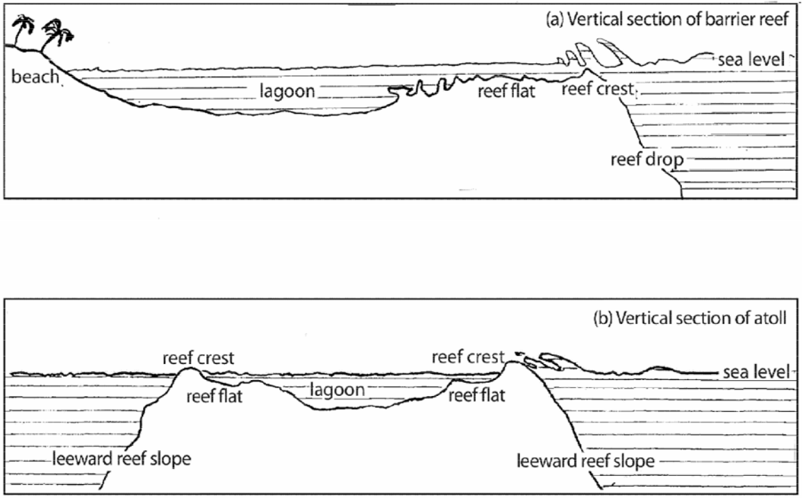

# The Seascape

by Meredith Osmond and Andrew Pawley and Malcolm Ross

## 1. Introduction

This chapter presents reconstructions pertaining to the inanimate marine environment, the seascape.[^1] As experienced sailors (see Chapter 6), Proto Oceanic speakers would have possessed a vocabulary to express the physical details of their maritime world, of waves, currents and swells, and, more locally, of tides, of treacherous rocks and reefs, of passages through the reef and sheltered water. As fishermen and gatherers of reef foods their descendants have demonstrated an extensive knowledge of the reef in all its parts ([McEldowney 1995](../references.md#source-Mceldowney1995), [Hviding 1996](../references.md#source-Hviding1996), [Akimichi 1978](../references.md#source-Akimichi1978), [Dye 1983](../references.md#source-Dye1983)). Data have been organized within two main categories: (i) the sea and its features — currents, waves and tides; and (ii) the reef environment.

As in Chapter 3, some of the nouns reconstructed here had both a common-noun and a local-noun sense. It is the common-noun senses that are treated here. For further discussion and reconstruction of local-noun senses, see Chapter 8, §2.

## 2. The sea and its features

### 2.1. Sea, salt water

Four POc words denoting ‘sea’ have been reconstructed: _&ast;tasik_, _&ast;masawa(n,ŋ)_, _&ast;laman_ and _&ast;laur_. Of these, _&ast;tasik_ has the most general reference. In addition to its sense of ‘sea’ as opposed to ‘land’, it has a second sense, ‘salt water, sea water’ contrasting with ‘fresh water’. It also had a local-noun sense (see p.240). Its reflexes have wide distribution and also occur frequently in compounds. Of the others, _&ast;masawa(n,ŋ)_ emphasized the sense of open sea, _&ast;laman_ evidently denoted deep water in contrast to the shallow water on or within the fringing reef, while _&ast;laur_ seems to have functioned primarily, and perhaps exclusively, as a local noun meaning ‘seawards’, and is reconstructed in this sense in Chapter 8, p.239. A few common-noun reflexes of _&ast;laur_ are given below.

<table id="2-4-2-1-92-POc-tasik-a">
<tr>
<td><strong>PMP</strong></td><td> </td>
<td>
<i>&ast;tasik</i>
</td>
<td>
'sea' (<a href="../references.md#source-Dempwolff1938">Dempwolff1938</a>)
</td>
</tr>
<tr>
<td><strong>POc</strong></td><td> </td>
<td>
<i>&ast;tasik</i>
</td>
<td>
'sea, salt water'</td>
</tr>
<tr>
<td><strong>PPn</strong></td><td> </td>
<td>
<i>&ast;tahi</i>
</td>
<td>
'shallow sea near shore or in lagoon, salt water; tide'</td>
</tr>
<tr>
<td>Adm</td><td>Loniu</td><td><i>tas</i></td>
<td>
'sea, ocean, salt water, salt'</td>
</tr>
<tr>
<td>Adm</td><td>Seimat</td><td><i>tax</i></td>
<td>
'sea'</td>
</tr>
<tr>
<td>Adm</td><td>Titan</td><td><i>ⁿras</i></td>
<td>
'ocean, salt water'</td>
</tr>
<tr>
<td>NNG</td><td>Manam</td><td><i>tari</i></td>
<td>
'strong sea current'</td>
</tr>
<tr>
<td>NNG</td><td>Bariai</td><td><i>tad</i></td>
<td>
'ocean'</td>
</tr>
<tr>
<td>NNG</td><td>Kove</td><td><i>tari</i></td>
<td>
'sea, salt water'</td>
</tr>
<tr>
<td>PT</td><td>Bwaidoga</td><td><i>tagiga</i></td>
<td>
'salt deposit on skin after bathing in sea'</td>
</tr>
<tr>
<td>PT</td><td>Motu</td><td><i>tadi</i></td>
<td>
'sea water'</td>
</tr>
<tr>
<td>MM</td><td>Patpatar</td><td><i>tes</i></td>
<td>
'ocean'</td>
</tr>
<tr>
<td>MM</td><td>Ramoaaina</td><td><i>tai</i></td>
<td>
'sea'</td>
</tr>
<tr>
<td>MM</td><td>Sursurunga</td><td><i>tas</i></td>
<td>
'salt water; salt'</td>
</tr>
<tr>
<td>MM</td><td>Tangga</td><td><i>tes</i></td>
<td>
'salt water'</td>
</tr>
<tr>
<td>MM</td><td>Tolai</td><td><i>ta</i></td>
<td>
'sea, salt water'</td>
</tr>
<tr>
<td>MM</td><td>Teop</td><td><i>tahī</i></td>
<td>
'sea, ocean'</td>
</tr>
<tr>
<td>MM</td><td>Teop</td><td><i>ta-tahi(ana)</i></td>
<td>
'salty'</td>
</tr>
<tr>
<td>SES</td><td>Gela</td><td><i>tahi</i></td>
<td>
'sea'</td>
</tr>
<tr>
<td>SES</td><td>Bugotu</td><td><i>tahi</i></td>
<td>
'sea, salt water, salt'</td>
</tr>
<tr>
<td>SES</td><td>Arosi</td><td><i>asi</i></td>
<td>
'salt, salt water, the sea'</td>
</tr>
<tr>
<td>SES</td><td>Lau</td><td><i>asi</i></td>
<td>
'sea, salt water'</td>
</tr>
<tr>
<td>SES</td><td>Kwaio</td><td><i>asi</i></td>
<td>
'sea, salt, seawater'</td>
</tr>
<tr>
<td>NCV</td><td>Raga</td><td><i>tahi</i></td>
<td>
'sea, salt water'</td>
</tr>
<tr>
<td>NCV</td><td>Tamambo</td><td><i>tasi</i></td>
<td>
'sea' (old word)</td>
</tr>
<tr>
<td>NCV</td><td>Nguna</td><td><i>na-tasi</i></td>
<td>
'sea, salt water'</td>
</tr>
<tr>
<td>SV</td><td>Lenakel</td><td><i>tehe</i></td>
<td>
'the sea'</td>
</tr>
<tr>
<td>SV</td><td>S.W. Tanna</td><td><i>tahik</i></td>
<td>
'sea, salt water'</td>
</tr>
<tr>
<td>NCal</td><td>Nemi</td><td><i>dalik</i></td>
<td>
'sea' (<em>talik</em> ‘seaside’ (locative))</td>
</tr>
<tr>
<td>Mic</td><td>Kosraean</td><td><i>te</i></td>
<td>
'beach, seaside'</td>
</tr>
<tr>
<td>Mic</td><td>Mokilese</td><td><i>cɛt</i></td>
<td>
'sea, salt'</td>
</tr>
<tr>
<td>Mic</td><td>Puluwatese</td><td><i>hǣt</i></td>
<td>
'sea, ocean, tide'</td>
</tr>
<tr>
<td>Mic</td><td>Woleaian</td><td><i>tati</i></td>
<td>
'sea, salt water'</td>
</tr>
<tr>
<td>Fij</td><td>Bauan</td><td><i>taði</i></td>
<td>
'the sea'</td>
</tr>
<tr>
<td>Pn</td><td>Tongan</td><td><i>tahi</i></td>
<td>
'sea, sea-water, tide'</td>
</tr>
<tr>
<td>Pn</td><td>East Futunan</td><td><i>tai</i></td>
<td>
'shallow sea over the reef as opposed to the open ocean (<em>moana</em>); the shore as opposed to inland (<em>ʔuta</em>); tide'</td>
</tr>
<tr>
<td>Pn</td><td>Pukapukan</td><td><i>tai</i></td>
<td>
'sea, beach, tide'</td>
</tr>
<tr>
<td>Pn</td><td>Rennellese</td><td><i>tai</i></td>
<td>
'ocean, lake, saltwater'</td>
</tr>
<tr>
<td>Pn</td><td>Samoan</td><td><i>tai</i></td>
<td>
'tide, the sea'</td>
</tr>
<tr>
<td>Pn</td><td>Tikopia</td><td><i>tai</i></td>
<td>
'sea, near the shore; coastal as opposed to inland'</td>
</tr>
<tr>
<td>Pn</td><td>Rarotongan</td><td><i>tai</i></td>
<td>
'sea, sea water, coast bordering the sea, tide'</td>
</tr>
<tr>
<td>Pn</td><td>Māori</td><td><i>tai</i></td>
<td>
'sea near shore, tide; shore as opposed to inland'</td>
</tr>
<tr>
<td>Pn</td><td>Hawaiian</td><td><i>kai</i></td>
<td>
'sea, seawater, area near the sea'</td>
</tr>
</table>

In addition to these simple terms, a number of compound terms consisting of _&ast;tasik_ plus a modifier probably existed in POc, denoting conditions or defined areas of sea. Many contemporary languages possess such compounds. For example, Lau (SES) distinguishes the following compounds whose first element is _asi_ (< _&ast;tasik_).

<table id="2-4-2-1-93-ses-lau-asiabua">
<tr>
<td>SES</td>
<td>Lau</td>
<td><i>asiʔabua</i></td>
<td>
'deep blue sea'</td>
</tr>
<tr>
<td>SES</td>
<td>Lau</td>
<td><i>asidalafa</i></td>
<td>
'open ocean'</td>
</tr>
<tr>
<td>SES</td>
<td>Lau</td>
<td><i>asidaudau</i></td>
<td>
'open sea outside reef'</td>
</tr>
<tr>
<td>SES</td>
<td>Lau</td>
<td><i>asifolā, asimae</i></td>
<td>
'sea within reef'</td>
</tr>
<tr>
<td>SES</td>
<td>Lau</td>
<td><i>asimauri</i></td>
<td>
'sea outside reef'</td>
</tr>
<tr>
<td>SES</td>
<td>Lau</td>
<td><i>asinamo</i></td>
<td>
'lagoon within reef'</td>
</tr>
<tr>
<td>SES</td>
<td>Lau</td>
<td><i>asīle</i></td>
<td>
'where reef drops to deep water'</td>
</tr>
<tr>
<td>SES</td>
<td>Lau</td>
<td><i>asirū</i></td>
<td>
'sea where there is no reef'</td>
</tr>
</table>

In Polynesian languages reflexes of _&ast;tasik_ chiefly refer to the sea near the shore, the shallow coastal waters, while another term, PPn _&ast;moana_ (see below) has been adopted to refer to the open sea.

POc _&ast;masawa(n,ŋ)_ has reflexes in both Western Oceanic and Eastern Oceanic meaning ‘deep ocean’ or ‘open sea’. It appears also to have had the sense ‘open space, clear space’ and to be etymologically related to POc _&ast;sawa(n,ŋ)_ ‘channel, passage’ (§3.5).

<table id="2-4-2-1-93-POc-masawan-a">
<tr>
<td><strong>POc</strong></td><td> </td>
<td>
<i>&ast;masawa(n,ŋ)</i>
</td>
<td>
'open sea'</td>
</tr>
<tr>
<td>NNG</td><td>Bariai</td><td><i>madaoan</i></td>
<td>
'deep ocean'</td>
</tr>
<tr>
<td>NNG</td><td>Manam</td><td><i>masaoa-saoa</i></td>
<td>
'far, distant, remote'</td>
</tr>
<tr>
<td>SES</td><td>Bugotu</td><td><i>maha</i></td>
<td>
(V) 'be deep of sea, (N) the deep sea'</td>
</tr>
<tr>
<td>SES</td><td>'Are'are</td><td><i>matāwa</i></td>
<td>
'the open sea'</td>
</tr>
<tr>
<td>SES</td><td>Sa'a</td><td><i>matawa</i></td>
<td>
'the open sea'</td>
</tr>
<tr>
<td>SES</td><td>Lau</td><td><i>matakʷa</i></td>
<td>
'open sea'</td>
</tr>
<tr>
<td>SES</td><td>Arosi</td><td><i>matawa</i></td>
<td>
'open sea far from land'</td>
</tr>
<tr>
<td>NCV</td><td>Raga</td><td><i>mahava</i></td>
<td>
'space (time or place)'</td>
</tr>
<tr>
<td>NCV</td><td>Lonwolwol</td><td><i>meha</i></td>
<td>
'clear place, sky, air, space, void, open sea'</td>
</tr>
<tr>
<td>NCV</td><td>Atchin</td><td><i>masaw</i></td>
<td>
'open sea'</td>
</tr>
<tr>
<td>NCV</td><td>Nguna</td><td><i>masawa(ga)</i></td>
<td>
'space between fingers'</td>
</tr>
<tr>
<td>SV</td><td>Kwamera</td><td><i>(kʷán)mahan</i></td>
<td>
'storage place, space, nothingness, an opening between the clouds'</td>
</tr>
<tr>
<td>Mic</td><td>Mokilese</td><td><i>mataw</i></td>
<td>
'open sea'</td>
</tr>
<tr>
<td>Mic</td><td>Woleaian</td><td><i>metaw</i></td>
<td>
'sea, ocean, lagoon, a big body of sea water'</td>
</tr>
<tr>
<td>Mic</td><td>Puluwatese</td><td><i>metaw</i></td>
<td>
'deep sea, ocean'</td>
</tr>
</table>

Polynesian languages reflect another term for ‘ocean’:

<table id="2-4-2-1-93-PPn-moana-a">
<tr>
<td><strong>PPn</strong></td><td> </td>
<td>
<i>&ast;moana</i>
</td>
<td>
'sea beyond the reef, ocean' (<a href="../references.md#source-BiggsandClark1993">BiggsandClark1993</a>)
</td>
</tr>
<tr>
<td>Pn</td><td>Niuean</td><td><i>moana</i></td>
<td>
'ocean, deep sea'</td>
</tr>
<tr>
<td>Pn</td><td>Tongan</td><td><i>moana</i></td>
<td>
'deep sea, sea beyond the reef'</td>
</tr>
<tr>
<td>Pn</td><td>Rennellese</td><td><i>moana</i></td>
<td>
'sea beyond the reef, ocean'</td>
</tr>
<tr>
<td>Pn</td><td>Samoan</td><td><i>moana</i></td>
<td>
'deep sea, deep water'</td>
</tr>
<tr>
<td>Pn</td><td>Tikopia</td><td><i>moana</i></td>
<td>
'sea, esp. deep sea, ocean, as distinct from inshore waters on and around reef'</td>
</tr>
<tr>
<td>Pn</td><td>Māori</td><td><i>moana</i></td>
<td>
'sea'</td>
</tr>
<tr>
<td>Pn</td><td>Hawaiian</td><td><i>moana</i></td>
<td>
'ocean, open sea'</td>
</tr>
</table>

Ross Clark (pers. comm.) hypothesises that _&ast;moana_ may be derived from POc _&ast;masawa(n,ŋ)_, once the final consonant has been lost. He suggests that if we assume _&ast;masawa_ could carry a possessive suffix (as a relational noun, ‘open sea between …’ or ‘open sea off …’), then _&ast;masawa-ña_ would have given PPn _&ast;&ast;mahawana_. The reduction of _&ast;&ast;-aw-_ to _&ast;-o-_ is a common sporadic change. Clark notes a parallel in the treatment of _&ast;qasawa-na_ ‘spouse’, which becomes Nuclear Pn _&ast;qāwaŋa_ (unexplained _&ast;n_ > _ŋ_), but Tongan _ʔohoana_, Niuean _hoana_.

The PCEMP reconstruction in the next set is supported by cognates in the Central Malayo-Polynesian languages Yamdena, Fordata and Kei, and the South Halmahera/Irian Jaya languages Buli and Numfor, all meaning ‘deep’ or ‘depth’. Cognates in Oceanic languages fairly consistently refer to deep water, and most probably to deep water just beyond the reef, i.e. where the sudden change of depth is significant.

<table id="2-4-2-1-94-POc-laman-a">
<tr>
<td><strong>PCEMP</strong></td><td> </td>
<td>
<i>&ast;laman</i>
</td>
<td>
'deep' (<a href="../references.md#source-Blust1984">Blust1984</a>)
</td>
</tr>
<tr>
<td><strong>POc</strong></td><td> </td>
<td>
<i>&ast;laman</i>
</td>
<td>
'deep sea beyond the reef'</td>
</tr>
<tr>
<td>Adm</td><td>Mussau</td><td><i>lamana</i></td>
<td>
'sea near the shore' (cf. malioŋe ‘deep blue sea beyond the reef’)</td>
</tr>
<tr>
<td>Adm</td><td>Penchal</td><td><i>lam</i></td>
<td>
'deep sea beyond the reef'</td>
</tr>
<tr>
<td>Adm</td><td>Loniu</td><td><i>laman</i></td>
<td>
'deep sea just beyond the reef'</td>
</tr>
<tr>
<td>NNG</td><td>Gitua</td><td><i>laman</i></td>
<td>
'deep'</td>
</tr>
<tr>
<td>MM</td><td>Ramoaaina</td><td><i>ləman</i></td>
<td>
'sea, blue water close to shore'</td>
</tr>
<tr>
<td>MM</td><td>Tolai</td><td><i>lamana</i></td>
<td>
'deep, of the sea'</td>
</tr>
<tr>
<td>MM</td><td>Tolai</td><td><i>lamana(na)</i></td>
<td>
'the deep sea, the depth of the sea'</td>
</tr>
<tr>
<td>MM</td><td>Patpatar</td><td><i>lam-lamana</i></td>
<td>
'deep ocean'</td>
</tr>
<tr>
<td>MM</td><td>Sursurunga</td><td><i>ləmən</i></td>
<td>
'deep'</td>
</tr>
<tr>
<td>MM</td><td>Teop</td><td><i>namana</i></td>
<td>
'deep ocean'</td>
</tr>
<tr>
<td>MM</td><td>Roviana</td><td><i>lamana</i></td>
<td>
'the ocean; deep, of water'</td>
</tr>
<tr>
<td>SES</td><td>Sa'a</td><td><i>lama</i></td>
<td>
'lake'</td>
</tr>
<tr>
<td>SES</td><td>Lau</td><td><i>lama</i></td>
<td>
'pool at low tide in the reef'</td>
</tr>
<tr>
<td>SES</td><td>Arosi</td><td><i>rama</i></td>
<td>
'water between reef and shore; long deep channel in the open sea'</td>
</tr>
<tr>
<td>SES</td><td>Arosi</td><td><i>rama-rama</i></td>
<td>
'deep water beyond the edge of the reef'</td>
</tr>
<tr>
<td>NCV</td><td>Mota</td><td><i>lama</i></td>
<td>
'open sea'</td>
</tr>
<tr>
<td>SV</td><td>Lenakel</td><td><i>lɨmʷnān</i></td>
<td>
'deep water'</td>
</tr>
</table>

Listed below are common-noun reflexes of _&ast;laur_. However, these are few and scattered, and it is possible that this term had no common-noun use in POc. For local-noun uses, see p.239.

<table id="2-4-2-1-95-POc-laur-a">
<tr>
<td><strong>PMP</strong></td><td> </td>
<td>
<i>&ast;lahud</i>
</td>
<td>
'downriver, towards the sea' (<a href="../references.md#source-Blust1997">Blust1997</a>; <a href="../references.md#source-Dempwolff1938">Dempwolff1938</a>)
</td>
</tr>
<tr>
<td><strong>POc</strong></td><td> </td>
<td>
<i>&ast;laur</i>
</td>
<td>
'sea, seawards'</td>
</tr>
<tr>
<td><strong>PMic</strong></td><td> </td>
<td>
<i>&ast;lau</i>
</td>
<td>
'pool, pond' (<a href="../references.md#source-Marck1994">Marck1994: 313</a>)
</td>
</tr>
<tr>
<td>NNG</td><td>Gedaged</td><td><i>lau</i></td>
<td>
'the high seas, an open unenclosed portion of the sea'</td>
</tr>
<tr>
<td>MM</td><td>Tabar</td><td><i>ro-rau</i></td>
<td>
'sea'</td>
</tr>
<tr>
<td>MM</td><td>Tolai</td><td><i>lau</i></td>
<td>
'open sea, horizon'; 'any place out of sight' (for bush people)</td>
</tr>
<tr>
<td>MM</td><td>Nehan</td><td><i>laur</i></td>
<td>
'water'</td>
</tr>
<tr>
<td>SES</td><td>Gela</td><td><i>lau</i></td>
<td>
'shore, sea; shorewards, seawards (from a speaker inland)'</td>
</tr>
<tr>
<td>NCV</td><td>Mota</td><td><i>lau</i></td>
<td>
'seashore as opposed to inland; beach as approached from land'</td>
</tr>
<tr>
<td>NCV</td><td>Raga</td><td><i>(a)lau</i></td>
<td>
'on beach, on lee side'</td>
</tr>
<tr>
<td>Mic</td><td>Kosraean</td><td><i>lʌ-lʌ</i></td>
<td>
'pond, shallow lagoon'</td>
</tr>
<tr>
<td>Mic</td><td>Kiribatese</td><td><i>nei</i></td>
<td>
'pond, pool, swamp, marsh'</td>
</tr>
<tr>
<td>Mic</td><td>Satawalese</td><td><i>lə̄</i></td>
<td>
'pool, pond'</td>
</tr>
<tr>
<td>Mic</td><td>Carolinian</td><td><i>lə̄lə</i></td>
<td>
'all manner of standing water (puddles, pools, ponds, lakes), typically in reference to fresh water'</td>
</tr>
</table>

### 2.2. Sheltered or open sea

For sheltered or calm water, reflexes of POc _&ast;[ma-[d]]rapu_ ‘still, calm, windless’ or POc _&ast;malino_ ‘calm’ were used (for the full cognate sets see Chapter 5, §5.1). In Proto Eastern Oceanic, sheltered seas were referred to as ‘dead’ (_&ast;mate_), while open or exposed seas were described as ‘alive’ (_&ast;maqurip_). Codrington and Palmer write that this distinction also occurs in Malagasy (1896:205).

<table id="2-4-2-2-95-PEOc-tasikmate-a">
<tr>
<td><strong>PEOc</strong></td><td> </td>
<td>
<i>&ast;tasik mate</i>
</td>
<td>
'sheltered sea, lee shore'</td>
</tr>
<tr>
<td>SES</td><td>'Are'are</td><td><i>āsi mae</i></td>
<td>
'quiet sea in the lagoon'</td>
</tr>
<tr>
<td>SES</td><td>Lau</td><td><i>asi mae</i></td>
<td>
'area within reef'</td>
</tr>
<tr>
<td>SES</td><td>Arosi</td><td><i>asi mae</i></td>
<td>
'lee side of an island'</td>
</tr>
<tr>
<td>SES</td><td>Sa'a</td><td><i>esi mae</i></td>
<td>
'lee shore'</td>
</tr>
<tr>
<td>NCV</td><td>Mota</td><td><i>tas mate</i></td>
<td>
'a district of Mota to the leeward where the sea is quiet or dead'</td>
</tr>
<tr>
<td>NCV</td><td>Raga</td><td><i>tahi mate</i></td>
<td>
'calm sea, lee shore'</td>
</tr>
<tr>
<td>NCV</td><td>Paamese</td><td><i>tasi mat</i></td>
<td>
'calm sea'</td>
</tr>
<tr>
<td>Pn</td><td>Hawaiian</td><td><i>kai make</i></td>
<td>
'ebb tide; calm sea'</td>
</tr>
</table>

cf. also: 
<table>
<tr>
<td>Pn</td>
<td>Tongan</td>
<td><i>mate-mate</i></td>
<td>
'calm, of wind or sea'</td>
</tr>
</table>

<table id="2-4-2-2-96-PEOc-tasikmaqurip-a">
<tr>
<td><strong>PEOc</strong></td><td> </td>
<td>
<i>&ast;tasik maquri(p)</i>
</td>
<td>
'open sea; ocean on the weather side; weather shore'</td>
</tr>
<tr>
<td>SES</td><td>'Are'are</td><td><i>āsi mauri</i></td>
<td>
'open sea, as opposed to <em>āsi mae</em>'</td>
</tr>
<tr>
<td>SES</td><td>Lau</td><td><i>asi mauri</i></td>
<td>
'sea outside reef'</td>
</tr>
<tr>
<td>SES</td><td>Arosi</td><td><i>asi mauri</i></td>
<td>
'the weather side'</td>
</tr>
<tr>
<td>NCV</td><td>Mota</td><td><i>tas maur</i></td>
<td>
'the weather side where the sea is lively'</td>
</tr>
<tr>
<td>NCV</td><td>Raga</td><td><i>tahi mauri</i></td>
<td>
'ocean on the weather shore'</td>
</tr>
</table>

These compounds are echoed in Wayan (Fij) terms _wai mate_ ‘quiet sea’ and _wai ðola_ ‘sea with free-flowing current’, with the reflex of POc _&ast;waiR_ ‘water’ replacing _&ast;tasik_, and _ðola_ ‘alive’ replacing _&ast;maqurip_.

In a number of languages, rough water is described by reflexes of POc &ast;saqat ‘bad’.

<table id="2-4-2-2-96-pt-kiriwina-ipaisaga">
<tr>
<td>PT</td>
<td>Kilivila</td>
<td><i>(ipai)saga</i></td>
<td>
'rough, of sea, weather'</td>
</tr>
<tr>
<td>SES</td>
<td>'Are'are</td>
<td><i>āsi taʔa </i></td>
<td>
'rough sea'</td>
</tr>
<tr>
<td>SES</td>
<td>Arosi</td>
<td><i>asi taʔa </i></td>
<td>
'confused sea'</td>
</tr>
</table>

### 2.3. Current

Several terms denoting current or flow of water can be reconstructed for POc. Reflexes of _&ast;qaRus_ and _&ast;tape_ occur as both noun and verb. A third term, POc _&ast;ma-qañur_ ‘floating, adrift’ is a stative verb. There is also the doublet POc _&ast;qaliR_/_&ast;saliR_ ‘to flow, drift, float’, which has general application, i.e. to the movement of birds, winds and liquids.

<table id="2-4-2-3-96-POc-qarus-a">
<tr>
<td><strong>PMP</strong></td><td> </td>
<td>
<i>&ast;qaRus</i>
</td>
<td>
(N) 'current'; (V) 'flow' (<a href="../references.md#source-Dempwolff1938">Dempwolff1938</a>)
</td>
</tr>
<tr>
<td><strong>POc</strong></td><td> </td>
<td>
<i>&ast;qaRus</i>
</td>
<td>
(N) 'current'; (V) 'flow'</td>
</tr>
<tr>
<td>PT</td><td>Motu</td><td><i>aru</i></td>
<td>
'current of river or sea'</td>
</tr>
<tr>
<td>None</td><td>Tubetube</td><td><i>kalusi</i></td>
<td>
'current (in the sea)'</td>
</tr>
<tr>
<td>PT</td><td>Kilivila</td><td><i>yelu</i></td>
<td>
'sea; current'</td>
</tr>
<tr>
<td>PT</td><td>Minaveha</td><td><i>anue</i></td>
<td>
'float away'</td>
</tr>
<tr>
<td>PT</td><td>Molima</td><td><i>ʔaluwa</i></td>
<td>
'float, be borne away by water or wind'</td>
</tr>
<tr>
<td>PT</td><td>Muyuw</td><td><i>yeiwl</i></td>
<td>
'current'</td>
</tr>
<tr>
<td>NCV</td><td>Mota</td><td><i>ar</i></td>
<td>
'currents in the sea between Mota and Gaua'</td>
</tr>
<tr>
<td>SV</td><td>N. Tanna</td><td><i>aeh</i></td>
<td>
'flow'</td>
</tr>
<tr>
<td>SV</td><td>Kwamera</td><td><i>arəs</i></td>
<td>
'flow'</td>
</tr>
<tr>
<td>SV</td><td>Anejom</td><td><i>areθ-raθ</i></td>
<td>
'flow'</td>
</tr>
<tr>
<td>SV</td><td>Anejom</td><td><i>n-areθ</i></td>
<td>
'current'</td>
</tr>
<tr>
<td>NCal</td><td>Nêlêmwâ</td><td><i>aut</i></td>
<td>
'wave, swell'</td>
</tr>
<tr>
<td>NCal</td><td>Nemi</td><td><i>kōt</i></td>
<td>
'flow'</td>
</tr>
<tr>
<td>NCal</td><td>Cèmuhî</td><td><i>ōot</i></td>
<td>
'current'</td>
</tr>
<tr>
<td>Mic</td><td>Kosraean</td><td><i>ɛṣ</i></td>
<td>
'current, stream'</td>
</tr>
<tr>
<td>Mic</td><td>Woleaian</td><td><i>yaɨt</i></td>
<td>
'current, tidal or nontidal movement of lake or ocean water'</td>
</tr>
<tr>
<td>Mic</td><td>Puluwatese</td><td><i>yawɨt</i></td>
<td>
'current; to flow, as a current'</td>
</tr>
<tr>
<td>Fij</td><td>Bauan</td><td><i>yau</i></td>
<td>
'carry, bring'</td>
</tr>
<tr>
<td>Pn</td><td>Tongan</td><td><i>ʔau</i></td>
<td>
'current, stream; (of pus) to ooze out, flow (but blood is said to tafe); (of a boil, etc.) to give out pus'</td>
</tr>
<tr>
<td>Pn</td><td>Rennellese</td><td><i>ʔau(a)</i></td>
<td>
'float'</td>
</tr>
<tr>
<td>Pn</td><td>Samoan</td><td><i>au</i></td>
<td>
'flow on, roll on; continue; current; stream; carry (in the hand)'</td>
</tr>
<tr>
<td>Pn</td><td>Samoan</td><td><i>au-au</i></td>
<td>
'current'</td>
</tr>
<tr>
<td>Pn</td><td>Anutan</td><td><i>au</i></td>
<td>
'ocean current'</td>
</tr>
<tr>
<td>Pn</td><td>Nukuoro</td><td><i>au</i></td>
<td>
'the generic term for the major types of currents in the open sea'</td>
</tr>
<tr>
<td>Pn</td><td>Rarotongan</td><td><i>au</i></td>
<td>
'a current, as of a river or of the ocean; the wake of a boat or ship'</td>
</tr>
<tr>
<td>Pn</td><td>Māori</td><td><i>au</i></td>
<td>
'current, wake of a canoe; rapid; whirlpool'</td>
</tr>
<tr>
<td>Pn</td><td>Hawaiian</td><td><i>au</i></td>
<td>
'current; movement, eddy, tide, motion; to move, drift, float, walk, hurry, stir'</td>
</tr>
</table>

The bare PAn verb _&ast;qañud_ ‘drift on a current, carried away by flowing water’ does not appear to have reflexes in Oceanic languages, but the form _&ast;ma-qañud_ is well represented:

<table id="2-4-2-3-97-POc-maqanur-a">
<tr>
<td><strong>PAn</strong></td><td> </td>
<td>
<i>&ast;ma-qañud</i>
</td>
<td>
'adrift' (<a href="../references.md#source-Blust1995">Blust1995</a>)
</td>
</tr>
<tr>
<td><strong>POc</strong></td><td> </td>
<td>
<i>&ast;maqañur</i>
</td>
<td>
'float, be afloat or drifting' (ACD has ‘floating, adrift’)</td>
</tr>
<tr>
<td>Adm</td><td>Seimat</td><td><i>man</i></td>
<td>
(VI) 'drift, float on a current'</td>
</tr>
<tr>
<td>SES</td><td>Sa'a</td><td><i>manu</i></td>
<td>
'float'</td>
</tr>
<tr>
<td>SES</td><td>Arosi</td><td><i>manu</i></td>
<td>
'float in water or air, as pumice, the moon, frigate hawk'</td>
</tr>
<tr>
<td>NCal</td><td>Nengone</td><td><i>nʰae</i></td>
<td>
'float, be afloat or drifting'</td>
</tr>
<tr>
<td>Mic</td><td>Trukese</td><td><i>māɾ</i></td>
<td>
'be becalmed, adrift; drift; soar (without flapping wings), glide; do a dance movement with outstretched arms'</td>
</tr>
<tr>
<td>Mic</td><td>Puluwatese</td><td><i>mān</i></td>
<td>
'drift, as a becalmed canoe'</td>
</tr>
<tr>
<td>Mic</td><td>Woleaian</td><td><i>mārɨ</i></td>
<td>
'drift, be adrift (as a canoe)'</td>
</tr>
<tr>
<td>Fij</td><td>Rotuman</td><td><i>manu</i></td>
<td>
'float'</td>
</tr>
<tr>
<td>Pn</td><td>Tongan</td><td><i>maʔanu</i></td>
<td>
'be afloat, not to be resting on or touching the bottom'</td>
</tr>
<tr>
<td>Pn</td><td>East Uvean</td><td><i>maʔanu</i></td>
<td>
'afloat, float'</td>
</tr>
<tr>
<td>Pn</td><td>Rennellese</td><td><i>maʔanu</i></td>
<td>
'float, drift, soar; to leap, as in a dance'</td>
</tr>
<tr>
<td>Pn</td><td>Samoan</td><td><i>mānu</i></td>
<td>
'come to the surface, emerge (as a turtle)'</td>
</tr>
<tr>
<td>Pn</td><td>Tikopia</td><td><i>mānū</i></td>
<td>
'floating on water'</td>
</tr>
<tr>
<td>Pn</td><td>Māori</td><td><i>mānu</i></td>
<td>
'float; be launched: so start, of an expedition by water; overflow; be flooded'</td>
</tr>
</table>

<table id="2-4-2-3-97-POc-tape-a">
<tr>
<td><strong>POc</strong></td><td> </td>
<td>
<i>&ast;tape</i>
</td>
<td>
(V) '(current) flow'; (N) 'current, flow'</td>
</tr>
<tr>
<td>PT</td><td>Motu</td><td><i>taha (i rame)</i></td>
<td>
'current in the sea'</td>
</tr>
<tr>
<td>SES</td><td>Bugotu</td><td><i>tave</i></td>
<td>
(V) 'flow'</td>
</tr>
<tr>
<td>SES</td><td>Gela</td><td><i>tave</i></td>
<td>
(V) '(liquids, air) flow'</td>
</tr>
<tr>
<td>SES</td><td>Lau</td><td><i>afe</i></td>
<td>
'current, wave, tide' (also afea, afeafe, afela ‘current, tide rip’)</td>
</tr>
<tr>
<td>SES</td><td>Kwaio</td><td><i>afe</i></td>
<td>
(V) 'flow, drip, run down, dissolve'; (N) 'current'</td>
</tr>
<tr>
<td>SES</td><td>Kwaio</td><td><i>afe-afe</i></td>
<td>
'current'</td>
</tr>
<tr>
<td>SES</td><td>Sa'a</td><td><i>ahe</i></td>
<td>
(N) 'surf; currents from wind or tide'; (V) 'flow'</td>
</tr>
<tr>
<td>SES</td><td>'Are'are</td><td><i>ʔahe</i></td>
<td>
'tidal current, tidal rip'</td>
</tr>
<tr>
<td>SES</td><td>Arosi</td><td><i>ahe</i></td>
<td>
(V) '(current) flow'</td>
</tr>
<tr>
<td>SES</td><td>Arosi</td><td><i>ahe(ra)</i></td>
<td>
'current'</td>
</tr>
<tr>
<td>NCV</td><td>Paamese</td><td><i>tahe</i></td>
<td>
(N) 'wave'</td>
</tr>
<tr>
<td>NCal</td><td>Nemi</td><td><i>davec</i></td>
<td>
'flood'</td>
</tr>
<tr>
<td>Fij</td><td>Bauan</td><td><i>dave</i></td>
<td>
(V) '(liquids in a small stream) flow'</td>
</tr>
<tr>
<td>Pn</td><td>Niuean</td><td><i>tafe</i></td>
<td>
(V) 'flow'</td>
</tr>
<tr>
<td>Pn</td><td>Tongan</td><td><i>tafe</i></td>
<td>
'(liquids) flow, run'</td>
</tr>
<tr>
<td>Pn</td><td>Anutan</td><td><i>ta-tape</i></td>
<td>
'for water to flow; particularly for an ocean current to run' (<a href="../references.md#source-Feinberg1988">Feinberg1988: 197</a>)
</td>
</tr>
<tr>
<td>Pn</td><td>Anutan</td><td><i>tape</i></td>
<td>
'tide, current'</td>
</tr>
<tr>
<td>Pn</td><td>Samoan</td><td><i>tafe</i></td>
<td>
'flow, run'</td>
</tr>
<tr>
<td>Pn</td><td>Rennellese</td><td><i>tahe</i></td>
<td>
'float, drift'</td>
</tr>
<tr>
<td>Pn</td><td>Tikopia</td><td><i>tafe</i></td>
<td>
(N) 'current'; (V) 'drift at sea; trickle'</td>
</tr>
<tr>
<td>Pn</td><td>West Futunan</td><td><i>tafe</i></td>
<td>
'flow, melt'</td>
</tr>
<tr>
<td>Pn</td><td>Emae</td><td><i>tafe</i></td>
<td>
(V) 'flow'</td>
</tr>
<tr>
<td>Pn</td><td>Hawaiian</td><td><i>kahe</i></td>
<td>
(V) 'flow'</td>
</tr>
</table>

<table id="2-4-2-3-98-POc-qalir-a">
<tr>
<td><strong>PAn</strong></td><td> </td>
<td>
<i>&ast;qaluR(?)</i>
</td>
<td>
(V) 'flow' (<a href="../references.md#source-Blust1999">Blust1999</a>)
</td>
</tr>
<tr>
<td><strong>POc</strong></td><td> </td>
<td>
<i>&ast;qaliR</i>
</td>
<td>
'flow, drift, float' (doublet *saliR)</td>
</tr>
<tr>
<td>MM</td><td>Tolai</td><td><i>alir(en)</i></td>
<td>
'rivulet or small stream caused by the rain'</td>
</tr>
<tr>
<td>MM</td><td>Tolai</td><td><i>alir</i></td>
<td>
'swim, float, drift'</td>
</tr>
<tr>
<td>MM</td><td>Ramoaaina</td><td><i>alir</i></td>
<td>
'flow, float, drift, swim'</td>
</tr>
<tr>
<td>MM</td><td>Roviana</td><td><i>ale</i></td>
<td>
'float'</td>
</tr>
<tr>
<td>SES</td><td>Lau</td><td><i>alilo</i></td>
<td>
(V) 'shift, of wind'; 'an eddy'</td>
</tr>
<tr>
<td>SES</td><td>'Are'are</td><td><i>arir(oʔa)</i></td>
<td>
(N,V) 'eddy, of wind'</td>
</tr>
</table>

<table id="2-4-2-3-98-POc-salir-a">
<tr>
<td><strong>PMP</strong></td><td> </td>
<td>
<i>&ast;saliR</i>
</td>
<td>
'flow'</td>
</tr>
<tr>
<td><strong>POc</strong></td><td> </td>
<td>
<i>&ast;saliR</i>
</td>
<td>
(V) 'flow, float, drift'</td>
</tr>
<tr>
<td>MM</td><td>Meramera</td><td><i>sali</i></td>
<td>
(V) 'flow'</td>
</tr>
<tr>
<td>MM</td><td>Nakanai</td><td><i>sali</i></td>
<td>
(V) 'flow'</td>
</tr>
<tr>
<td>NCV</td><td>Mota</td><td><i>sale</i></td>
<td>
'float, drift, flow, run with water'</td>
</tr>
<tr>
<td>NCV</td><td>Raga</td><td><i>hala</i></td>
<td>
'float, drift, wave hands in dancing'</td>
</tr>
<tr>
<td>NCV</td><td>Lonwolwol</td><td><i>hal</i></td>
<td>
'(liquids) gush out; float, spread, flow, float'</td>
</tr>
<tr>
<td>Pn</td><td>Niuean</td><td><i>hili</i></td>
<td>
'float'</td>
</tr>
</table>

### 2.4. Waves

Two types of wave commonly distinguished in Oceanic languages are (a) surf, waves breaking on the shore, and (b) ocean swells, typically unbroken although the wind can whip up white caps. For instance, Mussau (Adm) has _koto_ ‘surf, breakers’ and _toŋe-toŋea_ ‘wave, swell in the open sea’, Motu (PT) has _hure-hure_ ‘surf’ and _sinaia_ ‘ocean swell, high waves which do not break’. In Roviana (MM) the corresponding terms are _tovovo_ ‘breakers, esp. on sea reef or exposed shore’ and _bogusu_ ‘ocean swell’, and in Tongan (Pn), _ŋalu_ ‘surf’ and _ākefua_ ‘to have an ocean swell (no breaking waves)’. Although we can reconstruct three POc terms for types of wave, _&ast;napo(k)_ ‘breaking wave, surf’, _&ast;ŋalu(n)_ ‘mounting wave, ocean wave’ and _&ast;bayau_ ‘ocean swell’, there is some crossover of meaning in reflexes of the first two forms. POc _&ast;bayau_ is the only reconstruction which appears to refer unambiguously to ocean swells. Three other reconstructions are relevant here. POc _&ast;loka_ referred to ‘high sea or tide, heavy breakers’, while POc _&ast;[u]Ruap_ with primary meaning ‘high tide’ (see §2.6 below) evidently referred also to ‘wave’. The term _&ast;bari_ ‘(waves) pound the coast at high tide’ is reconstructable for Proto Central Pacific.

<table id="2-4-2-4-99-POc-napok-a">
<tr>
<td><strong>PAn</strong></td><td> </td>
<td>
<i>&ast;Nabek</i>
</td>
<td>
'breakers, surf, waves' (<a href="../references.md#source-Blust1995">Blust1995</a>)
</td>
</tr>
<tr>
<td><strong>POc</strong></td><td> </td>
<td>
<i>&ast;napo(k)</i>
</td>
<td>
'breaking wave; surf'</td>
</tr>
<tr>
<td>MM</td><td>Tabar</td><td><i>nava</i></td>
<td>
'wave'</td>
</tr>
<tr>
<td>MM</td><td>Lihir</td><td><i>i-nah</i></td>
<td>
'tide'</td>
</tr>
<tr>
<td>SES</td><td>Lau</td><td><i>nafo</i></td>
<td>
'surf, wave'</td>
</tr>
<tr>
<td>SES</td><td>Kwaio</td><td><i>nafo</i></td>
<td>
'surf, waves'</td>
</tr>
<tr>
<td>SES</td><td>'Are'are</td><td><i>naho</i></td>
<td>
'wave, surf'</td>
</tr>
<tr>
<td>SES</td><td>Sa'a</td><td><i>naho</i></td>
<td>
'surf, wave'</td>
</tr>
<tr>
<td>SES</td><td>Arosi</td><td><i>naho</i></td>
<td>
'surf, waves on the beach'</td>
</tr>
<tr>
<td>NCV</td><td>Mota</td><td><i>nawo</i></td>
<td>
'salt water, surf'</td>
</tr>
<tr>
<td>NCV</td><td>Raga</td><td><i>navo</i></td>
<td>
'wave, surf, salt'</td>
</tr>
<tr>
<td>Mic</td><td>Kiribatese</td><td><i>nao</i></td>
<td>
'wave, swell'</td>
</tr>
<tr>
<td>Mic</td><td>Mokilese</td><td><i>no</i></td>
<td>
'wave'</td>
</tr>
<tr>
<td>Mic</td><td>Puluwatese</td><td><i>nɔ</i></td>
<td>
'wave, be many waves, as in a strong sea'</td>
</tr>
<tr>
<td>Mic</td><td>Woleaian</td><td><i>lɔ</i></td>
<td>
'wave, surf'</td>
</tr>
</table>

Reflexes of POc _&ast;ŋalu(n)_ in some languages refer to ocean waves in general and in others to breaking waves or surf.

<table id="2-4-2-4-99-POc-alun-a">
<tr>
<td><strong>PMP</strong></td><td> </td>
<td>
<i>&ast;qalun</i>
</td>
<td>
'long rolling wave, swell, billow' (<a href="../references.md#source-Blust1995">Blust1995</a>; <a href="../references.md#source-Dempwolff1938">Dempwolff1938</a>)
</td>
</tr>
<tr>
<td><strong>POc</strong></td><td> </td>
<td>
<i>&ast;ŋalu(n)</i>
</td>
<td>
'mounting wave, ocean wave'</td>
</tr>
<tr>
<td>NNG</td><td>Manam</td><td><i>(ma)ŋalu</i></td>
<td>
'breakers, surf'</td>
</tr>
<tr>
<td>None</td><td>Tubetube</td><td><i>yalu</i></td>
<td>
'backwash from wave breaking on the beach'</td>
</tr>
<tr>
<td>SES</td><td>Lau</td><td><i>ŋalu-ŋalua</i></td>
<td>
'a rough confused sea'</td>
</tr>
<tr>
<td>Mic</td><td>Marshallese</td><td><i>ŋʌl</i></td>
<td>
'ocean swell, mounting wave which does not break, billow'</td>
</tr>
<tr>
<td>Mic</td><td>Mokilese</td><td><i>ŋal-ŋal</i></td>
<td>
'low tide'</td>
</tr>
<tr>
<td>Pn</td><td>Tongan</td><td><i>ŋalu</i></td>
<td>
'wave (when rolling in), breaker or surf'</td>
</tr>
<tr>
<td>Pn</td><td>Samoan</td><td><i>ŋalu</i></td>
<td>
'wave, breaker; to be rough'</td>
</tr>
<tr>
<td>Pn</td><td>Tikopia</td><td><i>ŋaru</i></td>
<td>
'wave, swell (normally used as collective in singular)'</td>
</tr>
<tr>
<td>Pn</td><td>Māori</td><td><i>ŋaru</i></td>
<td>
'wave of the sea, corrugation'</td>
</tr>
<tr>
<td>Pn</td><td>Anutan</td><td><i>ŋaru</i></td>
<td>
'wave (generic); breaker' (<a href="../references.md#source-Feinberg1988">Feinberg1988: 192</a>)
</td>
</tr>
<tr>
<td>Pn</td><td>Hawaiian</td><td><i>nalu</i></td>
<td>
'surf'</td>
</tr>
</table>

<table id="2-4-2-4-100-POc-bayau-a">
<tr>
<td><strong>POc</strong></td><td> </td>
<td>
<i>&ast;bayau</i>
</td>
<td>
'ocean wave, ocean swell'</td>
</tr>
<tr>
<td>Adm</td><td>Nyindrou</td><td><i>bayau</i></td>
<td>
'wave away from shore or reef'</td>
</tr>
<tr>
<td>PT</td><td>Motu</td><td><i>beu-beu</i></td>
<td>
'wave of the sea, generally of swell inside reef'</td>
</tr>
<tr>
<td>Fij</td><td>Bauan</td><td><i>biau</i></td>
<td>
'wave, billow (not breaking)'</td>
</tr>
<tr>
<td>Pn</td><td>Tongan</td><td><i>peau</i></td>
<td>
'wave, billow'</td>
</tr>
<tr>
<td>Pn</td><td>Samoan</td><td><i>peau</i></td>
<td>
'wave, billow'</td>
</tr>
<tr>
<td>Pn</td><td>Rennellese</td><td><i>peau</i></td>
<td>
'wave, esp. white caps'</td>
</tr>
<tr>
<td>Pn</td><td>Tuvalu</td><td><i>peau</i></td>
<td>
'wave of sea'</td>
</tr>
<tr>
<td>Pn</td><td>Tokelauan</td><td><i>peau</i></td>
<td>
'billow, roller'</td>
</tr>
<tr>
<td>Pn</td><td>West Futunan</td><td><i>peau</i></td>
<td>
'white caps; swell in ocean'</td>
</tr>
<tr>
<td>Pn</td><td>Tikopia</td><td><i>peau</i></td>
<td>
'foam, spindrift at sea'</td>
</tr>
</table>

cf. also: 
<table>
<tr>
<td>NNG</td>
<td>Dami</td>
<td><i>uyau</i></td>
<td>
'wave'</td>
</tr>
</table>

<table id="2-4-2-4-100-POc-loka-a">
<tr>
<td><strong>POc</strong></td><td> </td>
<td>
<i>&ast;loka</i>
</td>
<td>
(N) 'high sea or tide, heavy breakers'; (V) 'be high, rough, of sea or surf'</td>
</tr>
<tr>
<td>Adm</td><td>Lou</td><td><i>loka</i></td>
<td>
'high tide, flood'</td>
</tr>
<tr>
<td>Fij</td><td>Wayan</td><td><i>loka-loka</i></td>
<td>
'of sea, be rough during calm weather, indicating strong winds will come later'</td>
</tr>
<tr>
<td>Fij</td><td>Bauan</td><td><i>loka</i></td>
<td>
(N) 'heavy breakers over a reef, very heavy tides that flow inland, floods'; (V) 'break, of breakers, tidal wave' (<em>ua loka</em> ‘tidal wave’)</td>
</tr>
<tr>
<td>Pn</td><td>Niuean</td><td><i>loka</i></td>
<td>
'be rough, usually of sea'</td>
</tr>
<tr>
<td>Pn</td><td>Tongan</td><td><i>loka</i></td>
<td>
'be rough' (of harbour, lagoon, passage, or sea where it meets coast)</td>
</tr>
<tr>
<td>Pn</td><td>Tongan</td><td><i>loka-tau</i></td>
<td>
'be rough and roaring' (of sea near the coast)</td>
</tr>
<tr>
<td>Pn</td><td>Tikopia</td><td><i>roka</i></td>
<td>
'rough of sea; great wave, as in heavy surf'</td>
</tr>
</table>

<table id="2-4-2-4-100-PCP-bari-a">
<tr>
<td><strong>PCP</strong></td><td> </td>
<td>
<i>&ast;bari</i>
</td>
<td>
'(waves) pound the coast, as at high tide'</td>
</tr>
<tr>
<td><strong>PPn</strong></td><td> </td>
<td>
<i>&ast;pali</i>
</td>
<td>
'to pound the coast, as at high tide'</td>
</tr>
<tr>
<td>Fij</td><td>Bauan</td><td><i>bari</i></td>
<td>
'nibble at a hard thing, as waves against a rock face'</td>
</tr>
<tr>
<td>Pn</td><td>Tongareva</td><td><i>pari</i></td>
<td>
'rough, of waves'</td>
</tr>
<tr>
<td>Pn</td><td>Rarotongan</td><td><i>pari</i></td>
<td>
'high, full, as the tide'</td>
</tr>
<tr>
<td>Pn</td><td>Tahitian</td><td><i>pari-pari</i></td>
<td>
'spray breaking on the shore'</td>
</tr>
<tr>
<td>Pn</td><td>Tuamotuan</td><td><i>pari</i></td>
<td>
'(waves etc.) pound against and wear away; flow over, as the tide'</td>
</tr>
<tr>
<td>Pn</td><td>Māori</td><td><i>pari</i></td>
<td>
'flowing, of tide; flow over s.t., of tide'</td>
</tr>
</table>

### 2.5. Foam

Blust (ACD) has reconstructed several forms denoting ‘foam’ for PAn and lower-order protolanguages, all showing some degree of formal similarity:

|     |          |                                      |
|:----|:---------|:-------------------------------------|
| PAn | _&ast;buCaq_ | ‘foam, froth’                        |
| PAn | _&ast;puCaq_ | ‘foam, froth, lather’                |
| PMP | _&ast;budaq_ | ‘foam, bubbles, lather, scum, froth’ |
| POc | _&ast;puro_  | ‘foam, bubbles’                      |
| PMP | _&ast;busa_  | ‘foam’                               |
| PAn | _&ast;bujeq_ | ‘foam, bubbles, lather, scum, froth’ |
| PAn | _&ast;bua_   | ‘foam, bubbles, froth’               |

PAn _&ast;buCaq_ and _&ast;puCaq_ are to our knowledge not reflected in Oceanic languages (the expected POc reflexes of either would be _&ast;&ast;puta(q)_ and _&ast;&ast;buta(q)_). Of the other forms, PMP _&ast;budaq_ (POc _&ast;pura(q)_) and POc _&ast;puro_ are discussed in Chapter 3 (see p.61 and p.83 respectively), whilst PMP _&ast;busa_ and PAn _&ast;bujeq_ are referred to below. Blust’s reflexes of _&ast;bua_ are two from Taiwan, together with the Tolai and Maori reflexes that we prefer to attribute to PMP _&ast;busa_ (the expected Maori form is _&ast;&ast;puha_).

No single contemporary Oceanic language we know of has reflexes of two of these forms with identical meaning. However, Arosi has a contrast between _ʔabuta_ ‘the break of a wave, the foam and white of the crest of a wave’ and _huto-hut_o ‘foam, froth’, while ’Are’are contrasts _aputa_ ‘(surf) break’ with _huto-huto_ ‘slime, saliva’. This suggests that POc _&ast;busa_ and _&ast;puso_ may have differed in meaning, with the former perhaps denoting foam of the sea and the latter a more general term for foaming or slimy substances.

There is an additional formal complication, namely that PMP _&ast;bujeq_ seems to have two sets of reflexes in Oceanic languages, pointing to two POc forms: _&ast;buso_ and POc _&ast;puso_. It may be that POc indeed had both, _&ast;buso_ perhaps a verb, _&ast;puso_ a verb or a noun (see vol. 1, pp.30–31). Alternatively, forms apparently reflecting _&ast;buso_ may represent a conflation of _&ast;busa_ and _&ast;puso_, implying that &ast;buso did not in fact occur in POc.

<table id="2-4-2-5-101-POc-busa-a">
<tr>
<td><strong>PMP</strong></td><td> </td>
<td>
<i>&ast;busa</i>
</td>
<td>
'foam' (<a href="../references.md#source-Blust1995">Blust1995</a>)
</td>
</tr>
<tr>
<td><strong>POc</strong></td><td> </td>
<td>
<i>&ast;busa</i>
</td>
<td>
'foam, froth'</td>
</tr>
<tr>
<td>MM</td><td>Sursurunga</td><td><i>bus-bus</i></td>
<td>
'foam coming from the mouth; bubbles'</td>
</tr>
<tr>
<td>MM</td><td>Tolai</td><td><i>bua</i></td>
<td>
(N) 'foam of the sea'; (V) 'foam, bubble, boil'</td>
</tr>
<tr>
<td>SES</td><td>Arosi</td><td><i>(ʔa)buta</i></td>
<td>
'the break of a wave, surf' (<em>ʔabutasi</em> ‘to break in foam upon’)</td>
</tr>
<tr>
<td>SES</td><td>'Are'are</td><td><i>(a)puta</i></td>
<td>
'break, of surf'</td>
</tr>
<tr>
<td>NCV</td><td>Namakir</td><td><i>buha</i></td>
<td>
'foam'</td>
</tr>
<tr>
<td>Pn</td><td>Māori</td><td><i>pua</i></td>
<td>
'foam of the sea; foaming, breaking'</td>
</tr>
</table>

cf. also: 
<table>
<tr>
<td>Pn</td>
<td>Samoan</td>
<td><i>pusa</i></td>
<td>
'give out smoke, steam, vapour'</td>
</tr>
<tr>
<td>Pn</td>
<td>Tongan</td>
<td><i>pu-puha</i></td>
<td>
'be hot and perspiring'</td>
</tr>
</table>

<table id="2-4-2-5-101-POc-buso-a">
<tr>
<td><strong>PMP</strong></td><td> </td>
<td>
<i>&ast;bujeq</i>
</td>
<td>
'foam, bubbles, lather, scum, froth' (<a href="../references.md#source-Blust1995">Blust1995</a>)
</td>
</tr>
<tr>
<td><strong>POc</strong></td><td> </td>
<td>
<i>&ast;buso</i>
</td>
<td>
'foam, froth'</td>
</tr>
<tr>
<td>Adm</td><td>Mussau</td><td><i>bīso</i></td>
<td>
'foam, froth, bubbles'</td>
</tr>
<tr>
<td>NNG</td><td>Manam</td><td><i>buso</i></td>
<td>
'foam'</td>
</tr>
<tr>
<td>PT</td><td>Dobu</td><td><i>buso-buso</i></td>
<td>
'foam'</td>
</tr>
<tr>
<td>NCV</td><td>Raga</td><td><i>buso</i></td>
<td>
'foam'</td>
</tr>
<tr>
<td>Mic</td><td>Kiribatese</td><td><i>buro-buro</i></td>
<td>
'froth, bubbles, foam, lather'</td>
</tr>
<tr>
<td>Mic</td><td>Ponapean</td><td><i>pʷuto-pʷut</i></td>
<td>
'foam, scum'</td>
</tr>
<tr>
<td>Mic</td><td>Woleaian</td><td><i>ɸuẓo-ɸuẓ</i></td>
<td>
(N,V) 'bubbles, foam, froth'</td>
</tr>
</table>

<table id="2-4-2-5-102-POc-puso-a">
<tr>
<td><strong>PAn</strong></td><td> </td>
<td>
<i>&ast;bujeq</i>
</td>
<td>
'foam, bubbles, lather, scum, froth' (<a href="../references.md#source-Blust1995">Blust1995</a>)
</td>
</tr>
<tr>
<td><strong>POc</strong></td><td> </td>
<td>
<i>&ast;puso</i>
</td>
<td>
'foam, froth, slime'</td>
</tr>
<tr>
<td>PT</td><td>Kilivila</td><td><i>polu</i></td>
<td>
(N) 'foam, spray' (vowel metathesis)</td>
</tr>
<tr>
<td>MM</td><td>Nakanai</td><td><i>pu-puso</i></td>
<td>
'pumice'</td>
</tr>
<tr>
<td>SES</td><td>Sa'a</td><td><i>huto-huto</i></td>
<td>
(N) 'froth, foam'</td>
</tr>
<tr>
<td>SES</td><td>Arosi</td><td><i>huto-huto</i></td>
<td>
'froth, foam'</td>
</tr>
<tr>
<td>SES</td><td>'Are'are</td><td><i>huto-huto</i></td>
<td>
'slime, saliva'</td>
</tr>
<tr>
<td>Fij</td><td>Wayan</td><td><i>vuso</i></td>
<td>
'froth, foam'</td>
</tr>
<tr>
<td>Fij</td><td>Bauan</td><td><i>vuso</i></td>
<td>
(N,V) 'froth, foam'</td>
</tr>
<tr>
<td>Pn</td><td>Niuean</td><td><i>fiho</i></td>
<td>
(N) 'froth, foam'</td>
</tr>
<tr>
<td>Pn</td><td>Tongan</td><td><i>fiho</i></td>
<td>
'phlegm'</td>
</tr>
<tr>
<td>Pn</td><td>West Futunan</td><td><i>fiso</i></td>
<td>
(V) 'foam, bubble'</td>
</tr>
</table>

### 2.6. Tides

Tidal patterns are an important regulator of the daily life of communities which obtain much of their food by foraging on the reef, and by netting and trapping reef fish. They are also important in localities where canoe access through the reef is only possible under certain tidal conditions. Although we have reconstructed terms only for the high and low points of tidal movement, communities evidently had names for a number of intermediate tidal stages, for tides at particular times of day and for seasonal tides. The following description of Lau (SES) terms is from [Akimichi](../references.md#source-Akimichi1978) ([1978](../references.md#source-Akimichi1978):306). With one exception, these are all descriptive compounds based on either _lua_ (< POc _&ast;[u]Ruap_) ‘high tide’ or _mai_ (< POc _&ast;maqati_ ‘low tide’).

> Tide or tidal movement (_afe_) [from POc _&ast;tape_ ‘to flow’] is divided into _lua_ (flux) and _mai_ (reflux), and these are further subdivided into several phases, given here in a sequential order. The lowest phase is termed _mai laŋa_ [dry], then the tide starts to come up (_lua kariabulo_) [turn around]. Then the intertidal rocks become invisible or submerged (_lua e fakaelua_), and soon disappear under the water (_lua e dalafa_). The fullest phase is termed _lua e hata_. Then the tide begins to go out (_gouna asi maŋoli_), and it ebbs to a slight degree (_mai toli_). The rocks emerge from under the water (_mai tarafafoa_), and they come in sight completely (_mai tete_). Then the tide turns to be the lowest phase (_mai laŋa_) again.

In addition to their daily ebb and flow, tides have a seasonal cycle, with extreme highs and lows at certain times of year that correspond to phases of the lunar and solar cycles. Communities would have been aware of these spring or king tides, when there would be possible flooding, and of the unusually small neap tides which might permit such activities as the building and maintenance of stone fish traps on the reef. A detailed description of the seasonal cycle of tides comes from [McEldowney](../references.md#source-Mceldowney1995) ([1995](../references.md#source-Mceldowney1995)) who has written about Andra, a sand cay with surrounding reef just off the north coast of Manus in the Admiralties. She describes a community which has built hundreds of stone fish traps along the northern reef edge so that they form a nearly continuous wall. For Andra speakers, the times of neap tides signal the opportunity for rebuilding the trap walls and are the most opportune time for many fishing methods. McEldowney writes (p.283–284) that the lowest tides occur over four consecutive days when

> the reef is called _matahun_ [perhaps _&ast;maqati_ ‘low tide’ + _&ast;puna_ ‘origin, beginning’] and ‘new’ because the reef is becoming newly exposed. The low tides of _matahun_ are characterised as receding quickly and earlier than those on succeeding days; they do not drop as far as on following days; their duration is relatively short; and they are quickly replaced by the returning tide. This initial phase of the low water sequence is seen as the most opportune time for many fishing methods.

[Hviding](../references.md#source-Hviding1996) ([1996](../references.md#source-Hviding1996): 52) describes in some detail the seasonal variation in tides in Marovo, NW Solomons, and the way in which this affects the activities of its community. He notes how the time of the southeast tradewinds coincides with the occurrence of low tides during daytime (_mati rane_), and the time of northwest monsoons with low tides at night (_mati ipu_), and describes how these constitute predictable and distinct juxtaposed seasons. He writes:

> This recurring pattern, particularly the tidal one, is important for the yearly cycles of fishing and shellfish gathering and is tied in with knowledge and observation of a number of other cyclic events in nature. … Within the general two-season pattern, Marovo people recognize a number of predictable shorter-term fluctuations and climatic extremes that act as markers of important ceremonial occasions and productive activities. Among these are the particularly low tides occurring from mid- morning around June, announcing the ripening of the Canarium nut trees and aptly termed _mati buruburu_ (low tide of nut trees). _Mati buruburu_ also signifies the beginning of the period during which marriages were traditionally concentrated, when peak harvests from both fishing and gardening could be expected. The extreme low tides in mid-morning provide ideal conditions on the barrier reef flats for kuarao fishing, large communal efforts using an encircling line, yielding extraordinarily large catches, and associated with large feasts.

In Wayan (spoken in the Wasaya group, western Fiji), terms for spring and neap tides include _ua kurakura_ ‘spring tide, highest tide of the month, when moon is full’, _ua qē_ ‘neap tide, very quickly turning high tide, a low high tide’, and _ðere uaua_ ‘very quickly turning low tide, a high low tide’. Wayan speakers also have a range of terms for high tides occurring at different times of day: _ua qwata_ ‘morning tide, be high tide in morning’, _ua siŋa_ ‘midday tide, be high tide at midday’, _ua vakiavi_ ‘late afternoon tide’, _ua avi_ ‘evening tide, be high tide at evening’ and _ua boŋi_ ‘night tide, be high tide at night’. It is probable that in POc also, there were a number of compounds based on _&ast;[u]Ruap_ and _&ast;maqati_ that denoted specific kinds of high and low tide. However, on the evidence to hand we cannot recover the precise forms of such compounds.

The reconstruction for low tide, POc _&ast;maqati_, which continues a PAn form, is a well- supported one. The same form is also widely attested in the sense ‘dry reef, reef exposed at low tide’.

<table id="2-4-2-6-103-POc-maqati-a">
<tr>
<td><strong>PAn</strong></td><td> </td>
<td>
<i>&ast;ma-qaCi</i>
</td>
<td>
'ebb, of water in streams; low tide' (<a href="../references.md#source-Blust1995">Blust1995</a>)
</td>
</tr>
<tr>
<td><strong>POc</strong></td><td> </td>
<td>
<i>&ast;maqati</i>
</td>
<td>
(N) 'low tide; dry reef'; (V) 'ebb; dry, of reef'</td>
</tr>
<tr>
<td>Adm</td><td>Mussau</td><td><i>mati</i></td>
<td>
'low tide; dry reef'</td>
</tr>
<tr>
<td>Adm</td><td>Mussau</td><td><i>(poŋa)mati</i></td>
<td>
'coral reef'</td>
</tr>
<tr>
<td>Adm</td><td>Wuvulu</td><td><i>maʔi</i></td>
<td>
'low tide'</td>
</tr>
<tr>
<td>Adm</td><td>Seimat</td><td><i>mat</i></td>
<td>
'tide'</td>
</tr>
<tr>
<td>Adm</td><td>Lou</td><td><i>met</i></td>
<td>
'low tide; reef; dry reef'</td>
</tr>
<tr>
<td>Adm</td><td>Titan</td><td><i>mat</i></td>
<td>
'beach, tide'</td>
</tr>
<tr>
<td>Adm</td><td>Drehet</td><td><i>mʷak</i></td>
<td>
'ebb tide, dry reef'</td>
</tr>
<tr>
<td>Adm</td><td>Nyindrou</td><td><i>mek</i></td>
<td>
'reef; low tide'</td>
</tr>
<tr>
<td>NNG</td><td>Mangap</td><td><i>magat</i></td>
<td>
'low tide; dry reef'</td>
</tr>
<tr>
<td>NNG</td><td>Manam</td><td><i>mati</i></td>
<td>
'reef' (<em>mati-ibara</em> ‘ebb, ebb-tide; low water’)</td>
</tr>
<tr>
<td>MM</td><td>Nakanai</td><td><i>mahati</i></td>
<td>
'be out, of the tide; low tide; dry season'</td>
</tr>
<tr>
<td>MM</td><td>Vitu</td><td><i>maɣati</i></td>
<td>
'low tide, reef'</td>
</tr>
<tr>
<td>MM</td><td>Lavongai</td><td><i>mat</i></td>
<td>
'low tide' (kuli-mat ‘reef’)</td>
</tr>
<tr>
<td>MM</td><td>Tigak</td><td><i>mat</i></td>
<td>
'low tide; reef'</td>
</tr>
<tr>
<td>MM</td><td>Kara (East)</td><td><i>mat</i></td>
<td>
'reef'</td>
</tr>
<tr>
<td>MM</td><td>Tiang</td><td><i>mat</i></td>
<td>
'low tide; reef'</td>
</tr>
<tr>
<td>MM</td><td>Nalik</td><td><i>(sara)mat</i></td>
<td>
'low tide'</td>
</tr>
<tr>
<td>MM</td><td>Sursurunga</td><td><i>məs</i></td>
<td>
'low tide/shallow; dry spot'</td>
</tr>
<tr>
<td>MM</td><td>Tolai</td><td><i>mat (i marum)</i></td>
<td>
'low tide during darkness' (<em>mat i qai</em> ‘low tide during moonlight’)</td>
</tr>
<tr>
<td>MM</td><td>Siar</td><td><i>maiat</i></td>
<td>
'reef'</td>
</tr>
<tr>
<td>MM</td><td>Teop</td><td><i>masi</i></td>
<td>
'low tide with the reef visible'</td>
</tr>
<tr>
<td>MM</td><td>Simbo</td><td><i>mati</i></td>
<td>
'low tide'</td>
</tr>
<tr>
<td>MM</td><td>Marovo</td><td><i>mati</i></td>
<td>
'shallow reef; dry land; low tide; reef exposed by receding tide'</td>
</tr>
<tr>
<td>MM</td><td>Halia</td><td><i>mac</i></td>
<td>
'coral reef; low tide'</td>
</tr>
<tr>
<td>SES</td><td>Lau</td><td><i>mai</i></td>
<td>
'ebb tide; reef, dry reef; to ebb'</td>
</tr>
<tr>
<td>SES</td><td>Kwaio</td><td><i>mai</i></td>
<td>
'low tide'</td>
</tr>
<tr>
<td>SES</td><td>'Are'are</td><td><i>mai</i></td>
<td>
'low tide, ebb tide'</td>
</tr>
<tr>
<td>SES</td><td>Sa'a</td><td><i>mei</i></td>
<td>
'ebb tide, low tide'</td>
</tr>
<tr>
<td>SES</td><td>Arosi</td><td><i>mai</i></td>
<td>
'low tide, ebb'</td>
</tr>
<tr>
<td>SES</td><td>Arosi</td><td><i>mairara</i></td>
<td>
'dead low water at spring tide'</td>
</tr>
<tr>
<td>SES</td><td>Arosi</td><td><i>mainiharisi</i></td>
<td>
'neap tide' (harisi ‘season’)</td>
</tr>
<tr>
<td>SES</td><td>Arosi</td><td><i>maitē, maiuru</i></td>
<td>
'very low tide'</td>
</tr>
<tr>
<td>NCV</td><td>Paamese</td><td><i>a-mati</i></td>
<td>
'tide'</td>
</tr>
<tr>
<td>NCV</td><td>Nguna</td><td><i>māti</i></td>
<td>
'low tide'</td>
</tr>
<tr>
<td>NCV</td><td>Namakir</td><td><i>maʔat</i></td>
<td>
'shallow (water), low tide'</td>
</tr>
<tr>
<td>SV</td><td>Sye</td><td><i>mah</i></td>
<td>
'low tide'</td>
</tr>
<tr>
<td>SV</td><td>Kwamera</td><td><i>maha</i></td>
<td>
'low tide'</td>
</tr>
<tr>
<td>SV</td><td>Anejom</td><td><i>mas</i></td>
<td>
'low tide'</td>
</tr>
<tr>
<td>NCal</td><td>Nemi</td><td><i>māc</i></td>
<td>
'part of the reef exposed at low tide'</td>
</tr>
<tr>
<td>Fij</td><td>Rotuman</td><td><i>mafi</i></td>
<td>
'low-tide water; tide in general'</td>
</tr>
<tr>
<td>Fij</td><td>Bauan</td><td><i>mati</i></td>
<td>
(V) 'ebb, of the tide, as opposed to the flow'; 'part of the reef exposed at low tide'</td>
</tr>
</table>

POc _&ast;[ma]maca_ ‘dry up, evaporate’, has some reflexes which refer to low tide or to exposure of the reef at low tide. These may represent parallel semantic specialisations. (See also Chapter 7, §5.6)

<table id="2-4-2-6-105-POc-mamaca-a">
<tr>
<td><strong>PMP</strong></td><td> </td>
<td>
<i>&ast;maja</i>
</td>
<td>
'be dry'</td>
</tr>
<tr>
<td><strong>POc</strong></td><td> </td>
<td>
<i>&ast;[ma]maca</i>
</td>
<td>
(V) 'dry up, evaporate, be empty of liquid'; (N) 'low tide'</td>
</tr>
<tr>
<td>NNG</td><td>Kove</td><td><i>mamasa</i></td>
<td>
'dry'</td>
</tr>
<tr>
<td>PT</td><td>Kilivila</td><td><i>mamala</i></td>
<td>
'low tide'</td>
</tr>
<tr>
<td>PT</td><td>Motu</td><td><i>(ko)mada</i></td>
<td>
'low water'</td>
</tr>
<tr>
<td>MM</td><td>Nakanai</td><td><i>mamara</i></td>
<td>
'(water) partly dried up by sun; extremely low tide'</td>
</tr>
<tr>
<td>MM</td><td>Ramoaaina</td><td><i>məma</i></td>
<td>
'reef; low tide, shallow'</td>
</tr>
<tr>
<td>MM</td><td>Tolai</td><td><i>mamā</i></td>
<td>
'reef; low tide; coral; shallow'</td>
</tr>
<tr>
<td>MM</td><td>Roviana</td><td><i>masa</i></td>
<td>
'beach, sea shore' (masa-masa ‘shallow’, masa herepata ‘very low tide’)</td>
</tr>
<tr>
<td>SES</td><td>Gela</td><td><i>mamaha</i></td>
<td>
'dry'</td>
</tr>
<tr>
<td>SES</td><td>Sa'a</td><td><i>mamata</i></td>
<td>
'be high and dry, of a reef; be dry at low water'</td>
</tr>
<tr>
<td>SES</td><td>Arosi</td><td><i>mamata</i></td>
<td>
'dry'</td>
</tr>
<tr>
<td>NCV</td><td>Raga</td><td><i>mamasa</i></td>
<td>
'dry'</td>
</tr>
<tr>
<td>NCV</td><td>Paamese</td><td><i>mese</i></td>
<td>
'dry; (of tide) low, go out'</td>
</tr>
<tr>
<td>SV</td><td>Anejom</td><td><i>mesei</i></td>
<td>
'dry'</td>
</tr>
<tr>
<td>SV</td><td>Kwamera</td><td><i>maha</i></td>
<td>
'low tide; empty, of liquid'</td>
</tr>
<tr>
<td>NCal</td><td>Nemi</td><td><i>mat</i></td>
<td>
'dry up; low tide'</td>
</tr>
<tr>
<td>NCal</td><td>Iaai</td><td><i>mʰe</i></td>
<td>
'dry up, dry reef; low tide'</td>
</tr>
<tr>
<td>Mic</td><td>Kiribatese</td><td><i>mara</i></td>
<td>
'moistened, soaked, softened'</td>
</tr>
<tr>
<td>Mic</td><td>Kosraean</td><td><i>mɯes</i></td>
<td>
'shallow place in reef'</td>
</tr>
<tr>
<td>Mic</td><td>Mokilese</td><td><i>mat</i></td>
<td>
'portion of reef exposed at low tide'</td>
</tr>
<tr>
<td>Mic</td><td>Marshallese</td><td><i>mmat</i></td>
<td>
'protrude from surface (water or land), emerge'</td>
</tr>
<tr>
<td>Mic</td><td>Ponapean</td><td><i>mat</i></td>
<td>
'dry'</td>
</tr>
<tr>
<td>Mic</td><td>Carolinian</td><td><i>mmata</i></td>
<td>
'low tide, dry'</td>
</tr>
<tr>
<td>Mic</td><td>Puluwatese</td><td><i>mmat</i></td>
<td>
'be low, of tide'</td>
</tr>
<tr>
<td>Mic</td><td>Woleaian</td><td><i>mmata</i></td>
<td>
'dry, low tide'</td>
</tr>
<tr>
<td>Fij</td><td>Rotuman</td><td><i>mamasa</i></td>
<td>
'be dry'</td>
</tr>
<tr>
<td>Fij</td><td>Bauan</td><td><i>maða</i></td>
<td>
'empty, dry of liquids'</td>
</tr>
<tr>
<td>Pn</td><td>Niuean</td><td><i>maha</i></td>
<td>
'empty, dry'</td>
</tr>
<tr>
<td>Pn</td><td>Tongan</td><td><i>maha</i></td>
<td>
'dry'</td>
</tr>
<tr>
<td>Pn</td><td>Tongan</td><td><i>mamaha</i></td>
<td>
'shallow; (tide) be out'</td>
</tr>
<tr>
<td>Pn</td><td>East Futunan</td><td><i>masa</i></td>
<td>
'dry'</td>
</tr>
<tr>
<td>Pn</td><td>East Uvean</td><td><i>maha</i></td>
<td>
'empty, dry'</td>
</tr>
<tr>
<td>Pn</td><td>Rennellese</td><td><i>masa</i></td>
<td>
'empty of liquid, (tide) shallow'</td>
</tr>
<tr>
<td>Pn</td><td>Samoan</td><td><i>masa</i></td>
<td>
'be shallow'</td>
</tr>
<tr>
<td>Pn</td><td>Nukuoro</td><td><i>masa</i></td>
<td>
'empty, low tide'</td>
</tr>
<tr>
<td>Pn</td><td>Emae</td><td><i>masa</i></td>
<td>
'empty of liquid'</td>
</tr>
</table>

POc _&ast;Ruap_ has been long-established as a term for high tide, with a PMP antecedent, _&ast;Ruab_. Further evidence in the form of the POc verb _&ast;[ma-]uRua(p)_ ‘flood, be flooded’ (see below) leads us to conclude that _&ast;Ruap_ had an alternant form _&ast;uRuap_.

<table id="2-4-2-6-106-POc-uruap-a">
<tr>
<td><strong>PMP</strong></td><td> </td>
<td>
<i>&ast;Ruab</i>
</td>
<td>
'high tide' (<a href="../references.md#source-Blust198485">Blust198485</a>)
</td>
</tr>
<tr>
<td><strong>POc</strong></td><td> </td>
<td>
<i>&ast;[u]Ruap</i>
</td>
<td>
(N) 'high tide'; (V) 'flow in, of tide'; (N) 'wave'</td>
</tr>
<tr>
<td>Adm</td><td>Lou</td><td><i>ua</i></td>
<td>
'high tide'</td>
</tr>
<tr>
<td>NNG</td><td>Malasanga</td><td><i>rua</i></td>
<td>
'flow'</td>
</tr>
<tr>
<td>MM</td><td>Tolai</td><td><i>ruap</i></td>
<td>
'breakers; break heavily, of the sea'</td>
</tr>
<tr>
<td>SES</td><td>Gela</td><td><i>lua</i></td>
<td>
'full tide'; (V) 'flow, of tide'</td>
</tr>
<tr>
<td>SES</td><td>Lau</td><td><i>lua</i></td>
<td>
'high tide; flow in, of tide; heavy sea, big waves' (<em>lua-lua</em> ‘breakers’, <em>lua ni odu</em> ‘a big swell’)</td>
</tr>
<tr>
<td>SES</td><td>Sa'a</td><td><i>lue</i></td>
<td>
'flood tide'</td>
</tr>
<tr>
<td>SES</td><td>Kwaio</td><td><i>lua</i></td>
<td>
'high tide'</td>
</tr>
<tr>
<td>SES</td><td>Kwaio</td><td><i>lua-lua, lu-luafe</i></td>
<td>
'flood tide' (<em>lua</em> + <em>afe</em> ‘flow’)</td>
</tr>
<tr>
<td>SES</td><td>'Are'are</td><td><i>rua</i></td>
<td>
'flood tide, incoming tide' (<em>rua paina</em> ‘high tide’)</td>
</tr>
<tr>
<td>SES</td><td>Arosi</td><td><i>rua-rua</i></td>
<td>
'flood of water'</td>
</tr>
<tr>
<td>NCV</td><td>Mota</td><td><i>rue</i></td>
<td>
'flow of tide, high tide, flood tide'</td>
</tr>
<tr>
<td>NCV</td><td>Fortsenal</td><td><i>ua</i></td>
<td>
'make waves'</td>
</tr>
<tr>
<td>NCV</td><td>Paamese</td><td><i>ue</i></td>
<td>
'high tide'</td>
</tr>
<tr>
<td>SV</td><td>Kwamera</td><td><i>a-rə-rukʷ</i></td>
<td>
'be high tide'</td>
</tr>
<tr>
<td>NCal</td><td>Nyelâyu</td><td><i>wap</i></td>
<td>
'high tide'</td>
</tr>
<tr>
<td>Fij</td><td>Bauan</td><td><i>ua</i></td>
<td>
'the tide, a wave' (<em>ua levu</em> ‘high tide’)</td>
</tr>
<tr>
<td>Fij</td><td>Wayan</td><td><i>ua</i></td>
<td>
'wave; tide' (<em>ua levu</em> ‘high tide’)</td>
</tr>
</table>

POc _&ast;ma-[u]Ruap_ and its counterpart, _&ast;ma-qati_ ‘low tide; be low tide, to ebb’ each had both a dynamic and a stative sense ([Evans & Ross 2001](../references.md#source-EvansandRoss2001)).

<table id="2-4-2-6-106-POc-mauruap-a">
<tr>
<td><strong>POc</strong></td><td> </td>
<td>
<i>&ast;[ma-]uRua(p)</i>
</td>
<td>
'flood, be flooded'</td>
</tr>
<tr>
<td>NNG</td><td>Manam</td><td><i>urua</i></td>
<td>
'flood, torrent'</td>
</tr>
<tr>
<td>PT</td><td>Molima</td><td><i>moluva</i></td>
<td>
'flood of river or stream'</td>
</tr>
<tr>
<td>PT</td><td>Dobu</td><td><i>muluwa</i></td>
<td>
'flood'</td>
</tr>
<tr>
<td>NCV</td><td>Tamambo</td><td><i>moruae</i></td>
<td>
'flood, big river'</td>
</tr>
</table>

Other reconstructions for high tide include the following (see also POc _&ast;lomak_ ‘flood, of sea’ (Ch. 3, p.87)):

<table id="2-4-2-6-106-POc-lubuk-a">
<tr>
<td><strong>PMP</strong></td><td> </td>
<td>
<i>&ast;lubuk</i>
</td>
<td>
'deep pool in water' (<a href="../references.md#source-Dempwolff1938">Dempwolff1938</a>)
</td>
</tr>
<tr>
<td><strong>POc</strong></td><td> </td>
<td>
<i>&ast;lubu(k)</i>
</td>
<td>
'high tide; deep water'</td>
</tr>
<tr>
<td>Adm</td><td>Drehet</td><td><i>(mʷak) ulup</i></td>
<td>
'high tide'</td>
</tr>
<tr>
<td>Adm</td><td>Drehet</td><td><i>lu-lup</i></td>
<td>
'tidepool'</td>
</tr>
<tr>
<td>NNG</td><td>Yabem</td><td><i>lop</i></td>
<td>
'flood tide'</td>
</tr>
<tr>
<td>MM</td><td>Vitu</td><td><i>lobo</i></td>
<td>
'high tide'</td>
</tr>
<tr>
<td>MM</td><td>Meramera</td><td><i>lubu-lubu</i></td>
<td>
'high tide'</td>
</tr>
<tr>
<td>MM</td><td>Tolai</td><td><i>lubu</i></td>
<td>
'to rise, flow or flood, of the tide; full tide'</td>
</tr>
<tr>
<td>MM</td><td>Ramoaaina</td><td><i>lubu</i></td>
<td>
'deep water; full tide; the change of the monsoon'</td>
</tr>
<tr>
<td>SES</td><td>Lau</td><td><i>lobo</i></td>
<td>
'deep water in lagoon' (<a href="../references.md#source-Akimichi1978">Akimichi1978</a>)
</td>
</tr>
<tr>
<td>NCal</td><td>Nemi</td><td><i>nigi</i></td>
<td>
'deep water'</td>
</tr>
</table>

<table id="2-4-2-6-107-PWOc-tunan-a">
<tr>
<td><strong>PWOc</strong></td><td> </td>
<td>
<i>&ast;tunan</i>
</td>
<td>
'high tide'</td>
</tr>
<tr>
<td>PT</td><td>Molima</td><td><i>tunana</i></td>
<td>
'high, of water'</td>
</tr>
<tr>
<td>PT</td><td>Muyuw</td><td><i>tan</i></td>
<td>
'high tide'</td>
</tr>
<tr>
<td>MM</td><td>Notsi</td><td><i>tun</i></td>
<td>
'high tide'</td>
</tr>
<tr>
<td>MM</td><td>Lihir</td><td><i>ton</i></td>
<td>
'high tide'</td>
</tr>
<tr>
<td>MM</td><td>Sursurunga</td><td><i>tun</i></td>
<td>
'tide'</td>
</tr>
<tr>
<td>MM</td><td>Tangga</td><td><i>tun</i></td>
<td>
'high tide'</td>
</tr>
<tr>
<td>MM</td><td>Konomala</td><td><i>tun-tun</i></td>
<td>
'high tide'</td>
</tr>
</table>

Sometimes reflexes of POc _&ast;ponuq_ ‘full’ are used to refer to a high tide (SES: Sa’a _asi e honu_ ‘high spring tide’, Pn: Takuu _fonu_ ‘deep; full, of tide’).

## 3. The reef environment

### 3.1. Coral

POc _&ast;laje_ was both a generic term for coral and the name for branching coral in contrast to _&ast;buŋa_ ‘smooth round or table coral’. The term _&ast;laje_ is widely attested in Oceanic but we know of only one probable cognate outside Oceanic, Lauje (Tomini-Tolitoli, Sulawesi) _lais_ ‘coral’. For _&ast;giri-giri_ ‘coral, coral rubble’, see Chapter 3, §7.3.

<table id="2-4-3-1-107-POc-laje-a">
<tr>
<td><strong>PMP</strong></td><td> </td>
<td>
<i>&ast;lajay</i>
</td>
<td>
'coral'</td>
</tr>
<tr>
<td><strong>POc</strong></td><td> </td>
<td>
<i>&ast;laje</i>
</td>
<td>
'coral'; 'branching coral'</td>
</tr>
<tr>
<td>Adm</td><td>Lou</td><td><i>las</i></td>
<td>
'limestone'</td>
</tr>
<tr>
<td>Adm</td><td>Loniu</td><td><i>lac</i></td>
<td>
'coral'</td>
</tr>
<tr>
<td>NNG</td><td>Takia</td><td><i>lad</i></td>
<td>
'coral'</td>
</tr>
<tr>
<td>NNG</td><td>Gedaged</td><td><i>lad</i></td>
<td>
'coral'</td>
</tr>
<tr>
<td>PT</td><td>Motu</td><td><i>lade</i></td>
<td>
'k.o. coral; coral reef'</td>
</tr>
<tr>
<td>PT</td><td>Minaveha</td><td><i>nai</i></td>
<td>
'reef; coral'</td>
</tr>
<tr>
<td>PT</td><td>Sudest</td><td><i>laje</i></td>
<td>
'coral'</td>
</tr>
<tr>
<td>PT</td><td>Kilivila</td><td><i>lai</i></td>
<td>
'coral'</td>
</tr>
<tr>
<td>MM</td><td>Babatana</td><td><i>laji</i></td>
<td>
'coral'</td>
</tr>
<tr>
<td>MM</td><td>Maringe</td><td><i>(glae)laje</i></td>
<td>
'coral'</td>
</tr>
<tr>
<td>SES</td><td>Gela</td><td><i>lade</i></td>
<td>
'all kinds of branching coral'</td>
</tr>
<tr>
<td>SES</td><td>Arosi</td><td><i>rade</i></td>
<td>
'coral'</td>
</tr>
<tr>
<td>SES</td><td>Kwaio</td><td><i>lade-lade</i></td>
<td>
'coral'</td>
</tr>
<tr>
<td>SES</td><td>Lau</td><td><i>lade</i></td>
<td>
'branching coral'</td>
</tr>
<tr>
<td>NCV</td><td>Mota</td><td><i>las</i></td>
<td>
'live coral, of the branching kinds'</td>
</tr>
<tr>
<td>NCV</td><td>Namakir</td><td><i>les</i></td>
<td>
'branching coral'</td>
</tr>
<tr>
<td>SV</td><td>Anejom</td><td><i>(n)las</i></td>
<td>
'live coral on a reef'</td>
</tr>
<tr>
<td>Mic</td><td>Kosraean</td><td><i>læs</i></td>
<td>
'k.o. coral'</td>
</tr>
<tr>
<td>Fij</td><td>Wayan</td><td><i>lase</i></td>
<td>
'coral (alive or dead), esp. branching coral; burnt coral, powdered coral, lime'</td>
</tr>
<tr>
<td>Fij</td><td>Wayan</td><td><i>vatu lase-lase</i></td>
<td>
'brain coral, smooth round coral'</td>
</tr>
<tr>
<td>Fij</td><td>Wayan</td><td><i>lase iviu</i></td>
<td>
'sea fan coral'</td>
</tr>
<tr>
<td>Fij</td><td>Bauan</td><td><i>lase</i></td>
<td>
'common branchy coral and the lime made from it'</td>
</tr>
<tr>
<td>Pn</td><td>Tongan</td><td><i>lahe</i></td>
<td>
'lime (coral)'</td>
</tr>
<tr>
<td>Pn</td><td>Rennellese</td><td><i>gase</i></td>
<td>
'k.o. common branching coral'</td>
</tr>
</table>

POc _&ast;buŋa_ ‘smooth round coral’ is evidently derived from PMP _&ast;buŋa_ ‘blossom’ through the latter’s extension of meaning to PMP _&ast;buŋa ni batu_ ‘coral sponge’ (lit. ‘blossom of stone’), which then reduced simply to _&ast;buŋa_ in Oceanic.

<table id="2-4-3-1-108-POc-bua-a">
<tr>
<td><strong>PMP</strong></td><td> </td>
<td>
<i>&ast;buŋa</i>
</td>
<td>
'flower, blossom'</td>
</tr>
<tr>
<td><strong>PMP</strong></td><td> </td>
<td>
<i>&ast;buŋa ni batu</i>
</td>
<td>
'coral sponge' (<a href="../references.md#source-Blust1995">Blust1995</a>)
</td>
</tr>
<tr>
<td><strong>POc</strong></td><td> </td>
<td>
<i>&ast;buŋa</i>
</td>
<td>
'smooth, round coral'</td>
</tr>
<tr>
<td><strong>PPn</strong></td><td> </td>
<td>
<i>&ast;puŋa</i>
</td>
<td>
'coral rock'</td>
</tr>
<tr>
<td>NNG</td><td>Takia</td><td><i>buŋ</i></td>
<td>
'large white coral'</td>
</tr>
<tr>
<td>NNG</td><td>Gedaged</td><td><i>buŋ</i></td>
<td>
'a round coral growth'</td>
</tr>
<tr>
<td>MM</td><td>Nakanai</td><td><i>buga</i></td>
<td>
'plate-shaped coral'</td>
</tr>
<tr>
<td>MM</td><td>Bola</td><td><i>buŋa</i></td>
<td>
'k.o. coral'</td>
</tr>
<tr>
<td>MM</td><td>Babatana</td><td><i>buŋa-na</i></td>
<td>
'large whitish stones found on the reef, calcified coral'</td>
</tr>
<tr>
<td>NCV</td><td>Mota</td><td><i>puŋa</i></td>
<td>
'k.o. coral (madrepore)'</td>
</tr>
<tr>
<td>Fij</td><td>Bauan</td><td><i>vuŋa</i></td>
<td>
'a porous coral rock in the sea'</td>
</tr>
<tr>
<td>Pn</td><td>Niuean</td><td><i>puŋa</i></td>
<td>
'limestone, coral rock' (<em>puŋa-puŋa</em> ‘limestone platform on the reef’)</td>
</tr>
<tr>
<td>Pn</td><td>Tongan</td><td><i>puŋa, (mata)puŋa</i></td>
<td>
'k.o. rather soft rock or stone, apparently a compact form of coral'</td>
</tr>
<tr>
<td>Pn</td><td>Samoan</td><td><i>puŋa</i></td>
<td>
'k.o. coral, used for polishing and as weights in breadfruit storage pits'</td>
</tr>
<tr>
<td>Pn</td><td>Rennellese</td><td><i>puŋa</i></td>
<td>
'general name for flat or round sharp coral'</td>
</tr>
<tr>
<td>Pn</td><td>Tikopia</td><td><i>puŋa</i></td>
<td>
'marine rock, prob. coral'</td>
</tr>
<tr>
<td>Pn</td><td>Tahitian</td><td><i>puʔa</i></td>
<td>
'coral sp., lime, abrasive stone'</td>
</tr>
<tr>
<td>Pn</td><td>Māori</td><td><i>puŋa-puŋa</i></td>
<td>
'pumice'</td>
</tr>
<tr>
<td>Pn</td><td>Hawaiian</td><td><i>puna</i></td>
<td>
'coral'</td>
</tr>
</table>

In Polynesian languages, reflexes of _&ast;puŋa_ typically contrast with those of _&ast;feo_.

<table id="2-4-3-1-108-PPn-feo-a">
<tr>
<td><strong>PPn</strong></td><td> </td>
<td>
<i>&ast;feo</i>
</td>
<td>
'coral, possibly branching coral'</td>
</tr>
<tr>
<td>Pn</td><td>Niuean</td><td><i>feo</i></td>
<td>
'coral'</td>
</tr>
<tr>
<td>Pn</td><td>Tongan</td><td><i>feo</i></td>
<td>
'coral'</td>
</tr>
<tr>
<td>Pn</td><td>East Futunan</td><td><i>fe(o)-feo</i></td>
<td>
'branching coral'</td>
</tr>
<tr>
<td>Pn</td><td>Samoan</td><td><i>feo-feo</i></td>
<td>
'branching coral'</td>
</tr>
<tr>
<td>Pn</td><td>Tikopia</td><td><i>feo</i></td>
<td>
'coral, generic'</td>
</tr>
<tr>
<td>Pn</td><td>Tuamotuan</td><td><i>heo</i></td>
<td>
'k.o. coral rock'</td>
</tr>
</table>

### 3.2. Reefs

Coral reefs are a dominant feature not only of atolls, but also of the coastal environments of parts of mainland New Guinea and of many of the high islands of the tropical Pacific. Reef systems can be loosely classified into atolls, fringing reefs which border shores, and barrier reefs which are some distance offshore. Although many atolls are in fact islands, some consist only of reef.

Coral reefs generally have a number of features in common, as shown in Figure 3. These include a windward slope, with often a steep drop to the ocean floor on the seaward side, a crest and a reef flat which is exposed at low tide and contains holes and channels. Reef flats in general are easily accessible and support a wide variety of fish and shellfish. A natural division is between the windward and leeward sides of the reef, with the windward more heavily scoured by tides and wave action, and the leeward supporting a much more varied and fragile coral community. Atolls and barrier reefs enclose a body of sheltered water, the lagoon, within which occur patch reefs, coral heads and sand patches.

Two POc reconstructions are glossed simply as ‘reef’, _&ast;sakaRu_ and _&ast;oda_. Oceanic reflexes of _&ast;sakaRu_ are extremely widespread. Outside Oceanic, we have located two terms from Austronesian languages in the Cenderawasih Bay area, Yeretuar _sʔaru_ ‘coral stone’ and Iresim _haru_ ‘coral reef’, both from the Anceaux collection of wordlists of Irian Jaya languages ([Smits & Voorhoeve 1992](../references.md#source-SmitsandVoorhoeve1992):228), which suggest a PEMP reconstruction. Blust (ACD) has recorded Chamorro _sahagu_ ‘deep water’ as cognate and thus proposes promotion of the POc reconstruction to PMP, albeit with questionable gloss. In [Tryon](../references.md#source-Tryon1995) ([1995](../references.md#source-Tryon1995)), which lists terms for ‘reef’ in around 50 non-Oceanic languages, the most common terms are cognates of the compound _&ast;patu karaŋ_, literally ‘coral rock’. It may be that reefs were not as central to life in many parts of Indonesia as they are in Oceanic settlements.

<table id="2-4-3-2-110-POc-sakaru-a">
<tr>
<td><strong>PMP</strong></td><td> </td>
<td>
<i>&ast;sakaRu</i>
</td>
<td>
'reef, shoal'</td>
</tr>
<tr>
<td><strong>POc</strong></td><td> </td>
<td>
<i>&ast;sakaRu</i>
</td>
<td>
'reef, shoal'</td>
</tr>
<tr>
<td>Adm</td><td>Baluan</td><td><i>suk</i></td>
<td>
'beach'</td>
</tr>
<tr>
<td>NNG</td><td>Dami</td><td><i>sā</i></td>
<td>
'sky, reef'</td>
</tr>
<tr>
<td>NNG</td><td>Mangap</td><td><i>sakar</i></td>
<td>
'reef'</td>
</tr>
<tr>
<td>NNG</td><td>Manam</td><td><i>sakaru</i></td>
<td>
'reef'</td>
</tr>
<tr>
<td>NNG</td><td>Sissano</td><td><i>saʔar</i></td>
<td>
'reef'</td>
</tr>
<tr>
<td>PT</td><td>Motu</td><td><i>haɣaru</i></td>
<td>
'rise, of the tide'</td>
</tr>
<tr>
<td>MM</td><td>Bali</td><td><i>zaɣaru</i></td>
<td>
'reef'</td>
</tr>
<tr>
<td>MM</td><td>Nakanai</td><td><i>sakalu</i></td>
<td>
'reef'</td>
</tr>
<tr>
<td>MM</td><td>Bola</td><td><i>rakaru</i></td>
<td>
'reef'</td>
</tr>
<tr>
<td>MM</td><td>Teop</td><td><i>han</i></td>
<td>
'a reef coming near the surface of the ocean, but is always under water'</td>
</tr>
<tr>
<td>MM</td><td>Halia</td><td><i>sāl</i></td>
<td>
'between the deep edge of the reef and where the surf breaks'</td>
</tr>
<tr>
<td>MM</td><td>Roviana</td><td><i>saɣaru</i></td>
<td>
'reef'</td>
</tr>
<tr>
<td>SES</td><td>Bugotu</td><td><i>hagalu</i></td>
<td>
'reef'</td>
</tr>
<tr>
<td>SES</td><td>Sa'a</td><td><i>taʔalu</i></td>
<td>
'shoal water, a coral patch under water'</td>
</tr>
<tr>
<td>SES</td><td>Lau</td><td><i>taʔalu</i></td>
<td>
'a shoal, shoalwater'</td>
</tr>
<tr>
<td>SES</td><td>'Are'are</td><td><i>taʔaru</i></td>
<td>
'shoal, reef in shallow water'</td>
</tr>
<tr>
<td>SES</td><td>Arosi</td><td><i>taʔaru</i></td>
<td>
'shoal, shallow spot in the sea; coral reef'</td>
</tr>
<tr>
<td>NCV</td><td>Mota</td><td><i>sakaru</i></td>
<td>
'rough coral stones between surf and beach'</td>
</tr>
<tr>
<td>NCV</td><td>Namakir</td><td><i>hako</i></td>
<td>
'reef'</td>
</tr>
<tr>
<td>Mic</td><td>Kiribatese</td><td><i>rakai</i></td>
<td>
'block of coral rocks; rock; reef'</td>
</tr>
<tr>
<td>Mic</td><td>Kosraean</td><td><i>tʌka</i></td>
<td>
'island, atoll'</td>
</tr>
<tr>
<td>Mic</td><td>Marshallese</td><td><i>təkæ, təkɛṛ</i></td>
<td>
'strip of reef; long reef between two islets'</td>
</tr>
<tr>
<td>Mic</td><td>Ponapean</td><td><i>teke</i></td>
<td>
'small island'</td>
</tr>
<tr>
<td>Mic</td><td>Puluwatese</td><td><i>tə̄</i></td>
<td>
'uninhabited reef island'</td>
</tr>
<tr>
<td>Fij</td><td>Wayan</td><td><i>ðakau</i></td>
<td>
'reef, shoal'</td>
</tr>
<tr>
<td>Fij</td><td>Bauan</td><td><i>ðakau</i></td>
<td>
'coral reef'</td>
</tr>
<tr>
<td>Pn</td><td>Tongan</td><td><i>hakau</i></td>
<td>
'coral reef or rock which appears above the surface at low tide'</td>
</tr>
<tr>
<td>Pn</td><td>Samoan</td><td><i>aʔau</i></td>
<td>
'coral reef'</td>
</tr>
<tr>
<td>Pn</td><td>Rennellese</td><td><i>akau</i></td>
<td>
'coral reef in general'</td>
</tr>
<tr>
<td>Pn</td><td>Tikopia</td><td><i>akau</i></td>
<td>
'reef fringing an island or in atoll form'</td>
</tr>
<tr>
<td>Pn</td><td>Tuvalu</td><td><i>akau</i></td>
<td>
'reef formations in the lagoon'</td>
</tr>
<tr>
<td>Pn</td><td>Marquesan</td><td><i>akau</i></td>
<td>
'coral outcrops'</td>
</tr>
</table>

POc _&ast;oda_ ‘reef’ is widely reflected in Micronesian languages, but otherwise is retained as a separate word (in our data) only in one Papuan Tip language.

<table id="2-4-3-2-110-POc-oda-a">
<tr>
<td><strong>POc</strong></td><td> </td>
<td>
<i>&ast;oda</i>
</td>
<td>
'reef'</td>
</tr>
<tr>
<td>PT</td><td>Kilivila</td><td><i>oda(iaga)</i></td>
<td>
'coral reef'</td>
</tr>
<tr>
<td>Mic</td><td>Kiribatese</td><td><i>ora</i></td>
<td>
'low tide, expanse of beach, strand'</td>
</tr>
<tr>
<td>Mic</td><td>Ponapean</td><td><i>ōt</i></td>
<td>
'reef' (archaic)</td>
</tr>
<tr>
<td>Mic</td><td>Marshallese</td><td><i>wəṛ</i></td>
<td>
'coral reef'</td>
</tr>
<tr>
<td>Mic</td><td>Mokilese</td><td><i>wos</i></td>
<td>
'reef'</td>
</tr>
<tr>
<td>Mic</td><td>Trukese</td><td><i>wōc̣, woc̣o-</i></td>
<td>
'reef'</td>
</tr>
<tr>
<td>Mic</td><td>Carolinian</td><td><i>wōṣ, woṣo-</i></td>
<td>
'reef, esp. fringing barrier reef'</td>
</tr>
<tr>
<td>Mic</td><td>Woleaian</td><td><i>woṣ, woṣo</i></td>
<td>
'reef, coral, lime'</td>
</tr>
<tr>
<td>Mic</td><td>Puluwatese</td><td><i>wɔ̄r</i></td>
<td>
'reef'</td>
</tr>
</table>

However, further evidence supporting oda as a term for ‘reef’ lies in two reconstructions made by Ross [Clark](../references.md#source-Clark1991) ([1991](../references.md#source-Clark1991)), POc _&ast;paŋ-oda_ ‘gather shellfish and other seafood on the reef’ and _&ast;p-in-aŋ-oda_ ‘shellfish, seafood gathered on the reef’ (where _&ast;paŋ-_ is the verbal suffix (underlying form _&ast;paN-_) and _-in-_ the noun-deriving infix discussed in vol. 1, p.29 and p.33 respectively). A selection of reflexes follows:

<table id="2-4-3-2-110-pt-motu-haoda">
<tr>
<td>PT</td>
<td>Motu</td>
<td><i>haoda</i></td>
<td>
'to fish'; (V) 'fish'</td>
</tr>
<tr>
<td>SES</td>
<td>Bugotu</td>
<td><i>vagoda</i></td>
<td>
'hunt for shellfish on the reef'</td>
</tr>
<tr>
<td>SES</td>
<td>Gela</td>
<td><i>vaŋoda</i></td>
<td>
(V) 'collect food on the reef.'; (N) 'shellfish, crustaceans and echinoderms gathered on the reef'; 'collect food on the reef; anything on the reef; gatherer of reef food'</td>
</tr>
<tr>
<td>SES</td>
<td>Sa'a</td>
<td><i>haŋoda</i></td>
<td>
'Haliotis, abalone'; 'haliotis (sea ear) used as bait for crayfish'</td>
</tr>
<tr>
<td>NCV</td>
<td>Mota</td>
<td><i>vaŋona</i></td>
<td>
'catch fish with a line, get shell-fish, etc. for a relish'; 'catch fish with a line; get shellfish on the reef or in a canoe'</td>
</tr>
<tr>
<td>NCV</td>
<td>Nguna</td>
<td><i>(pa)vagoda</i></td>
<td>
'look for shellfish'</td>
</tr>
<tr>
<td>NCV</td>
<td>Nguna</td>
<td><i>vinagoda</i></td>
<td>
'shellfish'</td>
</tr>
<tr>
<td>NCV</td>
<td>Lonwolwol</td>
<td><i>fogōr</i></td>
<td>
'look for fish (on reef etc.)'</td>
</tr>
<tr>
<td>SV</td>
<td>Anejom</td>
<td><i>a-haŋeč</i></td>
<td>
'forage on reef'</td>
</tr>
</table>

The following reconstruction is attested only in SE Solomonic languages and Rotuman.

<table id="2-4-3-2-111-PEOc-papo-a">
<tr>
<td><strong>PEOc</strong></td><td> </td>
<td>
<i>&ast;papo</i>
</td>
<td>
'shore reef, fringing reef'</td>
</tr>
<tr>
<td>SES</td><td>'Are'are</td><td><i>haho</i></td>
<td>
'the shore reef'</td>
</tr>
<tr>
<td>SES</td><td>Sa'a</td><td><i>haho</i></td>
<td>
'the shore reef'</td>
</tr>
<tr>
<td>SES</td><td>Arosi</td><td><i>haho</i></td>
<td>
'encircling reef'</td>
</tr>
<tr>
<td>Fij</td><td>Rotuman</td><td><i>haho</i></td>
<td>
'coral reef'</td>
</tr>
</table>

In addition to a general term for the reef, communities have terms for various zones within the reef. The Admiralties language spoken on Andra, a sand cay with fringing reef, distinguishes five major reef zones ([McEldowney 1995](../references.md#source-Mceldowney1995):484–488): the windward reef slope (_awea kontoh_); the windward reef crest (name not given) which is the most elevated portion of the reef, the reef flat (_lomat_); the leeward reef margin consisting of alternating series of coral patches and sand chutes (_lonpai_ ‘sand chute’), and the leeward reef slope (_chechen_). These in turn are divided into eleven subzones. For instance, the reef flat (_lomat_) consists of two segments, the windward two thirds (_lolomat_) dominated by live coral and largely exposed during the lower tides, and the leeward third (_lonpapi_) mainly covered by sand deposits which remain largely submerged even during the lowest tides. Also scattered through the reef flat are some areas of sea grass, referred to as _korekt_, and small deep pools known as _lolu_.

Raymond Firth in his Tikopia–English dictionary (1985:613) provides an illustration, reproduced here as Figure 4, of a reef profile with main features labelled. Tikopia is a high island with fringing reef. The features labelled include the ocean side of the reef (_tua akau_, lit. ‘back of reef’), the reef crest (_foŋa te akau_), that part of the reef dry at low tide (_roto tai_ or _tafora_, ‘middle salt water/reef waters’), the tide line (_vae tai_ ‘foot of salt water’), the sandy beach (_one_ ‘sand’), and the land above the beach (_tofua_ ‘sandy dunes’).

A second Polynesian example comes from Niuatoputapu, an island with a volcanic ridge and fringing reef located halfway between Tonga and Samoa. [Dye](../references.md#source-Dye1983) ([1983](../references.md#source-Dye1983):246) records a local division of the marine environment into four major biotopes: the reef flat (_namo_) including littoral zones, the shallow salt-water lagoon (_tahi_), the living fringing and barrier reef fronts (_mataʔuluʔulu_) and the open ocean (_moana_). The reef flat and reef edge are further divided into leeward and windward zones, although Dye gives the local name only for the windward reef flat, _lafo-lafo_.

:613, reproduced with permission)](../../raw/vol2/maps/fig_4.png)

Although we can be confident that there were Proto Oceanic names for various reef zones, we have reconstructions only at lower levels. PPn _&ast;tuqa-hakau_ (from _&ast;tuqa_ ‘back’ + _&ast;hakau_ ‘reef’) refers variously to the reef’s outer edge or to the ocean just beyond. Marovo (MM), spoken on New Georgia, has a term _tabikale_ ‘steep reef dropoff, into deep water’. Lau (SES) also has an unrelated term, _fafo-ʔile_, for the seaward side of the reef translated by Ivens as literally ‘overhanging the precipice’.

<table id="2-4-3-2-112-PPn-tuqahakau-a">
<tr>
<td><strong>PPn</strong></td><td> </td>
<td>
<i>&ast;tuqa-hakau</i>
</td>
<td>
'ocean side of the reef, ocean beyond the reef' (from PPn <em><em>tuqa_ ‘back’ + _</em>hakau</em> ‘reef’)</td>
</tr>
<tr>
<td>Pn</td><td>Rennellese</td><td><i>tuʔā</i></td>
<td>
'side of reef facing the ocean'</td>
</tr>
<tr>
<td>Pn</td><td>Samoan</td><td><i>tua-aʔau</i></td>
<td>
'outside the reef in deep water'</td>
</tr>
<tr>
<td>Pn</td><td>Tikopia</td><td><i>tua-akau</i></td>
<td>
'open sea just beyond the reef'</td>
</tr>
<tr>
<td>Pn</td><td>Hawaiian</td><td><i>kua-au</i></td>
<td>
'basin inside the reef; lagoon'</td>
</tr>
</table>

A PCP reconstruction that may also apply to the reef’s outer edge is _&ast;qulu-qulu_, (possibly from POc/PPn _&ast;qulu_ ‘head’).

<table id="2-4-3-2-112-PCP-quluqulu-a">
<tr>
<td><strong>PCP</strong></td><td> </td>
<td>
<i>&ast;qulu-qulu</i>
</td>
<td>
'outer edge of shore reef where waves break'</td>
</tr>
<tr>
<td>Fij</td><td>Wayan</td><td><i>ululu</i></td>
<td>
'pool or sandbar at mouth of a stream'</td>
</tr>
<tr>
<td>Pn</td><td>Niuean</td><td><i>ulu-ulu</i></td>
<td>
'reef'</td>
</tr>
<tr>
<td>Pn</td><td>Tongan</td><td><i>ʔulu-ʔulu</i></td>
<td>
'low-lying rocks adjoining shore or inner reef'</td>
</tr>
<tr>
<td>Pn</td><td>Niuatoputapu</td><td><i>(mata)ʔulu-ʔulu</i></td>
<td>
'reef front'</td>
</tr>
<tr>
<td>Pn</td><td>East Futunan</td><td><i>ʔulu-ʔulu</i></td>
<td>
'outer edge of reef where waves break'</td>
</tr>
<tr>
<td>Pn</td><td>Pukapukan</td><td><i>ulu-ulu(akau)</i></td>
<td>
'outer reef, reef shelf'</td>
</tr>
<tr>
<td>Pn</td><td>Rennellese</td><td><i>ʔugu-ʔugu</i></td>
<td>
'outer barrier reef'</td>
</tr>
<tr>
<td>Pn</td><td>Kapingamarangi</td><td><i>(mata) uru-uru</i></td>
<td>
'reef where waves come in and immediately beyond'</td>
</tr>
</table>

Reflexes of POc _&ast;mata_ with its extended meaning ‘edge’ are sometimes used in compounds to refer to reef edge. They include Molima (PT) _mata-ʔipi_ ‘edge of reef and beyond’ and Tikopia _mata akau_ ‘edge of reef’ as well as the Niuatoputapu and Kapingamarangi forms cited above.

The windward and leeward sides of the reef were possibly described by the terms reconstructed in the previous chapter for windward and leeward coasts, PEOc _&ast;liku_ ‘windward side’ and POc _&ast;ruru_ ‘calm, sheltered’ or by the terms for rough and sheltered water, PEOc _&ast;tasik maquri(p)_ and PEOc _&ast;tasik mate_ respectively, which evidently could be used to include also the weather and lee coasts of barrier islands (p.95).

### 3.3. Submerged reefs, rocks and sandbanks

Isolated patches of submerged reef occur in the open sea between the outer (barrier) reef and islands with shore reefs. These submerged reefs are dangerous to boats but are valuable fishing grounds. In some languages they are referred to by the generic word for ‘coral reef’, in others there is a separate term for a submerged patch of reef or rocks. In the following reconstruction, retention of the final vowel in Anejom and Mota suggests POc final _&ast;-q_ (John Lynch pers. comm.).

<table id="2-4-3-3-113-POc-maloq-a">
<tr>
<td><strong>POc</strong></td><td> </td>
<td>
<i>&ast;mʷaloq</i>
</td>
<td>
'submerged rock or coral reef, coral head'</td>
</tr>
<tr>
<td>NNG</td><td>Takia</td><td><i>mal</i></td>
<td>
'reef, a chain of rocks, coral, or a ridge of sand at or near the surface of water'</td>
</tr>
<tr>
<td>NNG</td><td>Manam</td><td><i>mʷalo(bo)</i></td>
<td>
'sink, submerge, be drowned'</td>
</tr>
<tr>
<td>MM</td><td>Nakanai</td><td><i>malo</i></td>
<td>
'wandering stones or reefs that chase and sink canoes'</td>
</tr>
<tr>
<td>MM</td><td>Lamasong</td><td><i>mano</i></td>
<td>
'reef'</td>
</tr>
<tr>
<td>MM</td><td>Bola</td><td><i>malo</i></td>
<td>
'steep face of reef that goes down into the deep'</td>
</tr>
<tr>
<td>SES</td><td>Lau</td><td><i>walo</i></td>
<td>
'coral reef'</td>
</tr>
<tr>
<td>SES</td><td>Kwaio</td><td><i>walo</i></td>
<td>
'reef'</td>
</tr>
<tr>
<td>SES</td><td>'Are'are</td><td><i>maro</i></td>
<td>
'submerged coral reef'</td>
</tr>
<tr>
<td>SES</td><td>Sa'a</td><td><i>mʷalo</i></td>
<td>
'sunken rock, reef at sea'</td>
</tr>
<tr>
<td>SES</td><td>Arosi</td><td><i>mʷaro</i></td>
<td>
'hidden rock or shoal'</td>
</tr>
<tr>
<td>NCV</td><td>Mota</td><td><i>mʷalo</i></td>
<td>
'a sunken rock where the sea breaks'</td>
</tr>
<tr>
<td>NCV</td><td>Raga</td><td><i>malo</i></td>
<td>
'reef'</td>
</tr>
<tr>
<td>NCV</td><td>Nguna</td><td><i>mʷālo</i></td>
<td>
'coral head'</td>
</tr>
<tr>
<td>SV</td><td>Anejom</td><td><i>in-mʷwoče</i></td>
<td>
'coral reef'</td>
</tr>
<tr>
<td>Pn</td><td>Tongan</td><td><i>ŋalo</i></td>
<td>
(VI) 'sink, submerge'</td>
</tr>
</table>

POc _&ast;nuku_ ‘sand bank, sand spit, sandy ground’ is listed with full cognate set in Chapter 3 (p.45). From two of its cognates, Bugotu and Bauan Fijian, we can also reconstruct PEOc _&ast;nuku potu_ ‘point of reef or sandbank (presumably one that appears at low tide)’ (_&ast;potu_ ‘appear, emerge’).

<table id="2-4-3-3-114-PEOc-nukupotu-a">
<tr>
<td><strong>PEOc</strong></td><td> </td>
<td>
<i>&ast;nuku potu</i>
</td>
<td>
'point of reef or sandbank (that appears at low tide)'</td>
</tr>
<tr>
<td>SES</td><td>Bugotu</td><td><i>nuɣu votu </i></td>
<td>
'point of a reef'</td>
</tr>
<tr>
<td>Fij</td><td>Bauan</td><td><i>nuku votu </i></td>
<td>
'sandbank'</td>
</tr>
</table>

Both the SE Solomonic and Micronesian reflexes of PEOc _&ast;baro_ refer to flat rocks in or near the sea.

<table id="2-4-3-3-114-PEOc-baro-a">
<tr>
<td><strong>PEOc</strong></td><td> </td>
<td>
<i>&ast;baro</i>
</td>
<td>
'flat rock or ledge (in or near sea)'</td>
</tr>
<tr>
<td>SES</td><td>Lau</td><td><i>baro</i></td>
<td>
'flat rock in the sea'</td>
</tr>
<tr>
<td>SES</td><td>Kwaio</td><td><i>balo</i></td>
<td>
'flat reef stones'</td>
</tr>
<tr>
<td>Mic</td><td>Kiribatese</td><td><i>ba</i></td>
<td>
'rock or ledge, continuous and solid'</td>
</tr>
<tr>
<td>Mic</td><td>Marshallese</td><td><i>pɯaṛɯ</i></td>
<td>
'rock'</td>
</tr>
<tr>
<td>Mic</td><td>Puluwatese</td><td><i>porōw</i></td>
<td>
'sandstone, calcified coral'</td>
</tr>
<tr>
<td>Mic</td><td>Woleaian</td><td><i>poẓou</i></td>
<td>
'beach rock, huge flat rock'</td>
</tr>
</table>

<table id="2-4-3-3-114-PPn-toka-a">
<tr>
<td><strong>PPn</strong></td><td> </td>
<td>
<i>&ast;toka</i>
</td>
<td>
'rock, as a submerged rock or reef' (<a href="../references.md#source-BiggsandClark1993">BiggsandClark1993</a>)
</td>
</tr>
<tr>
<td>Pn</td><td>Niuean</td><td><i>toka</i></td>
<td>
'bedrock of sea'</td>
</tr>
<tr>
<td>Pn</td><td>East Futunan</td><td><i>toka</i></td>
<td>
'reef rock'</td>
</tr>
<tr>
<td>Pn</td><td>Pukapukan</td><td><i>toka</i></td>
<td>
'coral growth'</td>
</tr>
<tr>
<td>Pn</td><td>Samoan</td><td><i>toʔa</i></td>
<td>
'sea rock, reef'</td>
</tr>
<tr>
<td>Pn</td><td>Tahitian</td><td><i>toʔa</i></td>
<td>
'rock, coral rock variety'</td>
</tr>
<tr>
<td>Pn</td><td>Hawaiian</td><td><i>koʔa</i></td>
<td>
'coral, coral head'</td>
</tr>
<tr>
<td>Pn</td><td>Anutan</td><td><i>toka</i></td>
<td>
'rock in sea, visible at low tide'</td>
</tr>
</table>

Reflexes of POc _&ast;baban_ ‘flat; flat rock, any hard flat surface’ are also used in some languages to refer to flat rock surfaces underwater (see vol. 1, p.58).

### 3.4. Lagoon, sheltered water

A feature of coral atolls and of some high islands with barrier reefs is the enclosed or sheltered water usually referred to as a lagoon. These can be very large, examples being the Marovo and Lau lagoons in the Solomons within which are located a number of inhabited islands. Reflexes of POc _&ast;namo_ refer at times to the lagoon within a reef, and at others to a deep hole in the reef. The common meaning ‘enclosed water’ is retained.

<table id="2-4-3-4-114-POc-namo-a">
<tr>
<td><strong>PMP</strong></td><td> </td>
<td>
<i>&ast;namaw</i>
</td>
<td>
'sheltered water: deep place in a river; cove, harbour, lagoon' (<a href="../references.md#source-Blust1995">Blust1995</a>)
</td>
</tr>
<tr>
<td><strong>POc</strong></td><td> </td>
<td>
<i>&ast;namo</i>
</td>
<td>
'lagoon inside a reef; deep pool or hole in reef'</td>
</tr>
<tr>
<td>PT</td><td>Motu</td><td><i>nomu</i></td>
<td>
'deeper place on shore reef' (irreg. vowel change)</td>
</tr>
<tr>
<td>MM</td><td>Kara</td><td><i>nam</i></td>
<td>
'lagoon'</td>
</tr>
<tr>
<td>SES</td><td>'Are'are</td><td><i>nāmo</i></td>
<td>
'lake; crevice, deep places in between the reefs'</td>
</tr>
<tr>
<td>SES</td><td>Sa'a</td><td><i>namo</i></td>
<td>
'land-locked harbour'</td>
</tr>
<tr>
<td>SES</td><td>Arosi</td><td><i>namo</i></td>
<td>
'a landlocked, shallow lagoon near the shore'</td>
</tr>
<tr>
<td>SES</td><td>Lau</td><td><i>namo</i></td>
<td>
'the lagoon inside a reef, near the reef (the deep) pools towards the shore'</td>
</tr>
<tr>
<td>SES</td><td>Kwaio</td><td><i>namo</i></td>
<td>
'lake, pool, deep place in river'</td>
</tr>
<tr>
<td>NCV</td><td>Mota</td><td><i>namʷo</i></td>
<td>
'lagoon within a reef'</td>
</tr>
<tr>
<td>Mic</td><td>Kiribatese</td><td><i>namo</i></td>
<td>
'harbour'</td>
</tr>
<tr>
<td>Mic</td><td>Ponapean</td><td><i>nāmʷ</i></td>
<td>
'deep place within the barrier reef; lagoon'</td>
</tr>
<tr>
<td>Mic</td><td>Puluwatese</td><td><i>nɔ̄mʷ</i></td>
<td>
'lagoon'</td>
</tr>
<tr>
<td>Mic</td><td>Woleaian</td><td><i>ramʷ</i></td>
<td>
'lagoon, lake'</td>
</tr>
<tr>
<td>Fij</td><td>Wayan</td><td><i>namo</i></td>
<td>
'deep-water hole within reef'</td>
</tr>
<tr>
<td>Pn</td><td>Niuean</td><td><i>namo</i></td>
<td>
'lake, lagoon'</td>
</tr>
<tr>
<td>Pn</td><td>Tongan</td><td><i>namo</i></td>
<td>
'lagoon'</td>
</tr>
<tr>
<td>Pn</td><td>Niuatoputapu</td><td><i>namo</i></td>
<td>
'the reef flat'</td>
</tr>
<tr>
<td>Pn</td><td>East Futunan</td><td><i>namo</i></td>
<td>
'large shallow area on reef'</td>
</tr>
<tr>
<td>Pn</td><td>Tokelauan</td><td><i>namo</i></td>
<td>
'lagoon'</td>
</tr>
</table>

In languages where the community’s activities are centred on the lagoon there are usually dozens of terms for particular features. For instance, [Akimichi](../references.md#source-Akimichi1978) ([1978](../references.md#source-Akimichi1978):305–306) reports that Lau has terms for shallow water (_mai_ or _fafo-mai_ ‘low water’ or ‘above low water’); intermediate depths (_fafo-buso_) and deep water (_lobo_). He adds a host of other terms for features of the lagoon and its boundaries:

> _Rarabala_ is applied to the places where the passes and the lagoon meet and the shelf area between the ocean and the lagoon, and where the depth is 6–7 m. _Fakana aba_ also is applied between passages and the lagoon, but only to those 4–5 m deep. Areas of the lagoon where the depth and the nature of the bottom changes are also named. For instance, _fakana matakwa_ indicates the area intermediate between _rarabala_ ‘reef shelf’ and _asi matakwa_ ‘ocean’, _fakana lobo_ is the off-shore border between _lobo_ ‘lagoon deeps’ and _fafobuso_ ‘intermediate’ (_fakana_ ‘outer terminal’), _raona lobo_ is the in- shore border between _lobo_ and _fafobuso_ (_raona_ ‘inner terminal’).

Small deep holes are a feature of the reef flat, but the only reconstructable term we have other than _&ast;namo_ is PPn _&ast;loto_ (see below). Ross in Chapter 8 has reconstructed POc _&ast;loto_ ‘space within a concave object’, and lists POc _&ast;lalo_, _&ast;lo-_ and _&ast;la-_, all as relational nouns referring to the space within something. Non-cognate terms include Andra (Adm) _lolu_ ‘small deep pools in reef’, Lau (SES) _lobo_ ‘a pool in the reef or in a river’ and Niuean (Pn) _lili_ ‘small hollow in the reef, as opposed to pools or puddles elsewhere’ and to deeper holes in the reef, which in Niuean are called pupuo.

<table id="2-4-3-4-115-POc-loto-a">
<tr>
<td><strong>POc</strong></td><td> </td>
<td>
<i>&ast;loto</i>
</td>
<td>
'space within a concave object' (see p.248 for full cognate set)</td>
</tr>
<tr>
<td><strong>PPn</strong></td><td> </td>
<td>
<i>&ast;loto</i>
</td>
<td>
'pool, depression in reef; inside' (<a href="../references.md#source-BiggsandClark1993">BiggsandClark1993</a>)
</td>
</tr>
<tr>
<td>Pn</td><td>Niuean</td><td><i>loto</i></td>
<td>
'small pool on the reef'</td>
</tr>
<tr>
<td>Pn</td><td>Tongan</td><td><i>loto</i></td>
<td>
'hole or depression in coral reef or sea bed'</td>
</tr>
<tr>
<td>Pn</td><td>Rennellese</td><td><i>goto</i></td>
<td>
'lagoon inside reef'</td>
</tr>
<tr>
<td>Pn</td><td>Samoan</td><td><i>loto</i></td>
<td>
'pool, stretch of deep (or deeper) water'</td>
</tr>
<tr>
<td>Pn</td><td>Tikopia</td><td><i>roto</i></td>
<td>
'lake, in interior of island'</td>
</tr>
<tr>
<td>Pn</td><td>Tuamotuan</td><td><i>roto</i></td>
<td>
'depression in reef, pool'</td>
</tr>
<tr>
<td>Pn</td><td>Tahitian</td><td><i>roto</i></td>
<td>
'lagoon'</td>
</tr>
<tr>
<td>Pn</td><td>Māori</td><td><i>roto</i></td>
<td>
'lake, pool'</td>
</tr>
<tr>
<td>Pn</td><td>Hawaiian</td><td><i>loko(kai)</i></td>
<td>
'lagoon' (<em>loko-loko</em> ‘puddles’)</td>
</tr>
</table>

### 3.5. Channel in fringing reef

A typical coral-fringed coastline or atoll has breaks in the reef which permit canoes to move from sheltered water to the open sea and back. The Lau people refer to passages connecting the ocean and the lagoon as _dari_ (lit. ‘gullets’), while canoe traffic at low tide uses a channel in the lagoon known as _tafaʔa_ ([Akimichi 1978](../references.md#source-Akimichi1978):306). According to Fox’s Lau dictionary, _tafaʔa_ can also be used for a pass in a mountain range. Two POc terms are reconstructable; _&ast;sawa(n,ŋ)_ ‘channel, passage’ continues PMP _&ast;sawaq_ ‘channel’, while _&ast;mata (qi/ni)_ _&ast;sawa(n,ŋ)_ ‘channel in fringing reef giving passage to boats; landing place’ refers specifically to a reef opening or channel associated with landing canoes. POc _&ast;wasas_ may have had a more abstract meaning, ‘space between’ or similar, but in at least one of its reflexes refers to the passageway through a reef.

The final nasal of _&ast;sawa(n,ŋ)_ is unexpected but attested in languages that retain POc final consonants.

<table id="2-4-3-5-116-POc-sawan-a">
<tr>
<td><strong>PMP</strong></td><td> </td>
<td>
<i>&ast;sawaq</i>
</td>
<td>
'channel' (<a href="../references.md#source-Blust1995">Blust1995</a>)
</td>
</tr>
<tr>
<td><strong>POc</strong></td><td> </td>
<td>
<i>&ast;sawa(n,ŋ)</i>
</td>
<td>
'channel, passage'</td>
</tr>
<tr>
<td><strong>PPn</strong></td><td> </td>
<td>
<i>&ast;awa</i>
</td>
<td>
'channel, passage through reef' (Biggs &amp; Clark 1993; loss of initial <em>*s-</em> is unexpected)</td>
</tr>
<tr>
<td>Adm</td><td>Wuvulu</td><td><i>tawa</i></td>
<td>
'channel, passage between islands'</td>
</tr>
<tr>
<td>Adm</td><td>Mussau</td><td><i>soana</i></td>
<td>
'channel, passage through the reef'</td>
</tr>
<tr>
<td>NNG</td><td>Yabem</td><td><i>sawa</i></td>
<td>
'space, empty area'; (ADJ) 'empty'</td>
</tr>
<tr>
<td>PT</td><td>Dobu</td><td><i>ʔawa</i></td>
<td>
'channel through reef'</td>
</tr>
<tr>
<td>PT</td><td>Kilivila</td><td><i>sawa</i></td>
<td>
'area of reef etc possessed by a village as its traditional fishing ground'</td>
</tr>
<tr>
<td>PT</td><td>Minaveha</td><td><i>awa(haha)</i></td>
<td>
'valley; gap between two peaks'</td>
</tr>
<tr>
<td>PT</td><td>Motu</td><td><i>dara</i></td>
<td>
'lagoon in atoll'</td>
</tr>
<tr>
<td>MM</td><td>Teop</td><td><i>hoa</i></td>
<td>
'a place in a reef where a canoe can cross through breakers'</td>
</tr>
<tr>
<td>MM</td><td>Nduke</td><td><i>savaŋa</i></td>
<td>
'passage'</td>
</tr>
<tr>
<td>MM</td><td>Roviana</td><td><i>savaŋa</i></td>
<td>
'strait between two islands'</td>
</tr>
<tr>
<td>SES</td><td>Gela</td><td><i>hā</i></td>
<td>
'open place'</td>
</tr>
<tr>
<td>SES</td><td>Bugotu</td><td><i>hā</i></td>
<td>
'landing place'</td>
</tr>
<tr>
<td>SES</td><td>Arosi</td><td><i>tawa</i></td>
<td>
'common prefix to names of landing places'</td>
</tr>
<tr>
<td>SES</td><td>'Are'are</td><td><i>tawa</i></td>
<td>
'channel in the shore reef; landing place; parting in the hair'</td>
</tr>
<tr>
<td>SES</td><td>Sa'a</td><td><i>tawa</i></td>
<td>
'opening in the shore reef; used in the names of landing places'</td>
</tr>
<tr>
<td>NCV</td><td>Mota</td><td><i>salava</i></td>
<td>
'landing place' (<em>savala</em> reinterpreted as <em>sawa</em> ‘landing place’ + <em>lava</em> ‘large’??)</td>
</tr>
<tr>
<td>Mic</td><td>Kiribatese</td><td><i>rawa</i></td>
<td>
'channel, passage through reef'</td>
</tr>
<tr>
<td>Mic</td><td>Mokilese</td><td><i>taw</i></td>
<td>
'channel, passage through reef'</td>
</tr>
<tr>
<td>Mic</td><td>Carolinian</td><td><i>tawur</i></td>
<td>
'channel, passage through reef'</td>
</tr>
<tr>
<td>Mic</td><td>Woleaian</td><td><i>tawa</i></td>
<td>
'channel, harbour'</td>
</tr>
<tr>
<td>Fij</td><td>Wayan</td><td><i>ðawa</i></td>
<td>
(N LOC) '(i) (when speaker is on coast) the beach or reef flat; (ii) (when speaker is inland) the coast, seaside'</td>
</tr>
<tr>
<td>Pn</td><td>Niuean</td><td><i>ava</i></td>
<td>
'channel, opening in the reef; harbour'</td>
</tr>
<tr>
<td>Pn</td><td>Rennellese</td><td><i>aba</i></td>
<td>
'pass, channel, canoe anchorage'</td>
</tr>
<tr>
<td>Pn</td><td>Samoan</td><td><i>ava</i></td>
<td>
'channel, passage (in the reef), gap'</td>
</tr>
<tr>
<td>Pn</td><td>Māori</td><td><i>awa</i></td>
<td>
'channel, landing place for canoes'</td>
</tr>
<tr>
<td>Pn</td><td>Hawaiian</td><td><i>awa</i></td>
<td>
'port, harbour; channel or passage, as through a reef'</td>
</tr>
</table>

<table id="2-4-3-5-117-POc-mataqinisawan-a">
<tr>
<td><strong>POc</strong></td><td> </td>
<td>
<i>&ast;mata (qi,ni) sawa(n,ŋ)</i>
</td>
<td>
'channel in fringing reef giving passage to boats; landing place' (Pawley &amp; Pawley 1994; <em><em>mata_ ‘eye’, _</em>qi</em> or <em>*ni</em> ‘genitive linker’)</td>
</tr>
<tr>
<td>Adm</td><td>Lou</td><td><i>mara-sa</i></td>
<td>
'channel, passage between islands'</td>
</tr>
<tr>
<td>Adm</td><td>Titan</td><td><i>mata-caw</i></td>
<td>
'channel, passage between islands'</td>
</tr>
<tr>
<td>Adm</td><td>Loniu</td><td><i>ma-caw</i></td>
<td>
'ocean passage between two islands'</td>
</tr>
<tr>
<td>SES</td><td>Gela</td><td><i>mata ni hā</i></td>
<td>
'landing place'</td>
</tr>
<tr>
<td>SES</td><td>Lau</td><td><i>mā-i-takwa</i></td>
<td>
'landing place, opening'</td>
</tr>
<tr>
<td>SES</td><td>Arosi</td><td><i>ma-e-tawa</i></td>
<td>
'landing place where the sea is calm'</td>
</tr>
<tr>
<td>SES</td><td>Kwaio</td><td><i>mā li takʷa</i></td>
<td>
'landing place'</td>
</tr>
<tr>
<td>SES</td><td>'Are'are</td><td><i>maritawa</i></td>
<td>
'landing place, channel'</td>
</tr>
<tr>
<td>Mic</td><td>Kiribatese</td><td><i>mata n rawa-rawa</i></td>
<td>
'channel, gap in reef'</td>
</tr>
<tr>
<td>Fij</td><td>Bauan</td><td><i>mata-sawa</i></td>
<td>
'landing place'</td>
</tr>
<tr>
<td>Fij</td><td>Wayan</td><td><i>mata-ðawa</i></td>
<td>
'beach'</td>
</tr>
</table>

In similar vein, Nakanai has _(la)mata-la-sakalu_ ‘passage through the reef’ (_la_ article).

POc _&ast;wasas_ seems basically to have denoted a space between two points, expanding its meaning in Central Pacific languages to mean ‘distance at sea’ and then finally simply ‘ocean’.

<table id="2-4-3-5-117-POc-wasas-a">
<tr>
<td><strong>POc</strong></td><td> </td>
<td>
<i>&ast;wasas</i>
</td>
<td>
'passage, space between, particularly at sea, distance between two points'</td>
</tr>
<tr>
<td><strong>PPn</strong></td><td> </td>
<td>
<i>&ast;wasa</i>
</td>
<td>
'open sea; space, distance, especially at sea' (not in Biggs and Clark 1993, which has PPn <em>*wā</em> ‘interval of space or time’)</td>
</tr>
<tr>
<td>PT</td><td>Gumawana</td><td><i>(neg)wasa</i></td>
<td>
'sea'</td>
</tr>
<tr>
<td>PT</td><td>Dobu</td><td><i>(a)wasasa</i></td>
<td>
'passage in reef'</td>
</tr>
<tr>
<td>PT</td><td>Muyuw</td><td><i>(a)wasas</i></td>
<td>
'space, gap, bay, gulf, inlet'</td>
</tr>
<tr>
<td>NCV</td><td>Mota</td><td><i>wasa(ŋiu)</i></td>
<td>
'narrow space or interval between'</td>
</tr>
<tr>
<td>Fij</td><td>Rotuman</td><td><i>vasa</i></td>
<td>
'far out at sea; stand between.'</td>
</tr>
<tr>
<td>Fij</td><td>Bauan</td><td><i>wasa-wasa</i></td>
<td>
'sea, ocean'</td>
</tr>
<tr>
<td>Pn</td><td>Tongan</td><td><i>vaha</i></td>
<td>
'space between; space, distance, especially at sea'</td>
</tr>
<tr>
<td>Pn</td><td>Tongan</td><td><i>vasa-loa</i></td>
<td>
'wide expanse, esp. of sea'</td>
</tr>
<tr>
<td>Pn</td><td>Tongan</td><td><i>vaha-mohe</i></td>
<td>
'so far apart that at least one night must be spent at sea in travelling from one to the other' (of two islands, <em>mohe vaha</em> ‘to sleep at sea’)</td>
</tr>
<tr>
<td>Pn</td><td>Rennellese</td><td><i>basa</i></td>
<td>
'far, deep ocean'</td>
</tr>
<tr>
<td>Pn</td><td>Samoan</td><td><i>vasa</i></td>
<td>
'open sea'</td>
</tr>
<tr>
<td>Pn</td><td>Tikopia</td><td><i>vasa</i></td>
<td>
'open space; empty space, esp. of cosmic kind; in marine context, ocean wastes'</td>
</tr>
<tr>
<td>Pn</td><td>East Futunan</td><td><i>vasa</i></td>
<td>
'separation, interval'</td>
</tr>
<tr>
<td>Pn</td><td>Tokelauan</td><td><i>vasa</i></td>
<td>
'open sea'</td>
</tr>
<tr>
<td>Pn</td><td>Mangareva</td><td><i>vaʔa</i></td>
<td>
'space, interval'</td>
</tr>
</table>

Where a Polynesian language includes reflexes of both _&ast;moana_ (p.94) and _&ast;wasa_, (as for example Tongan, Samoan and Tikopia do), the former generally refers to deep sea, the latter to open unlimited sea.

## 4. Conclusion

There can be no doubt that the physical world outlined by reconstructions in this chapter is consistent with the nature of Lapita settlements as reconstructed by archaeologists and described in Chapter 2. The reconstruction of terms for the marine physical environment in this chapter is substantially better supported that the reconstruction of terms for the terrestrial environment in Chapter 3. It includes a plethora of terms for the sea, for reefs, and for features associated with them, with such detail as submerged reefs and passageways through the reef for canoes, features relevant to human marine activities rather than simply features that dominate the landscape. As we noted in the conclusion of Chapter 3, the main reason that terms for certain landscape features are not reconstructable is probably that early Oceanic speakers were on the move from one landscape to another. By the same token, the fact that a reasonably detailed seascape terminology is reconstructable implies (i) that the seascape and coastal environment remained fairly constant even when the landscape changed; and (ii) that the sea and the coastline were of crucial importance to the economies of Proto Oceanic speakers and their descendants. The constancy of speakers’ coastal environments does not mean that they are identical on all Pacific islands—for they are not. Rather, it implies that Oceanic speakers have had a strong tendency to seek out coastal environments of a certain kind, namely those with accessible reefs.

## Notes

[^1]: Thanks are due to Ann Chowning, Ralph Lawton, John Lynch, Françoise Ozanne-Rivierre and Ian Scales who have all made useful suggestions and contributed additional data to this chapter.

[^2]: In Iaai _mʰ_ reflects PNCal _&ast;mm_ and POc _&ast;mam_. (For a fuller discussion, see [Ozanne-Rivierre 1986](../references.md#source-OzanneRivierre1986):39.)