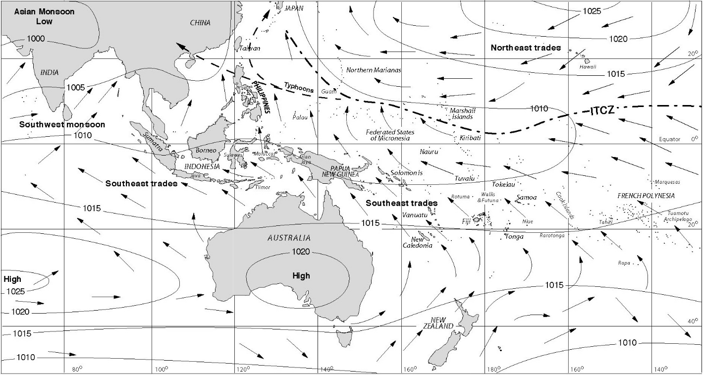
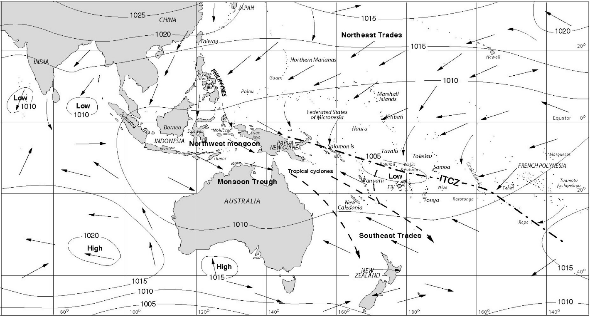

[Malcolm Ross](.smallcaps)

## 1. Introduction

The reconstruction of any terminology brings its own peculiar problems. In this case, the challenge was associated with the fact that meteorological conditions are not the same throughout the Austronesian speaking area. It is a necessary inference that as Austronesian speakers settled the regions they now occupy, they encountered new conditions which required adaptations in their terminology. Thus the meanings of the terms in a given language need to be related to the weather conditions which occur where the language is spoken. For this reason, [§2](../contributions/2-5#s-2) gives a short account of Pacific wind systems, while in [§3](../contributions/2-5#s-3) the weather patterns that Austronesian speakers encountered during their (largely eastward) migrations are described. Less trivially, a hypothesis about the semantic structure of POc speakers’ weather terminology must rest on a hypothesis about where POc was spoken — and the same is true of any protolanguage for which weather terms are reconstructed. My assumption here that POc was spoken in the Bismarck Archipelago. I return to this matter in the concluding section.[^1]

## 2. Pacific wind systems

The main planetary surface wind system affecting tropical regions consists of the trade winds. The trades blow from the sub-tropical high-pressure zones of both hemispheres to the equatorial low-pressure zone, but are deflected by the earth’s rotation (the Coriolis effect) so that they blow from the southeast in the southern hemisphere and from the northeast in the northern. The equatorial low-pressure zone where the southeast and northeast trade winds meet is known as the Inter-Tropical Convergence Zone (ITCZ), colloquially ‘the Doldrums’.

Meteorological phenomena   121

The trade winds and the ITCZ are two of the major ingredients of the weather in the region inhabited by Austronesian speakers. Map 10 provides a general overview for the period from (roughly) April to October.[^2]

The trades are noted for their consistency and force, especially over the eastern side of the ocean (Hawaii has quite consistent trade wind flow, bringing sunshine with sporadic cumulus and some humidity). Over the western Pacific (e.g. in the Bismarck Archipelago), they are less consistent because of monsoonal and other disturbances. Near their high- pressure source the trade winds are quite dry, but as they blow over the ocean towards the Equator they pick up moisture which they deposit as orographic rain when they hit high islands. Orographic rainfall occurs when air is forced to ascend the side of a mountain range, and is particularly common where mountains lie parallel to the coast over which blow moist winds from the sea. This is the situation on the large islands of the Philippines; in Papua New Guinea on Manus Island, the tip of Papua, the Huon Peninsula and the island of New Britain; in the New Georgia group and on Guadalcanal in the Solomons; and on the high islands of Fiji. All of these experience heavy rain on their windward coasts during the trades, whilst areas in the lee of their mountain ranges remain relatively dry. In these areas the trades are therefore associated with rain (and sometimes with the rainiest season), whereas in most Pacific locations they bring the dry season.

The ITCZ has weather effects of a different kind. It is a low-pressure belt with relatively little wind but various local perturbations. Incoming airflow has nowhere to go but up — in large numbers of isolated columns. Each island becomes capped with a cloud build-up resulting from evaporation due to the sun’s heat and there is thundery convectional rain, but little lee effect. Thus the ITCZ is characterised by frequent, more or less windless rainfall.

On non-monsoonal Pacific islands (i.e. islands well away from the land masses of Australia and mainland Asia) the main determinant of seasonal variation is the annual movement of the ITCZ. Because most of the languages I am concerned with in this paper are spoken in places south of the Equator, I will refer to the seasons as the southern hemisphere ‘winter’ (SHW) and the southern hemisphere ‘summer’ (SHS), using these terms also to refer to the northern hemisphere ‘summer’ and ‘winter’ respectively.

The movement of the ITCZ roughly tracks the zenith sun southward in the SHS, northward in the SHW. This movement is visible if one compares Maps 10 and 11. But because the northern hemisphere has larger land masses than the south, forming the areas of greatest heating, the mean annual position of the ITCZ generally lies well north of the Equator. On the leading edge of the ITCZ (the south in the SHS, the north in the SHW), tropical cyclones — ‘typhoons’ in the northwest Pacific — sometimes arise. They are small intense low-pressure systems. The wind whirls around them, often with torrential rainfall, as they move away from the ITCZ. The movement of the ITCZ of course means that the trades system also moves with the seasons: the southeast trades blow further north in the SHW, the northeast trades further south in the SHS.

Among non-monsoonal Pacific islands there are just a few inhabited locations which lie more or less constantly within the ITCZ despite its movement and hence have little seasonal variation in temperature or rainfall. These include the northern islands of Kiribati and the southern Marshall Islands between about 2˚N and 6˚N.

On other non-monsoonal islands there are two asymmetric seasons — a ‘wet’ and stormy season of about four months when the more intense effects of the ITCZ are felt, and a ‘dry’ and stormfree season during the rest of the year when the trade winds blow more or less without interruption. However, the terms ‘wet’ and ‘dry’ are merely relative in many Pacific locations, and exceptions to this pattern in any case occur where the trades bring heavy orographic rain.

In the southern hemisphere, when the ITCZ moves south in the SHS bringing the ‘wet’, islands closer to the Equator (easternmost parts of the island of New Guinea and the Bismarck Archipelago, the northern Solomons, Tuvalu, Tokelau) are directly within the ITCZ and receive relatively windless convectional rains. When the wind does blow, it is generally from the northwest. Islands further south (the southern Solomons, Vanuatu, Fiji, Tonga, Samoa) experience variable weather as the southeast trades are sporadically disrupted by westerly and northwesterly winds and tropical cyclones caused by perturbations in the ITCZ.

Non-monsoonal islands in the northern hemisphere experience the converse seasonal regime. When the ITCZ moves north in the SHW, the northeast trades are interrupted by wet weather with westerly and southwesterly winds and typhoons.

The main disruptions to the regime described above are the seasonal reversals of pressure and wind over the land masses and neighbouring oceans which are known as monsoons, which affect the weather on the islands close to the land masses of Australia and mainland Asia. Monsoons are caused by the summer heating of the land, which effectively causes an extension of the equatorial low-pressure zone well north into Asia in July and south into northern and central Australia in January.[^3] The Asiatic low-pressure area centring on northwestern India is so intense that it supersedes the equatorial low in the SHW, so that the southeast trades cross the Equator and become the southwest monsoon in peninsular India, whilst Malaysia, Indonesia, the Philippines, China and Japan experience winds from the south, varying to southeast and southwest as they blow in towards the heated continent. This phenomenon can be seen in Map 10. The extension of the equatorial low into Australia in the SHS is less intense, but is sufficient to draw the northeast trades across the Equator, where they become the northwest monsoon, bringing cloudy and rainy weather to Indonesia and western and southern parts of the island of New Guinea (see Map 11). From the perspective of this paper, the most important effect of the monsoon is that it brings a marked seasonal reversal. Whereas the wet on non-monsoonal islands either consists of the windless rain of the ITCZ or of variable, stormy weather, the monsoon draws the trade winds across the Equator into the opposite hemisphere, eliminating the doldrums and giving a clear reversal of wind direction.

## 3. The Austronesian weather experience[^4]

It is clear from this account of wind systems in Austronesian speaking areas that people in different parts of the area experience somewhat different configurations of wind and season. It follows from this that during their spread through the region, Austronesian speakers encountered new weather conditions and had either to adapt old terms to new conditions or to add new terms to their vocabularies.

Table 3 summarises the seasonal conditions pertaining in various Austronesian speaking areas. It is at best a crude summary, as local conditions may change considerably from one side of an island to the other, especially where orographic rain occurs. The locations are set out in very roughly the sequence in which I assume them (on the basis of Figure 1) to have been occupied by Austronesian speakers.

I assume that Proto Malayo-Polynesian was spoken in the northerly part of the Philippines. Here the northeast trades prevail in the SHS, but are replaced by monsoonal southerlies in the SHW. On the larger islands this means that east-facing slopes receive orographic rain during the trades and convectional rains in the monsoon, whilst west- facing slopes get orographic rain during the monsoon and have drought during the trades ([Alip & Borlaza 1984](../sources/AlipandBorlaza1984)). During the monsoon typhoons often strike the northern and central islands, but [Benedek](../sources/Benedek1991) ([1991](../sources/Benedek1991):13) reports for the islands between the Philippines and Taiwan that there is sometimes a period when the sea is becalmed and the heat becomes intolerable.

As Austronesian speakers moved south into Mindanao and then Borneo, Sulawesi and perhaps Halmahera, they left the trade winds behind and entered the equatorial region with two monsoon seasons where rain falls all the year round. North of the equator, the accustomed monsoonal southerlies or southwesterlies continued in the SHW, but in the SHS the northeast trades became the northeast monsoon as they accumulated moisture prior to crossing the Equator. When our travellers crossed the Equator, they experienced a reorientation of wind directions: the southerly monsoon of the SHW became decidedly southeasterly or easterly, whilst the northeast monsoon of the SHS veered to the northwest or west.

Even in the equatorial zone, there is some seasonal variation in rainfall, the peak occurring in the SHS when the airflow is from Asia to Australia. This difference became more pronounced the further south and east (i.e. the closer to Australia) Austronesian speakers moved, and Sumba and Timor are quite dry during the SHW when the easterly monsoon brings dry air from Australia. By the time it reaches western Indonesia or moves north of the Equator and becomes the southwest monsoon, its winds have become humid and a source of rain, so that Sumatra and Borneo have no dry season, whilst Java divides into a wet west (from orographic rain) and a dry east ([McDivitt 1984](../sources/Mcdivitt1984)).

When Austronesian speakers travelled eastwards, probably from Halmahera, and moved along the north coast of the island of New Guinea, they gradually experienced a lessening of the effects of the southeast monsoon, as the central cordillera provided an increasingly large obstacle to it. The northwest monsoon of the SHS continued to provide the rainy season, however.

As the migrants emerged from the lee of the cordillera onto the Huon Peninsula and crossed to New Britain, two things occurred which presumably came to be reflected in POc terminology. First, they had left the monsoonal region behind them, and during the SHS they experienced the fairly windless rainy season of the ITCZ, with some sporadic northwesterly winds. Secondly they encountered for the first time the southeast trades of the SHW, during which the north coasts of the Huon Peninsula and of New Britain have their dry season, whilst their south coasts suffer torrential orographic rain ([Howlett 1967](../sources/Howlett1967):36–38). As they later spread around the coasts and offshore islands of Papua New Guinea and into the Bismarck Archipelago and then the New Georgia group of the northwest Solomons, they continued to encounter this and other kinds of local variation, but the southeast trades always continued to be the prevailing winds.

: Table 3: Approximate summary of seasons in some Pacific locations

|                                                         | Southern Hemisphere Winter                                                    | Southern Hemisphere Summer                                                |
|:--------------------------------------------------------|:------------------------------------------------------------------------------|:--------------------------------------------------------------------------|
| Philippines                                             | southwest monsoon, wet season; in centre and north some cyclones              | northeast trades, dry season, orographic rain                             |
| Sumatra, Borneo                                         | in north, southwest monsoon; in south, southeast monsoon; humid wind and rain | in north, northeast monsoon; in south, northwest monsoon, clouds and rain |
| rest of Indonesia                                       | southeast monsoon, dry season; in west, some orographic rain                  | northwest monsoon, clouds and rain                                        |
| Manus Island, New Britain, Huon Peninsula, tip of Papua | southeast trades, heavy orographic rain                                       | ITCZ, convectional rain                                                   |
| Papua New Guinea rest                                   | southeast trades, dry season                                                  | ITCZ, convectional rain                                                   |
| New Georgia group                                       | southeast trades, heavy orographic rain                                       | ITCZ, convectional rain                                                   |
| rest of northwest Solomon Islands                       | southeast trades, dry season                                                  | ITCZ, convectional rain                                                   |
| southeast Solomon Islands, Vanuatu, New Caledonia       | southeast trades, dry season                                                  | variable stormy weather, some cyclones                                    |
| Fiji                                                    | southeast trades, dry season, heavy orographic rain                           | variable stormy weather, some cyclones                                    |
| Tonga, Samoa, Wallis, Futuna, Cooks, Tahiti, Tuamotus   | southeast trades, dry season                                                  | variable stormy weather, some cyclones                                    |
| Tuvalu, Tokelau, southern Gilberts, Nauru               | southeast trades, humid wind, some rain                                       | ITCZ, convectional rain                                                   |
| northern Gilberts, southern Marshalls                   | ITCZ, convectional rain                                                       | ITCZ, convectional rain                                                   |
| northern Marshalls, Carolines                           | variable stormy weather                                                       | northeast trades, some rain                                               |
| Hawaii                                                  | northeast trades,  some orographic rain                                       | northeast trades, some orographic rain                                    |

As Oceanic speakers moved further into the Pacific, the lie of the islands ensured that they first also moved further south as well as east. In the southeast Solomons, Vanuatu, New Caledonia, Fiji and Samoa this took them right out of the ITCZ into the southern tropical zone where the rainy season of the SHS is relatively short (around four months) and the winds are variable: sometimes the southeast trades continue to penetrate, but often they are disrupted by stormy northwesterlies and sometimes by cyclones. There is a long dry season when the southeast trades blow consistently, except when they deposit orographic rain on high islands, particularly in Fiji.

It was from somewhere in this zone that Oceanic speakers moved northwards into Micronesia. In Tuvalu and the southern Gilberts[^5] they encountered a climate similar to that of the smaller islands in the Bismarcks: the southeast trades continue to predominate, but become more moist nearer to the Equator, and the northwesterlies and cyclones give way again to the much less windy wet season of the ITCZ. Further north, in the northern Gilberts and southern Marshalls, they found themselves permanently in the ITCZ, with relatively little wind and a good measure of convectional rain. Finally, in the scattered archipelagoes of the northern tropical zone — the northern Marshalls, the Carolines and the Marianas — they left the ITCZ to their south and entered a region in which the climate is the converse of that in the southern tropical zone. Here in nuclear Micronesia there is a long dry season when the northeast trades prevail in the SHS and a short rainy season with variable winds and storms in the SHW.

In the sections below I set out my reconstructions of POc terms referring to and associated with winds and the weather.

## 4. Winds

### 4.1. Wind and wind strengths

Winds seem to have been classified in two ways in POc. In this section I will present generic terms for wind and wind strengths, in the next section terms for seasonal winds and wind directions.

The generic term for ‘wind’ in POc was _&ast;aŋin_, which continues PMP _&ast;haŋin_.

<table id="2-5-4-1-126-POc-ain-a">
<tr>
<td><strong>PMP</strong></td><td> </td>
<td>
<i>&ast;haŋin</i>
</td>
<td>
'air, wind' (<a href="../sources/Dempwolff1938">Dempwolff1938</a>)
</td>
</tr>
<tr>
<td><strong>POc</strong></td><td> </td>
<td>
<i>&ast;aŋin</i>
</td>
<td>
'wind'</td>
</tr>
<tr>
<td>NNG</td><td><a href="../languages/mangap">Mangap</a></td><td><i>yaŋ</i></td>
<td>
'rain'</td>
</tr>
<tr>
<td>NNG</td><td><a href="../languages/bing">Bing</a></td><td><i>yaŋ</i></td>
<td>
'wind'</td>
</tr>
<tr>
<td>PT</td><td><a href="../languages/minaveha">Minaveha</a></td><td><i>yagina</i></td>
<td>
'wind'</td>
</tr>
<tr>
<td>PT</td><td><a href="../languages/wedau">Wedau</a></td><td><i>ðaɣina</i></td>
<td>
'wind'</td>
</tr>
<tr>
<td>PT</td><td><a href="../languages/balawaia">Balawaia</a></td><td><i>aɣi</i></td>
<td>
'wind'</td>
</tr>
<tr>
<td>PT</td><td><a href="../languages/motu">Motu</a></td><td><i>lai</i></td>
<td>
'wind'</td>
</tr>
<tr>
<td>MM</td><td><a href="../languages/konomala">Konomala</a></td><td><i>yaŋin</i></td>
<td>
'wind'</td>
</tr>
<tr>
<td>NCV</td><td><a href="../languages/portsandwich">Port Sandwich</a></td><td><i>n-ean</i></td>
<td>
'wind'</td>
</tr>
<tr>
<td>Mic</td><td><a href="../languages/kiribatese">Kiribatese</a></td><td><i>aŋ</i></td>
<td>
'wind'</td>
</tr>
<tr>
<td>Mic</td><td><a href="../languages/woleaian">Woleaian</a></td><td><i>yaŋ</i></td>
<td>
'wind'</td>
</tr>
<tr>
<td>Fij</td><td><a href="../languages/bauanfijian">Bauan</a></td><td><i>ðaŋi</i></td>
<td>
'wind'</td>
</tr>
<tr>
<td>Pn</td><td><a href="../languages/tongan">Tongan</a></td><td><i>aŋi</i></td>
<td>
'(wind, breeze) blow'</td>
</tr>
<tr>
<td>Pn</td><td><a href="../languages/samoan">Samoan</a></td><td><i>aŋi</i></td>
<td>
'(wind, breeze) blow'</td>
</tr>
</table>

Three terms for winds of differing strengths are reconstructable. POc _&ast;jaŋi_ referred to a strong wind, _&ast;sau_/_&ast;sau-ŋ(a)_ and _&ast;mur[i,e]_ to breezes. It seems that &ast;sau was a verb (‘blow freshly’), and _&ast;sau-ŋ(a)_ a nominalisation referring to the breeze itself. I cannot reconstruct a difference in meaning between _&ast;sau_ and _&ast;mur[i,e]_.

<table id="2-5-4-1-127-POc-jai-a">
<tr>
<td><strong>POc</strong></td><td> </td>
<td>
<i>&ast;jaŋi</i>
</td>
<td>
[N] 'strong wind'; [V] 'be windy'</td>
</tr>
<tr>
<td>NNG</td><td><a href="../languages/bing">Bing</a></td><td><i>sāŋ</i></td>
<td>
'wind strong directly against'</td>
</tr>
<tr>
<td>NNG</td><td><a href="../languages/maposbuang">Mapos Buang</a></td><td><i>saŋ</i></td>
<td>
'strong winds which blow up the valley around November'</td>
</tr>
<tr>
<td>SES</td><td><a href="../languages/arosi">Arosi</a></td><td><i>daŋi</i></td>
<td>
'wind'</td>
</tr>
<tr>
<td>SES</td><td><a href="../languages/saa">Sa'a</a></td><td><i>deŋi</i></td>
<td>
'wind'</td>
</tr>
<tr>
<td>NCal</td><td><a href="../languages/nemi">Nemi</a></td><td><i>dān</i></td>
<td>
'wind'</td>
</tr>
<tr>
<td>Pn</td><td><a href="../languages/tongan">Tongan</a></td><td><i>(ma)taŋi</i></td>
<td>
[N] 'wind'; [V] 'be windy'</td>
</tr>
<tr>
<td>Pn</td><td><a href="../languages/samoan">Samoan</a></td><td><i>(ma)taŋi</i></td>
<td>
[N] 'wind'; [V] 'be windy, stormy'</td>
</tr>
</table>

<table id="2-5-4-1-127-POc-sau-a">
<tr>
<td><strong>POc</strong></td><td> </td>
<td>
<i>&ast;sau</i>
</td>
<td>
[V] '(breeze) blow'; [N] 'breeze'</td>
</tr>
<tr>
<td><strong>POc</strong></td><td> </td>
<td>
<i>&ast;sau-ŋ(a)</i>
</td>
<td>
[N] 'breeze'</td>
</tr>
<tr>
<td>Adm</td><td><a href="../languages/lou">Lou</a></td><td><i>soso</i></td>
<td>
'wind, breeze'</td>
</tr>
<tr>
<td>Adm</td><td><a href="../languages/titan">Titan</a></td><td><i>só-soú-n</i></td>
<td>
'wind from a particular direction'</td>
</tr>
<tr>
<td>NNG</td><td><a href="../languages/kilenge">Kilenge</a></td><td><i>-sou</i></td>
<td>
'(wind) blow'</td>
</tr>
<tr>
<td>NNG</td><td><a href="../languages/bilibil">Bilibil</a></td><td><i>sau</i></td>
<td>
'rain'</td>
</tr>
<tr>
<td>NNG</td><td><a href="../languages/poeng">Poeng</a></td><td><i>saū</i></td>
<td>
'wind; large, damaging with black, foreboding sky'</td>
</tr>
<tr>
<td>MM</td><td><a href="../languages/solos">Solos</a></td><td><i>seou-ŋ</i></td>
<td>
'wind'</td>
</tr>
<tr>
<td>SES</td><td><a href="../languages/gela">Gela</a></td><td><i>sau(toŋa)</i></td>
<td>
'north wind'</td>
</tr>
<tr>
<td>Fij</td><td><a href="../languages/wayan">Wayan</a></td><td><i>ðau-ðau</i></td>
<td>
'light to moderate wind, of early mornings and early evenings'</td>
</tr>
<tr>
<td>Fij</td><td><a href="../languages/bauanfijian">Bauan</a></td><td><i>ðau-ðau</i></td>
<td>
'land breeze'</td>
</tr>
<tr>
<td>Pn</td><td><a href="../languages/rapanui">Rapanui</a></td><td><i>hau</i></td>
<td>
'breeze, wind; blow freshly; cool'</td>
</tr>
<tr>
<td>Pn</td><td><a href="../languages/hawaiian">Hawaiian</a></td><td><i>hau</i></td>
<td>
'cool breeze'</td>
</tr>
<tr>
<td>Pn</td><td><a href="../languages/maori">Māori</a></td><td><i>hau</i></td>
<td>
'wind, breeze'</td>
</tr>
<tr>
<td>Pn</td><td><a href="../languages/westfutunan">West Futunan</a></td><td><i>sau</i></td>
<td>
'(wind) blow; sound of wind'</td>
</tr>
</table>

<table id="2-5-4-1-127-POc-murie-a">
<tr>
<td><strong>POc</strong></td><td> </td>
<td>
<i>&ast;mur[i,e]</i>
</td>
<td>
[N] 'breeze'; [V] 'blow gently'</td>
</tr>
<tr>
<td>NNG</td><td><a href="../languages/lukeppono">Lukep (Pono)</a></td><td><i>muru</i></td>
<td>
'breeze'</td>
</tr>
<tr>
<td>NNG</td><td><a href="../languages/mangap">Mangap</a></td><td><i>mīri</i></td>
<td>
'wind'</td>
</tr>
<tr>
<td>NNG</td><td><a href="../languages/mangap">Mangap</a></td><td><i>mir-mīri</i></td>
<td>
'little breeze'</td>
</tr>
<tr>
<td>NNG</td><td><a href="../languages/kilenge">Kilenge</a></td><td><i>na-mule</i></td>
<td>
'wind'</td>
</tr>
<tr>
<td>NNG</td><td><a href="../languages/yabem">Yabem</a></td><td><i>mu</i></td>
<td>
'wind'</td>
</tr>
<tr>
<td>MM</td><td><a href="../languages/tabar">Tabar</a></td><td><i>mur</i></td>
<td>
'wind'</td>
</tr>
<tr>
<td>Fij</td><td><a href="../languages/rotuman">Rotuman</a></td><td><i>mure</i></td>
<td>
'blow gently'</td>
</tr>
<tr>
<td>Fij</td><td><a href="../languages/bauanfijian">Bauan</a></td><td><i>mudre</i></td>
<td>
[V] '(wind) blow gently'; [N] 'cool breeze'; [ADJ] 'cool, breezy' (<em>-dr-</em> for expected <em>*-r-</em>)</td>
</tr>
<tr>
<td>Fij</td><td><a href="../languages/wayan">Wayan</a></td><td><i>mure</i></td>
<td>
'(breeze) blow lightly'</td>
</tr>
<tr>
<td>Pn</td><td><a href="../languages/maori">Māori</a></td><td><i>muri-muri</i></td>
<td>
'breeze'</td>
</tr>
<tr>
<td>Pn</td><td><a href="../languages/tuamotuan">Tuamotuan</a></td><td><i>mure</i></td>
<td>
'fail (of breath)'</td>
</tr>
</table>

The terms below may also reflect POc _&ast;mur[i,e]_, but with a change in meaning.

<table id="2-5-4-1-127-nng-amara-omur">
<tr>
<td>NNG</td>
<td>Amara</td>
<td><i>o-mur</i></td>
<td>
'southeast trade'</td>
</tr>
<tr>
<td>NNG</td>
<td>Bing</td>
<td><i>mur-mōriy</i></td>
<td>
'wind which blows strongly from the west, often causing damage'</td>
</tr>
<tr>
<td>PT</td>
<td>Motu</td>
<td><i>miri(gini)</i></td>
<td>
'north wind'</td>
</tr>
<tr>
<td>PT</td>
<td>Mekeo</td>
<td><i>mili(kini)</i></td>
<td>
'north wind'</td>
</tr>
</table>

The Mangap, Motu and Mekeo terms have _-i-_ where _-u-_ is expected. This may reflect vowel assimilation.

Another term for wind was POc _&ast;mal(i,e)u_, but it is not possible to determine its meaning precisely from its reflexes. In Proto Micronesian, it referred to a typhoon, but this was presumably its denotation after the ancestral Micronesians crossed out of the ITCZ into the northern hemisphere.

<table id="2-5-4-1-128-POc-malieu-a">
<tr>
<td><strong>POc</strong></td><td> </td>
<td>
<i>&ast;mal(i,e)u</i>
</td>
<td>
'wind'</td>
</tr>
<tr>
<td>SJ</td><td><a href="../languages/sobei">Sobei</a></td><td><i>maro</i></td>
<td>
'wind' (<em>-o</em> &lt; <em>*-ew</em>)</td>
</tr>
<tr>
<td>PT</td><td><a href="../languages/tawala">Tawala</a></td><td><i>malewa</i></td>
<td>
'favourable wind, wind from behind'</td>
</tr>
<tr>
<td>MM</td><td><a href="../languages/lavongai">Lavongai</a></td><td><i>malu</i></td>
<td>
'(wind) blow'</td>
</tr>
<tr>
<td>MM</td><td><a href="../languages/karawest">Kara (West)</a></td><td><i>maliu</i></td>
<td>
'wind'</td>
</tr>
<tr>
<td>MM</td><td><a href="../languages/nalik">Nalik</a></td><td><i>maliu</i></td>
<td>
'wind'</td>
</tr>
<tr>
<td>MM</td><td><a href="../languages/notsi">Notsi</a></td><td><i>mal</i></td>
<td>
'wind'</td>
</tr>
<tr>
<td>MM</td><td><a href="../languages/madak">Madak</a></td><td><i>man-man</i></td>
<td>
'wind'</td>
</tr>
<tr>
<td>MM</td><td><a href="../languages/maringe">Maringe</a></td><td><i>maloa</i></td>
<td>
'air, open space' (<em>-oa</em> &lt; <em>*-ewa</em>)</td>
</tr>
<tr>
<td>Mic</td><td><a href="../languages/mokilese">Mokilese</a></td><td><i>mɛl-mɛl</i></td>
<td>
'storm, typhoon'</td>
</tr>
<tr>
<td>Mic</td><td><a href="../languages/ponapean">Ponapean</a></td><td><i>mɛli-mɛl</i></td>
<td>
'windstorm, typhoon'</td>
</tr>
<tr>
<td>Mic</td><td><a href="../languages/woleaian">Woleaian</a></td><td><i>marɨ-mer</i></td>
<td>
'storm, typhoon'</td>
</tr>
</table>

In [Ross](../sources/Ross1995c) ([1995c](../sources/Ross1995c)) I wrote:

> my attempts to reconstruct POc terms for ‘typhoon’, ‘cyclone’ and ‘whirlwind’ have failed completely. On reflection, this is not surprising, as I have hypothesised that POc was spoken in the Bismarcks — too close to the Equator and to the ITCZ to be affected by winds of this kind.

[Lynch](../sources/Lynch1997) ([1997](../sources/Lynch1997)), however, points out that there is a South Vanuatu reflex of PAn _&ast;baRiuS_ ‘typhoon’, and that POc _&ast;paRiu_ ‘cyclone’ is therefore reconstructable. The lack of reflexes elsewhere is perhaps to be attributed, then, to their loss in languages whose speakers do not normally experience cyclones.

<table id="2-5-4-1-128-POc-pariu-a">
<tr>
<td><strong>PAn</strong></td><td> </td>
<td>
<i>&ast;baRiuS</i>
</td>
<td>
'typhoon'</td>
</tr>
<tr>
<td><strong>POc</strong></td><td> </td>
<td>
<i>&ast;paRiu</i>
</td>
<td>
'cyclone'</td>
</tr>
<tr>
<td>SV</td><td><a href="../languages/anejom">Anejom</a></td><td><i>(n)eheyo</i></td>
<td>
'cyclone, hurricane'</td>
</tr>
</table>

Although a number of etyma referring to a wind seem to have been used both as a noun denoting that wind and as a verb expressing the action of the particular wind, there are also several reconstructable POc terms which seem to have been primarily used as verbs of blowing with reference to winds or people.

Three of these, _&ast;upi_, _&ast;ipu_ and _&ast;i(p,pʷ)i_, are clearly related to each other phonologically. The pair _&ast;upi_ and _&ast;ipu_ ‘blow’ are strikingly parallel to POc _&ast;ubi_/_&ast;ibu_ ‘half coconut shell used as a drinking cup’, and it is possible that both pairs were generated at the same time by the application of a single rule (or similar wordplay) to the pre-existing member of each pair. In the case of POc _&ast;upi_/_&ast;ipu_ ‘blow’, it seems likely that the pre-existing member was _&ast;ipu_, since it can be traced back to PMP _&ast;ibut_ ‘breeze, draught of wind’, and that _&ast;upi_ was the late-generated form. However, its generation predates POc, as Blust has reconstructed PCEMP _&ast;upi_ ‘(wind, person) blow’ (1993).[^7] Similarly, the generation of the pair _&ast;ubi_/_&ast;ibu_ ‘half coconut shell …’ also predates POc, as both forms are reconstructable in Proto Eastern Malayo-Polynesian ([Blust 1978a](../sources/Blust1978a)).

<table id="2-5-4-1-129-POc-upi-a">
<tr>
<td><strong>PCEMP</strong></td><td> </td>
<td>
<i>&ast;upi</i>
</td>
<td>
'(wind, person) blow' (<a href="../sources/Blust1993">Blust1993</a>)
</td>
</tr>
<tr>
<td><strong>POc</strong></td><td> </td>
<td>
<i>&ast;upi</i>
</td>
<td>
'(wind, person) blow' (cf. vol. 1, pp.107–108)</td>
</tr>
<tr>
<td>Adm</td><td><a href="../languages/seimat">Seimat</a></td><td><i>uhi</i></td>
<td>
'blow on the fire'</td>
</tr>
<tr>
<td>NNG</td><td><a href="../languages/mangap">Mangap</a></td><td><i>-wi</i></td>
<td>
'(wind) blow'</td>
</tr>
<tr>
<td>NNG</td><td><a href="../languages/apalik">Apalik</a></td><td><i>uwi</i></td>
<td>
'northwest monsoon'</td>
</tr>
<tr>
<td>NNG</td><td><a href="../languages/takia">Takia</a></td><td><i>-wi</i></td>
<td>
'(wind) blow'</td>
</tr>
<tr>
<td>NNG</td><td><a href="../languages/yabem">Yabem</a></td><td><i>yu</i></td>
<td>
'(s.o.) blow'</td>
</tr>
<tr>
<td>NNG</td><td><a href="../languages/kaiwa">Kaiwa</a></td><td><i>u</i></td>
<td>
'(wind) blow'</td>
</tr>
<tr>
<td>NNG</td><td><a href="../languages/misim">Hote (Misim)</a></td><td><i>yuv</i></td>
<td>
'(wind) blow'</td>
</tr>
<tr>
<td>NNG</td><td><a href="../languages/vehes">Vehes</a></td><td><i>vin</i></td>
<td>
'wind'</td>
</tr>
<tr>
<td>NNG</td><td><a href="../languages/mangga">Mangga</a></td><td><i>va-vi</i></td>
<td>
'wind'</td>
</tr>
<tr>
<td>NNG</td><td><a href="../languages/medebur">Medebur</a></td><td><i>-wi</i></td>
<td>
'(wind) blow'</td>
</tr>
<tr>
<td>MM</td><td><a href="../languages/tabar">Tabar</a></td><td><i>uvi</i></td>
<td>
'(wind) blow'</td>
</tr>
<tr>
<td>SES</td><td><a href="../languages/gela">Gela</a></td><td><i>uvi-uvi</i></td>
<td>
'blow with the breath, play pipes'</td>
</tr>
<tr>
<td>SES</td><td><a href="../languages/lau">Lau</a></td><td><i>ufi</i></td>
<td>
'blow with the mouth; blow a conch or panpipes'</td>
</tr>
<tr>
<td>SES</td><td><a href="../languages/arosi">Arosi</a></td><td><i>uhi</i></td>
<td>
'blow, breathe on'</td>
</tr>
<tr>
<td>NCV</td><td><a href="../languages/mota">Mota</a></td><td><i>uw</i></td>
<td>
'blow with the mouth, or of wind'</td>
</tr>
<tr>
<td>NCV</td><td><a href="../languages/raga">Raga</a></td><td><i>uvi</i></td>
<td>
'blow'</td>
</tr>
<tr>
<td>NCV</td><td><a href="../languages/paamese">Paamese</a></td><td><i>uhi</i></td>
<td>
'blow'</td>
</tr>
<tr>
<td>Fij</td><td><a href="../languages/wayan">Wayan</a></td><td><i>uvi, uvu</i></td>
<td>
'(fire, flute) be blown with the mouth, (ball, balloon) inflated, blown up'</td>
</tr>
<tr>
<td>Fij</td><td><a href="../languages/wayan">Wayan</a></td><td><i>uvi</i></td>
<td>
'blow s.t. with the mouth'</td>
</tr>
</table>

In a number of NNG languages in the region of the Vitiaz Strait and the Huon Gulf, a nominalised form of &ast;upi ‘blow’ has become the generic term for ‘wind’ (see vol. 1, pp.33–34 with regard to nominalising morphology):

<table id="2-5-4-1-130-PNNG-upia-a">
<tr>
<td><strong>PNNG</strong></td><td> </td>
<td>
<i>&ast;upi-ŋ(a)</i>
</td>
<td>
'wind'</td>
</tr>
<tr>
<td>NNG</td><td><a href="../languages/atui">Atui</a></td><td><i>uvin</i></td>
<td>
'wind'</td>
</tr>
<tr>
<td>NNG</td><td><a href="../languages/kaiwa">Kaiwa</a></td><td><i>(wa)vin</i></td>
<td>
'wind'</td>
</tr>
<tr>
<td>NNG</td><td><a href="../languages/duwet">Duwet</a></td><td><i>fiŋ-fiŋ</i></td>
<td>
'wind'</td>
</tr>
<tr>
<td>NNG</td><td><a href="../languages/dangal">Dangal</a></td><td><i>fiŋ</i></td>
<td>
'(wind) blow'</td>
</tr>
<tr>
<td>NNG</td><td><a href="../languages/silisili">Silisili</a></td><td><i>fiᵑg</i></td>
<td>
'wind'</td>
</tr>
<tr>
<td>NNG</td><td><a href="../languages/adzera">Adzera</a></td><td><i>fi-fiŋ</i></td>
<td>
'strong, fierce wind'</td>
</tr>
</table>

<table id="2-5-4-1-130-POc-ipu-a">
<tr>
<td><strong>PMP</strong></td><td> </td>
<td>
<i>&ast;ibut</i>
</td>
<td>
'breeze, draught of wind' (<a href="../sources/Blust1995">Blust1995</a>)
</td>
</tr>
<tr>
<td><strong>POc</strong></td><td> </td>
<td>
<i>&ast;ipu</i>
</td>
<td>
'(wind) blow' (cf. vol. 1, pp.107–108)</td>
</tr>
<tr>
<td>NNG</td><td><a href="../languages/bing">Bing</a></td><td><i>yu</i></td>
<td>
'(wind) blow'</td>
</tr>
<tr>
<td>NNG</td><td><a href="../languages/sissano">Sissano</a></td><td><i>-iu</i></td>
<td>
'(wind) blow'</td>
</tr>
<tr>
<td>MM</td><td><a href="../languages/tinputz">Tinputz</a></td><td><i>viu</i></td>
<td>
'(wind) blow' (metathesis)</td>
</tr>
<tr>
<td>MM</td><td><a href="../languages/mono">Mono</a></td><td><i>ihu</i></td>
<td>
'(wind) blow'</td>
</tr>
<tr>
<td>MM</td><td><a href="../languages/lungga">Lungga</a></td><td><i>ivu</i></td>
<td>
'blow'</td>
</tr>
<tr>
<td>MM</td><td><a href="../languages/roviana">Roviana</a></td><td><i>ivu-a</i></td>
<td>
'blow on (fire), blow into (conch)'</td>
</tr>
<tr>
<td>MM</td><td><a href="../languages/maringe">Maringe</a></td><td><i>ifu</i></td>
<td>
'blow'</td>
</tr>
<tr>
<td>SES</td><td><a href="../languages/bugotu">Bugotu</a></td><td><i>ifu</i></td>
<td>
'blow (fire, pan-pipes)'</td>
</tr>
</table>

It seems likely that the form _&ast;i(p,pʷ)i_ is the result of an idiosyncratic change to _&ast;upi_, _&ast;ipu_ or both. A couple of forms, NNG: Kaulong _e-ip_ ‘the wind’ and MM: Nalik _if_ ‘(wind) blow’, may reflect either _&ast;ipu_ or _&ast;i(p,pʷ)i_.

<table id="2-5-4-1-130-POc-ippi-a">
<tr>
<td><strong>POc</strong></td><td> </td>
<td>
<i>&ast;i(p,pʷ)i</i>
</td>
<td>
'(wind, person) blow'</td>
</tr>
<tr>
<td>MM</td><td><a href="../languages/ramoaaina">Ramoaaina</a></td><td><i>ipi</i></td>
<td>
'(wind) blow'</td>
</tr>
<tr>
<td>MM</td><td><a href="../languages/tolai">Tolai</a></td><td><i>ipi</i></td>
<td>
'(wind) blow'</td>
</tr>
<tr>
<td>MM</td><td><a href="../languages/teop">Teop</a></td><td><i>ivi</i></td>
<td>
'(wind) blow'</td>
</tr>
<tr>
<td>Pn</td><td><a href="../languages/tongan">Tongan</a></td><td><i>ifi</i></td>
<td>
'blow with the mouth; blow or blow into or play (a whistle, or wind instrument)'</td>
</tr>
<tr>
<td>Pn</td><td><a href="../languages/samoan">Samoan</a></td><td><i>ifi</i></td>
<td>
'blow smoke'</td>
</tr>
<tr>
<td>Pn</td><td><a href="../languages/maori">Māori</a></td><td><i>ihi</i></td>
<td>
'blow, of wind'</td>
</tr>
</table>

Two other forms meaning ‘blow’ are also reconstructable. These are also formally rather similar to each other, but this similarity evidently dates back to well before the genesis of POc. I know of no proper non-Oceanic cognates of POc _&ast;(p,pʷ)usi_, but it appears to reflect the same monosyllabic root (_&ast;bus_) as PMP _&ast;qembus_ ‘snort, pant’ (ACD) (with regard to monosyllabic roots, see vol. 1, pp.27–28).

<table id="2-5-4-1-130-POc-ppusi-a">
<tr>
<td><strong>POc</strong></td><td> </td>
<td>
<i>&ast;(p,pʷ)usi</i>
</td>
<td>
'(wind) blow'</td>
</tr>
<tr>
<td>NNG</td><td><a href="../languages/aria">Aria</a></td><td><i>-pu</i></td>
<td>
'(wind) blow'</td>
</tr>
<tr>
<td>NNG</td><td><a href="../languages/sengseng">Sengseng</a></td><td><i>pe-puh</i></td>
<td>
'wind'</td>
</tr>
<tr>
<td>NNG</td><td><a href="../languages/numbami">Numbami</a></td><td><i>pusie</i></td>
<td>
'(wind) blow'</td>
</tr>
<tr>
<td>NNG</td><td><a href="../languages/patep">Patep</a></td><td><i>plu</i></td>
<td>
'blow'</td>
</tr>
<tr>
<td>MM</td><td><a href="../languages/konomala">Konomala</a></td><td><i>fus</i></td>
<td>
'(wind) blow'</td>
</tr>
<tr>
<td>MM</td><td><a href="../languages/minigir">Minigir</a></td><td><i>vusu</i></td>
<td>
'(wind) blow'</td>
</tr>
<tr>
<td>MM</td><td><a href="../languages/tolai">Tolai</a></td><td><i>vu</i></td>
<td>
'(wind) blow'</td>
</tr>
<tr>
<td>MM</td><td><a href="../languages/hahon">Hahon</a></td><td><i>vus</i></td>
<td>
'wind'</td>
</tr>
<tr>
<td>MM</td><td><a href="../languages/tinputz">Tinputz</a></td><td><i>vuh</i></td>
<td>
'wind'</td>
</tr>
<tr>
<td>SV</td><td><a href="../languages/sye">Sye</a></td><td><i>o-vosi</i></td>
<td>
'wind' (<a href="../sources/Lynch1978b">Lynch1978b</a>)
</td>
</tr>
<tr>
<td>Pn</td><td><a href="../languages/rennellese">Rennellese</a></td><td><i>pusi</i></td>
<td>
'(wind) blow; blow (flute)'</td>
</tr>
<tr>
<td>Pn</td><td><a href="../languages/maori">Māori</a></td><td><i>pu-puhi</i></td>
<td>
'blow (as the wind, a whale); shoot (as a gun)'</td>
</tr>
</table>

The initial _p-_ of the Pn items reflects POc _&ast;b-_ or _&ast;pʷ-_: hence the suggestion that there was a POc alternant _&ast;pʷusi_.

<table id="2-5-4-1-131-POc-puput-a">
<tr>
<td><strong>PAn</strong></td><td> </td>
<td>
<i>&ast;pu+put</i>
</td>
<td>
'blow' (<a href="../sources/Zorc1994">Zorc1994</a>)
</td>
</tr>
<tr>
<td><strong>PMP</strong></td><td> </td>
<td>
<i>&ast;putput</i>
</td>
<td>
'puff, blow suddenly and hard'</td>
</tr>
<tr>
<td><strong>POc</strong></td><td> </td>
<td>
<i>&ast;(pu)put</i>
</td>
<td>
'(wind) blow'</td>
</tr>
<tr>
<td>MM</td><td><a href="../languages/karawest">Kara (West)</a></td><td><i>fifit</i></td>
<td>
'(wind) blow'</td>
</tr>
<tr>
<td>MM</td><td><a href="../languages/siar">Siar</a></td><td><i>fut</i></td>
<td>
'(wind) blow'</td>
</tr>
<tr>
<td>MM</td><td><a href="../languages/selau">Selau</a></td><td><i>wut</i></td>
<td>
'(wind) blow'</td>
</tr>
<tr>
<td>MM</td><td><a href="../languages/papapana">Papapana</a></td><td><i>pute</i></td>
<td>
'wind'</td>
</tr>
</table>

### 4.2. Seasonal winds

If POc speakers lived in the Bismarcks, then they encountered two seasons: the dry, when the southeast trades blew with reasonable consistency, and the wet, when there were sporadic northwesterly winds. The POc terms for the winds associated with these seasons were respectively _&ast;raki_ and _&ast;apaRat_. They may also have referred to the seasons, with typical weather and wind direction as inevitable components of their meanings, as well as having associations with navigability and agriculture. Modern uses of wind terms suggest strongly that they also served as terms for cardinal directions in POc, and that the two major wind directions were perhaps the only cardinal directions for POc speakers ([Ch. 8, §1](../contributions/2-8#s-1)).

POc _&ast;raki_ ‘southeast trades’ has no obvious non-Oceanic cognates. This is hardly surprising. When Austronesian speakers came out of the lee of the New Guinea cordillera into the Bismarcks and encountered the southeast trades of the SHW and the attendant dry season, they met what was for them a new phenomenon. The only part of Indonesia with a similar season is in the southeast in the area around Timor, where the southeast monsoon brings a dry season. But it is unlikely that people ancestral to Oceanic speakers migrated via that area.

POc _&ast;raki_ probably also denoted the dry season when the southeast trades blow. In the Admiralties its reflex refers to a northeasterly wind, in Micronesia to the southerly direction and to the summer season (SHW) when the breadfruit grow. In both cases, the seasonal conditions familiar to POc speakers do not occur. On Manus Island in the Admiralties, there is a double rainfall maximum and no true dry season. Micronesia lies north of the Equator and has seasons the converse of those of POc. In both cases, reflexes of _&ast;raki_ have been applied to a new referent. In the Admiralties it has retained its association with a cooler wind and now applies to a cool wind from the mountains of Manus Island. In Micronesia it refers to the same period of the year and roughly the same wind direction as in POc, but because of the northern tropical location it now refers to the wet season rather than the dry. It is noteworthy, however, that in both the Admiralties and Micronesia, _&ast;raki_ continues to have a referent which is considered to be pleasant — in the Admiralties because the wind is cool, in Micronesia because the season produces breadfruit.

A selection of data supporting the reconstruction of _&ast;raki_ follows.

<table id="2-5-4-2-132-POc-raki-a">
<tr>
<td><strong>POc</strong></td><td> </td>
<td>
<i>&ast;raki</i>
</td>
<td>
'southeast trades' (probably also ‘dry season when the southeast trades blow’)</td>
</tr>
<tr>
<td>Adm</td><td><a href="../languages/lou">Lou</a></td><td><i>ra</i></td>
<td>
'northeast, northeast wind'</td>
</tr>
<tr>
<td>Adm</td><td><a href="../languages/titan">Titan</a></td><td><i>ⁿray</i></td>
<td>
'wind from the mainland, mountain breeze, blows at night'</td>
</tr>
<tr>
<td>NNG</td><td><a href="../languages/kove">Kove</a></td><td><i>hai</i></td>
<td>
'southeast trade, year'</td>
</tr>
<tr>
<td>NNG</td><td><a href="../languages/bariai">Bariai</a></td><td><i>rai</i></td>
<td>
'year'</td>
</tr>
<tr>
<td>NNG</td><td><a href="../languages/gitua">Gitua</a></td><td><i>rak</i></td>
<td>
'southeast trade'</td>
</tr>
<tr>
<td>NNG</td><td><a href="../languages/lukep">Lukep</a></td><td><i>rai</i></td>
<td>
'year'</td>
</tr>
<tr>
<td>NNG</td><td><a href="../languages/mangap">Mangap</a></td><td><i>rak-rak</i></td>
<td>
'fresh morning (during windy season)'</td>
</tr>
<tr>
<td>NNG</td><td><a href="../languages/tami">Tami</a></td><td><i>lai</i></td>
<td>
'southeast trade'</td>
</tr>
<tr>
<td>NNG</td><td><a href="../languages/maleu">Maleu</a></td><td><i>na-lai</i></td>
<td>
'southeast trade'</td>
</tr>
<tr>
<td>NNG</td><td><a href="../languages/ali">Ali</a></td><td><i>rai</i></td>
<td>
'southeast trade'</td>
</tr>
<tr>
<td>NNG</td><td><a href="../languages/tumleo">Tumleo</a></td><td><i>riei</i></td>
<td>
'southeast trade'</td>
</tr>
<tr>
<td>MM</td><td><a href="../languages/vitu">Vitu</a></td><td><i>raɣi</i></td>
<td>
'southeast trade'</td>
</tr>
<tr>
<td>MM</td><td><a href="../languages/bulu">Bulu</a></td><td><i>laɣi</i></td>
<td>
'southeast trade'</td>
</tr>
<tr>
<td>MM</td><td><a href="../languages/tigak">Tigak</a></td><td><i>rei</i></td>
<td>
'wind'</td>
</tr>
<tr>
<td>NCV</td><td><a href="../languages/lewo">Lewo</a></td><td><i>lagi(pesoi)</i></td>
<td>
'east wind'</td>
</tr>
<tr>
<td>Mic</td><td><a href="../languages/marshallese">Marshallese</a></td><td><i>ṛɯak</i></td>
<td>
'south, summer'</td>
</tr>
<tr>
<td>Mic</td><td><a href="../languages/ponapean">Ponapean</a></td><td><i>rāk</i></td>
<td>
'breadfruit season, season of plenty'</td>
</tr>
<tr>
<td>Mic</td><td><a href="../languages/woleaian">Woleaian</a></td><td><i>ẓaxi</i></td>
<td>
'year, age, summer season'</td>
</tr>
<tr>
<td>Fij</td><td><a href="../languages/wayan">Wayan</a></td><td><i>draki</i></td>
<td>
'weather'</td>
</tr>
<tr>
<td>Fij</td><td><a href="../languages/bauanfijian">Bauan</a></td><td><i>draki</i></td>
<td>
'weather'</td>
</tr>
<tr>
<td><strong>PPn</strong></td><td> </td>
<td>
<i>&ast;laki</i>
</td>
<td>
'southwesterly quandrant, southwest wind and weather associated with it'</td>
</tr>
<tr>
<td>Pn</td><td><a href="../languages/niuean">Niuean</a></td><td><i>laki</i></td>
<td>
'west'</td>
</tr>
<tr>
<td>Pn</td><td><a href="../languages/eastuvean">East Uvean</a></td><td><i>laki</i></td>
<td>
'southeast or southwest wind'</td>
</tr>
<tr>
<td>Pn</td><td><a href="../languages/pukapukan">Pukapukan</a></td><td><i>laki</i></td>
<td>
'southwest wind'</td>
</tr>
<tr>
<td>Pn</td><td><a href="../languages/samoan">Samoan</a></td><td><i>laʔi</i></td>
<td>
'southwest veering to northwest'</td>
</tr>
<tr>
<td>Pn</td><td><a href="../languages/tokelauan">Tokelauan</a></td><td><i>laki</i></td>
<td>
'hurricane season and westerly quarter winds that blow during it'</td>
</tr>
<tr>
<td>Pn</td><td><a href="../languages/anutan">Anutan</a></td><td><i>laki</i></td>
<td>
'the whole southwestern quadrant; westerly or southwesterly wind; the period of the year when the wind is from that quarter'</td>
</tr>
<tr>
<td>Pn</td><td><a href="../languages/rennellese">Rennellese</a></td><td><i>gaki</i></td>
<td>
[N] 'west or southwest wind'; [V] '(of this wind) blow'</td>
</tr>
<tr>
<td>Pn</td><td><a href="../languages/takuu">Takuu</a></td><td><i>laki</i></td>
<td>
'season of westerly winds'</td>
</tr>
<tr>
<td>Pn</td><td><a href="../languages/hawaiian">Hawaiian</a></td><td><i>laʔi</i></td>
<td>
'calm, stillness, quiet (of sea, sky, wind)'</td>
</tr>
<tr>
<td>Pn</td><td><a href="../languages/tuamotuan">Tuamotuan</a></td><td><i>raki</i></td>
<td>
'wind from southwesterly quadrant'</td>
</tr>
</table>

Much of the data for the reconstruction of PPn wind directions is drawn from [Biggs and Clark](../sources/BiggsandClark1993) ([1993](../sources/BiggsandClark1993)), but the glosses of the protoforms are mine. For example, for PPn _&ast;laki_ Biggs and Clark give the gloss ‘the westerly quarter, wind from that quarter and weather associated with it’. If this were its denotation, we might expect reflexes to range in meaning between northwest and southwest, but no reflex denotes a direction north of west. From this I infer that it denoted the southwesterly quadrant. Similar argumentation applies to PPn _&ast;toŋa_ ‘southeasterly quadrant, southeast wind’ and PPn _&ast;tokelau_ ‘northwesterly quadrant, north-west winds’ below.

POc _&ast;apaRat_ ‘northwest wind’ has non-Oceanic cognates. It is descended from PMP _&ast;habaRat_, and from the reflexes listed below, I infer that this meant ‘southwest monsoon, wet season’ in its homeland. However, in Mindanao, where Manobo is spoken, there are two monsoons, the southwest and the northeast. Because the northeast monsoon is a much moistened version of the northeast trades, it evidently blows harder than the southwest monsoon and has taken over the ‘monsoon/wet season’ label. When the northeast monsoon changes direction to northwest south of the Equator, it retains the same label right across Indonesia, and POc _&ast;apaRat_ ‘northwest wind’ is its natural continuation in the Bismarcks.

<table id="2-5-4-2-133-PAn-sabarat-a">
<tr>
<td><strong>PAn</strong></td><td> </td>
<td>
<i>&ast;SabaRat</i>
</td>
<td>
'(?) south wind' (ACD; Zorc 1994: ‘monsoon wind’)</td>
</tr>
<tr>
<td><strong>PMP</strong></td><td> </td>
<td>
<i>&ast;habaRat</i>
</td>
<td>
'west monsoon' (<a href="../sources/Blust1995">Blust1995</a>; <a href="../sources/Dempwolff1938">Dempwolff1938</a>)
</td>
</tr>
<tr>
<td>WMP</td><td><a href="../languages/belau">Belau</a></td><td><i>ŋəbarð</i></td>
<td>
'west wind' (<a href="../sources/Josephs1990">Josephs1990</a>)
</td>
</tr>
<tr>
<td>WMP</td><td><a href="../languages/yami">Yami</a></td><td><i>kavalat-an</i></td>
<td>
'west or southwest wind' (<a href="../sources/Benedek1991">Benedek1991</a>)
</td>
</tr>
<tr>
<td>WMP</td><td><a href="../languages/itbayat">Itbayat</a></td><td><i>havayat</i></td>
<td>
'west wind (blows from late July to September)'</td>
</tr>
<tr>
<td>None</td><td><a href="../languages/tagalog">Tagalog</a></td><td><i>habagat</i></td>
<td>
'west or southwest wind; monsoon'</td>
</tr>
<tr>
<td>WMP</td><td><a href="../languages/bikol">Bikol</a></td><td><i>habagat</i></td>
<td>
'south wind'</td>
</tr>
<tr>
<td>None</td><td><a href="../languages/cebuano">Cebuano</a></td><td><i>habagat</i></td>
<td>
'strong wind that hits Cebu from the southwest, common from June to September'</td>
</tr>
<tr>
<td>WMP</td><td><a href="../languages/manobo">Manobo</a></td><td><i>evaɣat</i></td>
<td>
'the strongest wind: the northeast monsoon' (<a href="../sources/Elkins1968">Elkins1968</a>)
</td>
</tr>
<tr>
<td>WMP</td><td><a href="../languages/tiruray">Tiruray</a></td><td><i>barat</i></td>
<td>
'the rainy season'</td>
</tr>
<tr>
<td>WMP</td><td><a href="../languages/aceh">Aceh</a></td><td><i>barat</i></td>
<td>
'west, westerly'</td>
</tr>
<tr>
<td>WMP</td><td><a href="../languages/oldjavanese">Old Javanese</a></td><td><i>barat</i></td>
<td>
'strong wind, storm; west'</td>
</tr>
<tr>
<td>None</td><td><a href="../languages/wolio">Wolio</a></td><td><i>bara</i></td>
<td>
'west, west monsoon'</td>
</tr>
<tr>
<td>None</td><td><a href="../languages/manggarai">Manggarai</a></td><td><i>warat</i></td>
<td>
'rainy season (primarily in January and February); violent storm'</td>
</tr>
<tr>
<td>None</td><td><a href="../languages/buru">Buru</a></td><td><i>fahat</i></td>
<td>
'west monsoon'</td>
</tr>
<tr>
<td>SHWNG</td><td><a href="../languages/numfor">Numfor</a></td><td><i>barek</i></td>
<td>
'west'</td>
</tr>
<tr>
<td>SHWNG</td><td><a href="../languages/numfor">Numfor</a></td><td><i>(wam)barek</i></td>
<td>
'west wind or monsoon'</td>
</tr>
</table>

POc _&ast;apaRat_ probably also denoted the accompanying wet season (SHS). The glosses of a number of its reflexes denote the wind direction rather than the season, whereas we might expect a priori that the word would refer primarily to the season rather than to the wind, as the latter does not blow consistently. This may be a product of elicitation techniques which asked for wind names rather than for seasons. In any case, there is no serious competitor for ‘wet season’, and a sufficient spread of reflexes referring to the season, to rain, to rough seas and to storms to establish _&ast;apaRat_ as the word for the season as well as for the wind. In Central Pacific languages (Fijian and Polynesian) reflexes refer to the storms and cyclones associated with the wet in the southern tropical zone.

<table id="2-5-4-2-133-POc-aparat-a">
<tr>
<td><strong>PMP</strong></td><td> </td>
<td>
<i>&ast;habaRat</i>
</td>
<td>
'west monsoon' (<a href="../sources/Blust1995">Blust1995</a>; <a href="../sources/Dempwolff1938">Dempwolff1938</a>)
</td>
</tr>
<tr>
<td><strong>POc</strong></td><td> </td>
<td>
<i>&ast;apaRat</i>
</td>
<td>
'northwest wind; wet season when northwesterlies blow and sea is rough'</td>
</tr>
<tr>
<td>Adm</td><td><a href="../languages/mussau">Mussau</a></td><td><i>apae</i></td>
<td>
'strong wind, storm wind'</td>
</tr>
<tr>
<td>Adm</td><td><a href="../languages/wuvulu">Wuvulu</a></td><td><i>afā</i></td>
<td>
'northwest wind'</td>
</tr>
<tr>
<td>Adm</td><td><a href="../languages/drehet">Drehet</a></td><td><i>yaha</i></td>
<td>
'stormy season, generally from November to March; strong wind and rough sea from the northwest'</td>
</tr>
<tr>
<td>NNG</td><td><a href="../languages/kove">Kove</a></td><td><i>awaha</i></td>
<td>
'rain'</td>
</tr>
<tr>
<td>NNG</td><td><a href="../languages/gitua">Gitua</a></td><td><i>yavara</i></td>
<td>
'north wind'</td>
</tr>
<tr>
<td>NNG</td><td><a href="../languages/tami">Tami</a></td><td><i>yawal</i></td>
<td>
'northwest wind'</td>
</tr>
<tr>
<td>NNG</td><td><a href="../languages/kairiru">Kairiru</a></td><td><i>yavar</i></td>
<td>
'northwest wind, makes sea rough'</td>
</tr>
<tr>
<td>PT</td><td><a href="../languages/muyuw">Muyuw</a></td><td><i>yavat</i></td>
<td>
'west, west wind'</td>
</tr>
<tr>
<td>PT</td><td><a href="../languages/iduna">Iduna</a></td><td><i>yavalata</i></td>
<td>
'rains with wind from the northwest in February and March'</td>
</tr>
<tr>
<td>PT</td><td><a href="../languages/tawala">Tawala</a></td><td><i>yawalata</i></td>
<td>
'light rain from southwest during dry season'</td>
</tr>
<tr>
<td>PT</td><td><a href="../languages/motu">Motu</a></td><td><i>lahara</i></td>
<td>
'northwest wind, season of northwest wind'</td>
</tr>
<tr>
<td>MM</td><td><a href="../languages/bali">Bali</a></td><td><i>vurata</i></td>
<td>
'northwest wind'</td>
</tr>
<tr>
<td>MM</td><td><a href="../languages/nakanai">Nakanai</a></td><td><i>le-avala</i></td>
<td>
'year, wet season'</td>
</tr>
<tr>
<td>MM</td><td><a href="../languages/karaeast">Kara (East)</a></td><td><i>yefet</i></td>
<td>
'wet season'</td>
</tr>
<tr>
<td>MM</td><td><a href="../languages/barok">Barok</a></td><td><i>awat</i></td>
<td>
'year'</td>
</tr>
<tr>
<td>MM</td><td><a href="../languages/siar">Siar</a></td><td><i>yahrat</i></td>
<td>
'year'</td>
</tr>
<tr>
<td>MM</td><td><a href="../languages/tinputz">Tinputz</a></td><td><i>ivat</i></td>
<td>
'strong wind'</td>
</tr>
<tr>
<td>NCal</td><td><a href="../languages/nelemwa">Nêlêmwâ</a></td><td><i>(w)āvac</i></td>
<td>
'north wind' (Lynch pers. comm.)</td>
</tr>
<tr>
<td>NCal</td><td><a href="../languages/pije">Pije</a></td><td><i>(y)avec</i></td>
<td>
'north wind'</td>
</tr>
<tr>
<td>NCal</td><td><a href="../languages/fwai">Fwai</a></td><td><i>(y)avec</i></td>
<td>
'north wind'</td>
</tr>
<tr>
<td>NCal</td><td><a href="../languages/nemi">Nemi</a></td><td><i>(y)avec, (y)aec</i></td>
<td>
'north wind'</td>
</tr>
<tr>
<td>NCal</td><td><a href="../languages/jawe">Jawe</a></td><td><i>(y)aec</i></td>
<td>
'north wind'</td>
</tr>
<tr>
<td><strong>PCP</strong></td><td> </td>
<td>
<i>&ast;avā</i>
</td>
<td>
'storm, gale, hurricane'</td>
</tr>
<tr>
<td>Fij</td><td><a href="../languages/wayan">Wayan</a></td><td><i>ðavā</i></td>
<td>
'storm, strong wind bringing rain'</td>
</tr>
<tr>
<td>Pn</td><td><a href="../languages/tongan">Tongan</a></td><td><i>afā</i></td>
<td>
'hurricane, gale or very severe storm'</td>
</tr>
<tr>
<td>Pn</td><td><a href="../languages/niuean">Niuean</a></td><td><i>afā</i></td>
<td>
'storm, hurricane, gale'</td>
</tr>
<tr>
<td>Pn</td><td><a href="../languages/samoan">Samoan</a></td><td><i>afā</i></td>
<td>
'storm, hurricane'</td>
</tr>
<tr>
<td>Pn</td><td><a href="../languages/tokelauan">Tokelauan</a></td><td><i>afā</i></td>
<td>
'storm, hurricane'</td>
</tr>
<tr>
<td>Pn</td><td><a href="../languages/eastfutunan">East Futunan</a></td><td><i>afā</i></td>
<td>
'storm, hurricane'</td>
</tr>
<tr>
<td>Pn</td><td><a href="../languages/eastuvean">East Uvean</a></td><td><i>afā</i></td>
<td>
'storm, hurricane'</td>
</tr>
<tr>
<td>Pn</td><td><a href="../languages/rennellese">Rennellese</a></td><td><i>ahā</i></td>
<td>
'storm, hurricane'</td>
</tr>
<tr>
<td>Pn</td><td><a href="../languages/westfutunan">West Futunan</a></td><td><i>afa</i></td>
<td>
'gale, storm winds, hurricane winds'</td>
</tr>
<tr>
<td>Pn</td><td><a href="../languages/tuamotuan">Tuamotuan</a></td><td><i>āfā</i></td>
<td>
'(storm) break forth violently'</td>
</tr>
<tr>
<td>Pn</td><td><a href="../languages/maori">Māori</a></td><td><i>āfā</i></td>
<td>
'storm, hurricane'</td>
</tr>
</table>

Related forms also occur in Southeast Solomonic and Micronesian languages, but all appear to be borrowed rather than directly inherited. The Southeast Solomonic forms below reflect a (non-existent) POc _&ast;&ast;awaRosi_ rather than _&ast;apaRat_. They are evidently the outcome of borrowing from a Western Oceanic language where POc final consonants were retained with paragogic _&ast;-i_ (the only group of languages which satisfy this criterion today are the Suauic languages of the Papuan Tip, and they are geographically somewhat unlikely candidates for the source).

<table id="2-5-4-2-135-ses-arosi-worosi">
<tr>
<td>SES</td>
<td>Arosi</td>
<td><i>worosi</i></td>
<td>
'northwest gale'</td>
</tr>
<tr>
<td>SES</td>
<td>'Are'are</td>
<td><i>awarosi</i></td>
<td>
'the northwest wind'</td>
</tr>
<tr>
<td>SES</td>
<td>Sa'a</td>
<td><i>awalosi</i></td>
<td>
'northwest wind'</td>
</tr>
</table>

The Micronesian forms are odd in two ways. Firstly, if sound correspondences are applied to infer their putative POc ancestor, the result is _&ast;&ast;barat[a]_, a form which is certainly not POc, but which is consistent with an early borrowing from a WMP language, perhaps a Philippine language. Its initial _&ast;b-_ and final _&ast;-t_ reflect the corresponding phonemes of PMP _&ast;habaRat_. Certain Philippine languages also reflect PMP _&ast;habaRat-an_ with the locative suffix _&ast;-an_, e.g. Cebuano _habagatan_ ‘southwest’, and the suffix may be the source of the final _-a_ of Trukic and Woleaian forms. Secondly, the forms mean ‘(northeast) trade wind’, not, as we might here expect, something like ‘southwest storm wind’:

<table id="2-5-4-2-135-mic-ponapean-nanpar">
<tr>
<td>Mic</td>
<td>Ponapean</td>
<td><i>(nan-)par</i></td>
<td>
'tradewind season'</td>
</tr>
<tr>
<td>Mic</td>
<td>Mortlockese</td>
<td><i>paras</i></td>
<td>
'rain that comes in due to wind'</td>
</tr>
<tr>
<td>Mic</td>
<td>Woleaian</td>
<td><i>paẓasa</i></td>
<td>
'tradewind'</td>
</tr>
</table>

Blust (ACD) takes it that PMP _&ast;habaRat_ ‘southwest monsoon season, wet season’ formed a pair with PMP _&ast;timuR_, implying that the latter referred to the northeast trades and the dry season. However, such a pairing seems to have arisen among the WMP languages of Indonesia, where reflexes of _&ast;habaRat_ mean ‘west’ and of _&ast;timuR_ ‘east’. In Philippine languages, where we might expect the PMP sense to be retained, reflexes of _&ast;timuR_ refer to a south or east wind, but not a monsoonal wind. (The PMP term for northeast trades seems to have been _&ast;qamíh-an_,[^8] lost when Austronesian speakers crossed into the southern hemisphere.) PMP _&ast;timuR_ also has reflexes in Oceanic languages, and POc _&ast;timu(R)_ seems to have meant ‘wind bringing light rain’. In Papuan Tip languages forms which appear to reflect _&ast;timu(R)_ have undergone a curious semantic shift and now mean ‘island’ ([Ch. 3, §2.2](../contributions/2-3#s-2-2)). Relevant data are listed below.

<table id="2-5-4-2-135-PMP-timur-a">
<tr>
<td><strong>PMP</strong></td><td> </td>
<td>
<i>&ast;timuR</i>
</td>
<td>
'south or east wind' (Dempwolff 1938: ‘wind bringing rain’; Zorc 1994: ‘rain wind from southeast’)</td>
</tr>
<tr>
<td>WMP</td><td><a href="../languages/belau">Belau</a></td><td><i>ðíməs</i></td>
<td>
'south wind' (<a href="../sources/Josephs1990">Josephs1990</a>)
</td>
</tr>
<tr>
<td>None</td><td><a href="../languages/tagalog">Tagalog</a></td><td><i>tīmog</i></td>
<td>
'south'</td>
</tr>
<tr>
<td>None</td><td><a href="../languages/cebuano">Cebuano</a></td><td><i>tímug</i></td>
<td>
'wind that hits Cebu from the east' (<a href="../sources/Wolff1972">Wolff1972</a>)
</td>
</tr>
<tr>
<td>WMP</td><td><a href="../languages/bilaan">Bilaan</a></td><td><i>timul</i></td>
<td>
'south'</td>
</tr>
<tr>
<td>WMP</td><td><a href="../languages/malagasy">Malagasy</a></td><td><i>a-tsimu</i></td>
<td>
'south'</td>
</tr>
<tr>
<td>WMP</td><td><a href="../languages/aceh">Aceh</a></td><td><i>timu</i></td>
<td>
'east'</td>
</tr>
<tr>
<td>WMP</td><td><a href="../languages/indonesian">Indonesian</a></td><td><i>timur</i></td>
<td>
'east'</td>
</tr>
<tr>
<td>WMP</td><td><a href="../languages/sasak">Sasak</a></td><td><i>timuq</i></td>
<td>
'east'</td>
</tr>
<tr>
<td>None</td><td><a href="../languages/buru">Buru</a></td><td><i>timo</i></td>
<td>
'east'</td>
</tr>
</table>

<table id="2-5-4-2-136-POc-timur-a">
<tr>
<td><strong>POc</strong></td><td> </td>
<td>
<i>&ast;timu(R)</i>
</td>
<td>
'wind bringing light rain'</td>
</tr>
<tr>
<td>NNG</td><td><a href="../languages/takia">Takia</a></td><td><i>tim</i></td>
<td>
'wind'</td>
</tr>
<tr>
<td>NNG</td><td><a href="../languages/ali">Ali</a></td><td><i>tim</i></td>
<td>
'dew'</td>
</tr>
<tr>
<td>PT</td><td><a href="../languages/iduna">Iduna</a></td><td><i>himula</i></td>
<td>
'island'</td>
</tr>
<tr>
<td>PT</td><td><a href="../languages/dobu">Dobu</a></td><td><i>simula</i></td>
<td>
'island'</td>
</tr>
<tr>
<td>PT</td><td><a href="../languages/motu">Motu</a></td><td><i>si-simu</i></td>
<td>
'light shower'</td>
</tr>
<tr>
<td>MM</td><td><a href="../languages/ramoaaina">Ramoaaina</a></td><td><i>timtim</i></td>
<td>
'drizzle; of rain'</td>
</tr>
<tr>
<td>Pn</td><td><a href="../languages/samoan">Samoan</a></td><td><i>timu</i></td>
<td>
'be rainy, rain'</td>
</tr>
<tr>
<td>Pn</td><td><a href="../languages/anutan">Anutan</a></td><td><i>timu</i></td>
<td>
'light rain, drizzle'</td>
</tr>
<tr>
<td>Pn</td><td><a href="../languages/tongan">Tongan</a></td><td><i>jimu-jimu</i></td>
<td>
'heavy blowing, almost a hurricane'</td>
</tr>
</table>

In Fijian and Polynesian languages the reflexes of POc _&ast;raki_ ‘southeast trades’ and _&ast;apaRat_ ‘northwest wind’ listed above reflect shifts in meaning. In Fijian languages, reflexes of _&ast;raki_ mean ‘weather’, whilst Polynesian reflexes point to PPn _&ast;laki_ ‘southwesterly quandrant, southwest wind and weather associated with it’ ([Biggs & Clark 1993](../sources/BiggsandClark1993)), i.e. a shift from southeast to southwest. In both Fijian and Polynesian languages, reflexes of POc _&ast;apaRat_ point to PCP _&ast;avā_ ‘storm, gale, hurricane’.

The closest functional equivalents to POc _&ast;raki_ and _&ast;apaRat_ in PPn were evidently PPn _&ast;toŋa_ ‘southeasterly quadrant, southeast wind’ and PPn _&ast;tokelau_ ‘northwesterly quadrant, northwest winds’. Whereas the POc terms evidently referred prototypically to seasonal winds, the central meanings of the PPn terms seem to have been winds from a certain portion—apparently a quadrant—of the compass, as the reflexes below indicate and as [Åkerblom](../sources/Akerblom1968) ([1968](../sources/Akerblom1968):52) has observed. In Rarotongan, for example, _toŋa_ refers to winds from south-by-west to south-southeast (but prototypically to south), _tokerau_ to winds from northwest-by-north to west-northwest (prototypically to northwest); in Pukapukan _toŋa_ refers to winds from south-by-east to southeast-by-south (but prototypically to south- southeast), _tokelau_ to winds from north to northwest ([Lewis 1972](../sources/Lewis1972):74–75). Åkerblom goes a step further and suggests that neither term refers specifically to the trade wind. However, he recognises that throughout Polynesia a feature of the meaning of each is the prevailing wind and that they are often used with reference to the southeast trades and to northwest storm winds.

The ancestry of PPn _&ast;toŋa_ is unclear, and I return to this below. Data supporting its reconstruction are as follows:

<table id="2-5-4-2-136-PPn-toa-a">
<tr>
<td><strong>PPn</strong></td><td> </td>
<td>
<i>&ast;toŋa</i>
</td>
<td>
'southeasterly quadrant, southeast wind'</td>
</tr>
<tr>
<td>Pn</td><td><a href="../languages/niuean">Niuean</a></td><td><i>toŋa</i></td>
<td>
'south wind'</td>
</tr>
<tr>
<td>Pn</td><td><a href="../languages/tongan">Tongan</a></td><td><i>toŋa</i></td>
<td>
[N] 'south'; [V] '(wind) be south'</td>
</tr>
<tr>
<td>Pn</td><td><a href="../languages/eastuvean">East Uvean</a></td><td><i>toŋa</i></td>
<td>
'south wind'</td>
</tr>
<tr>
<td>Pn</td><td><a href="../languages/eastfutunan">East Futunan</a></td><td><i>toŋa</i></td>
<td>
'south (wind)'</td>
</tr>
<tr>
<td>Pn</td><td><a href="../languages/pukapukan">Pukapukan</a></td><td><i>toŋa</i></td>
<td>
'south-southeast wind' (<a href="../sources/Lewis1972">Lewis1972: 75</a>)
</td>
</tr>
<tr>
<td>Pn</td><td><a href="../languages/rennellese">Rennellese</a></td><td><i>toŋa</i></td>
<td>
'east'</td>
</tr>
<tr>
<td>Pn</td><td><a href="../languages/samoan">Samoan</a></td><td><i>toŋa</i></td>
<td>
'south wind'</td>
</tr>
<tr>
<td>Pn</td><td><a href="../languages/tuvalu">Tuvalu</a></td><td><i>toŋa</i></td>
<td>
'south'</td>
</tr>
<tr>
<td>Pn</td><td><a href="../languages/tikopia">Tikopia</a></td><td><i>toŋa</i></td>
<td>
'east, east wind, trade wind; winter'</td>
</tr>
<tr>
<td>Pn</td><td><a href="../languages/westfutunan">West Futunan</a></td><td><i>toŋa</i></td>
<td>
'south'</td>
</tr>
<tr>
<td>Pn</td><td><a href="../languages/rapanui">Rapanui</a></td><td><i>toŋa</i></td>
<td>
'autumn, winter'</td>
</tr>
<tr>
<td>Pn</td><td><a href="../languages/rarotongan">Rarotongan</a></td><td><i>toŋa</i></td>
<td>
'one of the wind quarters, south or southerly'; 'south wind' (<a href="../sources/Lewis1972">Lewis1972: 74</a>)
</td>
</tr>
<tr>
<td>Pn</td><td><a href="../languages/mangareva">Mangareva</a></td><td><i>toŋa</i></td>
<td>
'south wind'</td>
</tr>
<tr>
<td>Pn</td><td><a href="../languages/tahitian">Tahitian</a></td><td><i>toʔa</i></td>
<td>
'south wind'</td>
</tr>
<tr>
<td>Pn</td><td><a href="../languages/maori">Māori</a></td><td><i>toŋa</i></td>
<td>
'south'</td>
</tr>
<tr>
<td>Pn</td><td><a href="../languages/tuamotuan">Tuamotuan</a></td><td><i>toŋa</i></td>
<td>
'wind from southerly or easterly quarter'</td>
</tr>
<tr>
<td>Pn</td><td><a href="../languages/hawaiian">Hawaiian</a></td><td><i>kona</i></td>
<td>
'leeward (i.e. south or southwest)'</td>
</tr>
</table>

PPn _&ast;tokelau_ ‘northwesterly quadrant, northwest winds’ reflects POc _&ast;tokalau(r)_, the precise denotation of which is unclear. It presumably did not mean ‘northwest wind’, as this was the meaning of POc _&ast;apaRat_. The glosses of its reflexes below suggest that it denoted a northerly, or perhaps northeasterly, wind.

<table id="2-5-4-2-137-POc-tokalaur-a">
<tr>
<td><strong>POc</strong></td><td> </td>
<td>
<i>&ast;tokalau(r)</i>
</td>
<td>
'(?) northerly wind'</td>
</tr>
<tr>
<td>Adm</td><td><a href="../languages/baluan">Baluan</a></td><td><i>tolaw</i></td>
<td>
'north wind'</td>
</tr>
<tr>
<td>Adm</td><td><a href="../languages/nyindrou">Nyindrou</a></td><td><i>tolau</i></td>
<td>
'north'</td>
</tr>
<tr>
<td>NNG</td><td><a href="../languages/kairiru">Kairiru</a></td><td><i>tolau</i></td>
<td>
'non-seasonal south wind, makes sea rough'</td>
</tr>
<tr>
<td>NCV</td><td><a href="../languages/paamese">Paamese</a></td><td><i>tōlau</i></td>
<td>
'northeast wind'</td>
</tr>
<tr>
<td>NCV</td><td><a href="../languages/atchin">Atchin</a></td><td><i>tola</i></td>
<td>
'northwest wind'</td>
</tr>
<tr>
<td>NCV</td><td><a href="../languages/nguna">Nguna</a></td><td><i>tokolau</i></td>
<td>
'northwest wind'</td>
</tr>
<tr>
<td>NCV</td><td><a href="../languages/namakir">Namakir</a></td><td><i>tokolo</i></td>
<td>
'northwest wind'</td>
</tr>
<tr>
<td>Fij</td><td><a href="../languages/wayan">Wayan</a></td><td><i>tokalau</i></td>
<td>
'easterly wind'</td>
</tr>
<tr>
<td>Fij</td><td><a href="../languages/bauanfijian">Bauan</a></td><td><i>tokalau</i></td>
<td>
'northeast wind; third of compass from N to roughly WSW' (<a href="../sources/Neyret1950">Neyret1950</a>)
</td>
</tr>
<tr>
<td><strong>PPn</strong></td><td> </td>
<td>
<i>&ast;tokelau</i>
</td>
<td>
'northwesterly quadrant, northwest winds' (<a href="../sources/BiggsandClark1993">BiggsandClark1993</a>)
</td>
</tr>
<tr>
<td>Pn</td><td><a href="../languages/tongan">Tongan</a></td><td><i>tokelau</i></td>
<td>
'north'</td>
</tr>
<tr>
<td>Pn</td><td><a href="../languages/eastfutunan">East Futunan</a></td><td><i>tokelau</i></td>
<td>
'northerly wind'</td>
</tr>
<tr>
<td>Pn</td><td><a href="../languages/pukapukan">Pukapukan</a></td><td><i>tokelau (iti)</i></td>
<td>
'north wind' (<a href="../sources/Lewis1972">Lewis1972: 75</a>)
</td>
</tr>
<tr>
<td>Pn</td><td><a href="../languages/pukapukan">Pukapukan</a></td><td><i>tokelau (matua)</i></td>
<td>
'northwest wind' (<a href="../sources/Lewis1972">Lewis1972: 75</a>)
</td>
</tr>
<tr>
<td>Pn</td><td><a href="../languages/rennellese">Rennellese</a></td><td><i>tokegau</i></td>
<td>
'northwest wind'</td>
</tr>
<tr>
<td>Pn</td><td><a href="../languages/samoan">Samoan</a></td><td><i>toʔelau</i></td>
<td>
'trade wind from northeast to east-southeast'</td>
</tr>
<tr>
<td>Pn</td><td><a href="../languages/tuvalu">Tuvalu</a></td><td><i>tokelau</i></td>
<td>
'north, northerly wind'</td>
</tr>
<tr>
<td>Pn</td><td><a href="../languages/takuu">Takuu</a></td><td><i>tokorau</i></td>
<td>
'north, northerly wind'</td>
</tr>
<tr>
<td>Pn</td><td><a href="../languages/sikaiana">Sikaiana</a></td><td><i>tokelau</i></td>
<td>
'north'</td>
</tr>
<tr>
<td>Pn</td><td><a href="../languages/luangiua">Luangiua</a></td><td><i>koʔolau</i></td>
<td>
'north'</td>
</tr>
<tr>
<td>Pn</td><td><a href="../languages/tikopia">Tikopia</a></td><td><i>tokerau</i></td>
<td>
'north wind'</td>
</tr>
<tr>
<td>Pn</td><td><a href="../languages/rarotongan">Rarotongan</a></td><td><i>tokerau</i></td>
<td>
'northwest wind' (<a href="../sources/Lewis1972">Lewis1972: 74</a>)
</td>
</tr>
<tr>
<td>Pn</td><td><a href="../languages/hawaiian">Hawaiian</a></td><td><i>koʔolau</i></td>
<td>
'windward (northeast) sides of Hawaiian islands.'</td>
</tr>
<tr>
<td>Pn</td><td><a href="../languages/marquesan">Marquesan</a></td><td><i>tokoʔau</i></td>
<td>
'north or northwest wind'</td>
</tr>
<tr>
<td>Pn</td><td><a href="../languages/anutan">Anutan</a></td><td><i>tokerau</i></td>
<td>
'approximately north; northerly wind'</td>
</tr>
</table>

POc _&ast;tokalau(r)_ ‘(?) northerly wind’ reflects two PMP morphemes, as [Dempwolff](../sources/Dempwolff1938) ([1938](../sources/Dempwolff1938):134) observed. The first appears to be PMP _&ast;tekas_ ‘come to rest in a place’ (ACD), the second PMP _&ast;lahud_ ‘downriver, towards the sea’. It is not clear how the POc meaning is derived from the glosses of these morphemes, and probable that POc _&ast;toka-lau(r)_ was a lexicalised unit.

POc may also have inherited a semantically related term _&ast;toŋa-laur_, reflected in the items below and apparently denoting a northwesterly wind.[^9]

<table id="2-5-4-2-138-mm-roviana-toarauru">
<tr>
<td>MM</td>
<td>Roviana</td>
<td><i>toŋa-rauru</i></td>
<td>
'wind from direction of Lauru (approx north to northwest)'</td>
</tr>
<tr>
<td>NCV</td>
<td>Mota</td>
<td><i>toŋa-lau</i></td>
<td>
'northwest wind'</td>
</tr>
<tr>
<td>NCV</td>
<td>Raga</td>
<td><i>toŋa-lau</i></td>
<td>
'wind from direction of Ambae, i.e. northwest wind'</td>
</tr>
</table>

This term seems to contain the morpheme _&ast;toŋa_ (cf. PPn _&ast;toŋa_ ‘southeasterly quadrant, southeast wind’ above), implying its existence in POc, even though its POc meaning remains unknown. It is perhaps also reflected in Gela _sau-toŋa_ ‘north wind’, where _sau_ reflects POc _&ast;sau_ ‘breeze’. However, caution is necessary here: it is possible that the three terms above simply reflect a sporadic sound change in POc _&ast;tokalau(r)_ ‘(?) northerly wind’.

Other terms relating to a major wind direction or a season and reconstructable in POc or one of its more immediate daughters all refer to the southeast trades, not to the storm winds. This probably reflects the fact that the POc homeland lay within the ITCZ during the SHS, when the winds of the rainy season are fairly unpredictable and sporadic. The southeast trade wind of the SHW, on the other hand, blows consistently, and the various terms presumably reflect its nuances or refer to various aspects of its activity.

POc _&ast;karak(a)_ seems to have referred to a strong southeast trade wind. Some reflexes suggest _&ast;&ast;karag_, but final voiced stops did not occur in POc. Some NNG reflexes imply a POc final vowel, but SES reflexes do not. Some of the SES reflexes lack an expected initial consonant (Gela _ɣ-_, Longgu, Lau, Kwaio _ʔ-_), and so does Woleaian (_x-_). However, the fact that these items have appropriate meanings and otherwise correspond formally suggests that they belong to this cognate set, even if the loss of the initial is unexplained.

<table id="2-5-4-2-138-POc-karaka-a">
<tr>
<td><strong>POc</strong></td><td> </td>
<td>
<i>&ast;karak(a)</i>
</td>
<td>
'(strong?) southeast trade'</td>
</tr>
<tr>
<td>NNG</td><td><a href="../languages/lukep">Lukep</a></td><td><i>karaka</i></td>
<td>
'southeast trade'</td>
</tr>
<tr>
<td>NNG</td><td><a href="../languages/bing">Bing</a></td><td><i>karag</i></td>
<td>
'southeast trade, blows off the sea strongly in August and September'</td>
</tr>
<tr>
<td>NNG</td><td><a href="../languages/bilibil">Bilibil</a></td><td><i>karag</i></td>
<td>
'dry wind'</td>
</tr>
<tr>
<td>NNG</td><td><a href="../languages/gedaged">Gedaged</a></td><td><i>kìl̥ag</i></td>
<td>
'southeast trade'</td>
</tr>
<tr>
<td>NNG</td><td><a href="../languages/takia">Takia</a></td><td><i>karag-arag</i></td>
<td>
'a light southeast wind which appears as part of the initial development of the southeast trade in April'</td>
</tr>
<tr>
<td>PT</td><td><a href="../languages/gapapaiwa">Gapapaiwa</a></td><td><i>kara-karata</i></td>
<td>
'east wind'</td>
</tr>
<tr>
<td>SES</td><td><a href="../languages/gela">Gela</a></td><td><i>ara</i></td>
<td>
'southeast wind'</td>
</tr>
<tr>
<td>SES</td><td><a href="../languages/talise">Talise</a></td><td><i>ɣara-ɣara</i></td>
<td>
'wind'</td>
</tr>
<tr>
<td>SES</td><td><a href="../languages/malango">Malango</a></td><td><i>hara-hara</i></td>
<td>
'wind'</td>
</tr>
<tr>
<td>SES</td><td><a href="../languages/birao">Birao</a></td><td><i>hara-hara</i></td>
<td>
'wind'</td>
</tr>
<tr>
<td>SES</td><td><a href="../languages/longgu">Longgu</a></td><td><i>ara</i></td>
<td>
'a cool, pleasant wind from the southeast'</td>
</tr>
<tr>
<td>SES</td><td><a href="../languages/lau">Lau</a></td><td><i>āra</i></td>
<td>
'southeast trades, violent wind'</td>
</tr>
<tr>
<td>SES</td><td><a href="../languages/kwaio">Kwaio</a></td><td><i>ala</i></td>
<td>
'southeast wind'</td>
</tr>
<tr>
<td>Mic</td><td><a href="../languages/woleaian">Woleaian</a></td><td><i>aẓa</i></td>
<td>
'south wind'</td>
</tr>
</table>

Two other terms which apparently referred to the southeast trades are given below.

<table id="2-5-4-2-139-POc-marau-a">
<tr>
<td><strong>POc</strong></td><td> </td>
<td>
<i>&ast;marau</i>
</td>
<td>
'southeast trade wind'</td>
</tr>
<tr>
<td>NNG</td><td><a href="../languages/kove">Kove</a></td><td><i>marau</i></td>
<td>
'light wind from the sea'</td>
</tr>
<tr>
<td>NNG</td><td><a href="../languages/bariai">Bariai</a></td><td><i>marau</i></td>
<td>
'wind'</td>
</tr>
<tr>
<td>NNG</td><td><a href="../languages/bam">Bam</a></td><td><i>marau(lo)</i></td>
<td>
'southeast trade'</td>
</tr>
<tr>
<td>MM</td><td><a href="../languages/vitu">Vitu</a></td><td><i>marau</i></td>
<td>
'north wind'</td>
</tr>
<tr>
<td>SES</td><td><a href="../languages/areare">'Are'are</a></td><td><i>marāu</i></td>
<td>
'southeast trades'</td>
</tr>
<tr>
<td>SES</td><td><a href="../languages/saa">Sa'a</a></td><td><i>marāu</i></td>
<td>
'southeast trades'</td>
</tr>
<tr>
<td>SES</td><td><a href="../languages/arosi">Arosi</a></td><td><i>marāu</i></td>
<td>
'southeast trades'</td>
</tr>
</table>

<table id="2-5-4-2-139-PNGOc-yawana-a">
<tr>
<td><strong>PNGOc</strong></td><td> </td>
<td>
<i>&ast;yawana</i>
</td>
<td>
'southerly wind'</td>
</tr>
<tr>
<td>NNG</td><td><a href="../languages/bing">Bing</a></td><td><i>yowan</i></td>
<td>
'wind, a cold easterly wind across the land which brings the rain'</td>
</tr>
<tr>
<td>NNG</td><td><a href="../languages/takia">Takia</a></td><td><i>yawan</i></td>
<td>
'a southerly wind associated with moderately heavy seas'</td>
</tr>
<tr>
<td>PT</td><td><a href="../languages/iduna">Iduna</a></td><td><i>yawana</i></td>
<td>
'wind from the sea'</td>
</tr>
<tr>
<td>PT</td><td><a href="../languages/tawala">Tawala</a></td><td><i>yawana</i></td>
<td>
'south wind, wind from the south'</td>
</tr>
<tr>
<td>PT</td><td><a href="../languages/suau">Suau</a></td><td><i>yawana</i></td>
<td>
'northwest monsoon'</td>
</tr>
<tr>
<td>PT</td><td><a href="../languages/misima">Misima</a></td><td><i>yavana</i></td>
<td>
'southerly wind'</td>
</tr>
</table>

One more term, _&ast;aqura_, seems to have served both as a generic wind term and as a term for the ‘default’ wind, the southeast trade:

<table id="2-5-4-2-139-POc-aqura-a">
<tr>
<td><strong>POc</strong></td><td> </td>
<td>
<i>&ast;aqura</i>
</td>
<td>
'wind, possibly southeast trade'</td>
</tr>
<tr>
<td>Adm</td><td><a href="../languages/nauna">Nauna</a></td><td><i>eul</i></td>
<td>
'wind' (<a href="../sources/Blust1995">Blust1995</a>)
</td>
</tr>
<tr>
<td>Adm</td><td><a href="../languages/penchal">Penchal</a></td><td><i>aul</i></td>
<td>
'wind' (<a href="../sources/Blust1995">Blust1995</a>)
</td>
</tr>
<tr>
<td>Adm</td><td><a href="../languages/lou">Lou</a></td><td><i>our</i></td>
<td>
'wind'</td>
</tr>
<tr>
<td>Adm</td><td><a href="../languages/pak">Pak</a></td><td><i>ouh</i></td>
<td>
'wind' (<a href="../sources/Blust1995">Blust1995</a>)
</td>
</tr>
<tr>
<td>NNG</td><td><a href="../languages/tuam">Tuam</a></td><td><i>yawur</i></td>
<td>
'wind'</td>
</tr>
<tr>
<td>NNG</td><td><a href="../languages/mutu">Mutu</a></td><td><i>yagur</i></td>
<td>
'wind'</td>
</tr>
<tr>
<td>NNG</td><td><a href="../languages/malai">Malai</a></td><td><i>yagur</i></td>
<td>
'wind'</td>
</tr>
<tr>
<td>NNG</td><td><a href="../languages/sio">Sio</a></td><td><i>wɔr̃a</i></td>
<td>
'northwest monsoon'</td>
</tr>
<tr>
<td>NNG</td><td><a href="../languages/numbami">Numbami</a></td><td><i>aula</i></td>
<td>
'wind'</td>
</tr>
<tr>
<td>NNG</td><td><a href="../languages/takia">Takia</a></td><td><i>ur</i></td>
<td>
'air'</td>
</tr>
<tr>
<td>NNG</td><td><a href="../languages/ali">Ali</a></td><td><i>ur</i></td>
<td>
'wind'</td>
</tr>
<tr>
<td>PT</td><td><a href="../languages/motu">Motu</a></td><td><i>laura(bada)</i></td>
<td>
'southeast trade wind' (bada ‘big’)</td>
</tr>
<tr>
<td>SES</td><td><a href="../languages/kwaio">Kwaio</a></td><td><i>au</i></td>
<td>
'southeast wind, wind from sea'</td>
</tr>
<tr>
<td>Mic</td><td><a href="../languages/kosraean">Kosraean</a></td><td><i>ɛir</i></td>
<td>
'north'</td>
</tr>
<tr>
<td>Mic</td><td><a href="../languages/ponapean">Ponapean</a></td><td><i>(pali)eir</i></td>
<td>
'south'</td>
</tr>
<tr>
<td>Mic</td><td><a href="../languages/carolinian">Carolinian</a></td><td><i>ə̄r</i></td>
<td>
'south'</td>
</tr>
</table>

The terms I have reconstructed above refer to wind directions and to seasons, sometimes prototypically to the wind, sometimes to the season. A further development is that one of the seasonal terms comes to mean ‘year’ (perhaps something like ‘the annual round’ would be more accurate). Relevant examples are repeated here, but this development also affects local seasonal/wind terms. Thus these items reflect POc _&ast;raki_ ‘southeast trades’ —

<table id="2-5-4-2-140-nng-kove-hai">
<tr>
<td>NNG</td>
<td>Kove</td>
<td><i>hai</i></td>
<td>
'southeast trade, year'</td>
</tr>
<tr>
<td>NNG</td>
<td>Bariai</td>
<td><i>rai</i></td>
<td>
'year'</td>
</tr>
<tr>
<td>NNG</td>
<td>Lukep</td>
<td><i>rai</i></td>
<td>
'year'</td>
</tr>
<tr>
<td>Mic</td>
<td>Woleaian</td>
<td><i>ẓaxi</i></td>
<td>
'year, age, summer season'</td>
</tr>
</table>

— whilst the two below reflect POc _&ast;apaRat_ ‘northwest wind’:

<table id="2-5-4-2-140-mm-barok-awat">
<tr>
<td>MM</td>
<td>Barok</td>
<td><i>awat</i></td>
<td>
'year'</td>
</tr>
<tr>
<td>MM</td>
<td>Siar</td>
<td><i>yahrat</i></td>
<td>
'year'</td>
</tr>
</table>

## 5. The weather

5.5.1 ‘calm’

Four reconstructions with the meaning ‘calm’ (as applied to the weather) are given below. The first two, _&ast;malino_ and _&ast;[ma-[d]]rapu_, are reconstructed for POc (and earlier stages). The multiple bracketing of _&ast;[ma-[d]]rapu_ does not reflect doubt about the reconstruction, but rather the fact that POc inherited several derivationally related forms: _&ast;rapu_, _&ast;ma-rapu_, _&ast;N-rapu_, _&ast;maN-rapu_ (it is not clear in what measure these derivations were still productive in POc).

It is difficult to distinguish between the meanings of these two terms but the glosses for reflexes of &ast;malino imply an emphasis on tranquility, whereas those of _&ast;[ma-[d]]rapu_ seem to refer to the stillness of the wind.

The cognate set below indicates that speakers of several daughter languages adopted one or other strategy to get rid of _&ast;-l-_ and _&ast;-n-_ in the onsets of consecutive syllables in POc &ast;malino. The two sounds entail different manners of articulation at the same point of articulation, but it is not clear to me why this should have led to the avoidance of the sequence.

<table id="2-5-5-None-140-POc-malino-a">
<tr>
<td><strong>PMP</strong></td><td> </td>
<td>
<i>&ast;linaw</i>
</td>
<td>
'be clear' (<a href="../sources/Dempwolff1938">Dempwolff1938</a>)
</td>
</tr>
<tr>
<td><strong>POc</strong></td><td> </td>
<td>
<i>&ast;ma-lino</i>
</td>
<td>
'calm' (<a href="../sources/Grace1969">Grace1969</a>)
</td>
</tr>
<tr>
<td>NNG</td><td><a href="../languages/kove">Kove</a></td><td><i>malilo</i></td>
<td>
'calm' (consonant assimilation)</td>
</tr>
<tr>
<td>NNG</td><td><a href="../languages/atui">Atui</a></td><td><i>mullil</i></td>
<td>
'soft' (consonant assimilation)</td>
</tr>
<tr>
<td>NNG</td><td><a href="../languages/takia">Takia</a></td><td><i>malin</i></td>
<td>
'calm'</td>
</tr>
<tr>
<td>NNG</td><td><a href="../languages/manam">Manam</a></td><td><i>malino</i></td>
<td>
'calm'</td>
</tr>
<tr>
<td>NNG</td><td><a href="../languages/bam">Bam</a></td><td><i>malin</i></td>
<td>
'calm'</td>
</tr>
<tr>
<td>PT</td><td><a href="../languages/balawaia">Balawaia</a></td><td><i>maino</i></td>
<td>
'calm'</td>
</tr>
<tr>
<td>PT</td><td><a href="../languages/gabadi">Gabadi</a></td><td><i>maino</i></td>
<td>
'calm'</td>
</tr>
<tr>
<td>MM</td><td><a href="../languages/vitu">Vitu</a></td><td><i>manilo</i></td>
<td>
'calm' (metathesis)</td>
</tr>
<tr>
<td>MM</td><td><a href="../languages/nakanai">Nakanai</a></td><td><i>malilo</i></td>
<td>
'calm' (consonant assimilation)</td>
</tr>
<tr>
<td>MM</td><td><a href="../languages/lavongai">Lavongai</a></td><td><i>malila</i></td>
<td>
'calm' (consonant assimilation)</td>
</tr>
<tr>
<td>MM</td><td><a href="../languages/minigir">Minigir</a></td><td><i>malila</i></td>
<td>
'calm' (consonant assimilation)</td>
</tr>
<tr>
<td>MM</td><td><a href="../languages/mono">Mono</a></td><td><i>malilo</i></td>
<td>
'calm' (consonant assimilation)</td>
</tr>
<tr>
<td>Pn</td><td><a href="../languages/samoan">Samoan</a></td><td><i>manino</i></td>
<td>
'transparent, clear' (consonant assimilation)</td>
</tr>
<tr>
<td>Pn</td><td><a href="../languages/tongan">Tongan</a></td><td><i>melino</i></td>
<td>
'at peace'</td>
</tr>
<tr>
<td>Pn</td><td><a href="../languages/tuamotuan">Tuamotuan</a></td><td><i>marino</i></td>
<td>
'calm'</td>
</tr>
</table>

<table id="2-5-5-None-141-POc-madmarapu-a">
<tr>
<td><strong>PMP</strong></td><td> </td>
<td>
<i>&ast;(d,r)apu</i>
</td>
<td>
'still, calm, quiet' (<a href="../sources/Blust1972b">Blust1972b</a>)
</td>
</tr>
<tr>
<td><strong>POc</strong></td><td> </td>
<td>
<i>&ast;[ma-d,ma-]rapu</i>
</td>
<td>
'still, calm, windless'</td>
</tr>
<tr>
<td>Adm</td><td><a href="../languages/nyindrou">Nyindrou</a></td><td><i>ⁿra-dah</i></td>
<td>
'breeze'</td>
</tr>
<tr>
<td>MM</td><td><a href="../languages/petats">Petats</a></td><td><i>marah</i></td>
<td>
'calm'</td>
</tr>
<tr>
<td>MM</td><td><a href="../languages/halia">Halia</a></td><td><i>maraha</i></td>
<td>
'calm'</td>
</tr>
<tr>
<td>MM</td><td><a href="../languages/taiof">Taiof</a></td><td><i>madav</i></td>
<td>
'calm'</td>
</tr>
<tr>
<td>MM</td><td><a href="../languages/teop">Teop</a></td><td><i>mara</i></td>
<td>
'calm'</td>
</tr>
<tr>
<td>Fij</td><td><a href="../languages/bauanfijian">Bauan</a></td><td><i>maravu</i></td>
<td>
[N] 'a calm (at sea)'; [V, ADJ] '(sea) calm,'</td>
</tr>
<tr>
<td>Fij</td><td><a href="../languages/wayan">Wayan</a></td><td><i>maravu</i></td>
<td>
'(sea) calm, still, windless'</td>
</tr>
</table>

The other two forms, PEOc _&ast;ma-lua(s)_ ‘soft, gentle, (weather) calm’ and PWOc _&ast;siwaRop_/_&ast;niwaRop_ ‘(weather) calm, peaceful’, are reconstructable as weather terms in lower-order protolanguages.

PEOc _&ast;ma-lua(s)_ ‘soft, gentle, (weather) calm’ is descended from POc _&ast;ma-luas_ ‘soft’, but only the Eastern Oceanic reflexes refer to the calmness—or perhaps more accurately the gentleness—of the weather.

<table id="2-5-5-None-141-POc-maluas-a">
<tr>
<td><strong>POc</strong></td><td> </td>
<td>
<i>&ast;ma-luas</i>
</td>
<td>
'soft'</td>
</tr>
<tr>
<td>MM</td><td><a href="../languages/notsi">Notsi</a></td><td><i>məlus</i></td>
<td>
'soft'</td>
</tr>
<tr>
<td>MM</td><td><a href="../languages/konomala">Konomala</a></td><td><i>(ma)mlas</i></td>
<td>
'soft'</td>
</tr>
<tr>
<td>MM</td><td><a href="../languages/siar">Siar</a></td><td><i>(ma)maluas</i></td>
<td>
'soft'</td>
</tr>
<tr>
<td>MM</td><td><a href="../languages/ramoaaina">Ramoaaina</a></td><td><i>(mal)malua</i></td>
<td>
'soft'</td>
</tr>
<tr>
<td>MM</td><td><a href="../languages/nehan">Nehan</a></td><td><i>(mal)malua(n)</i></td>
<td>
'soft'</td>
</tr>
<tr>
<td><strong>PEOc</strong></td><td> </td>
<td>
<i>&ast;ma-lua(s)</i>
</td>
<td>
'soft, gentle, (weather) calm'</td>
</tr>
<tr>
<td>SES</td><td><a href="../languages/gela">Gela</a></td><td><i>malua</i></td>
<td>
'soft'</td>
</tr>
<tr>
<td>SES</td><td><a href="../languages/areare">'Are'are</a></td><td><i>mārūrū</i></td>
<td>
'soft, gentle, flexible'</td>
</tr>
<tr>
<td>Mic</td><td><a href="../languages/ponapean">Ponapean</a></td><td><i>malu-n</i></td>
<td>
'calm, of the sea'</td>
</tr>
<tr>
<td>Mic</td><td><a href="../languages/mokilese">Mokilese</a></td><td><i>molu-n</i></td>
<td>
'calm or fine, of weather'</td>
</tr>
<tr>
<td>Mic</td><td><a href="../languages/mortlockese">Mortlockese</a></td><td><i>maləwa-ləw</i></td>
<td>
'peaceful'</td>
</tr>
<tr>
<td>Mic</td><td><a href="../languages/puluwatese">Puluwatese</a></td><td><i>malɨwa-lɨ</i></td>
<td>
'to be easy or slow, to be calm (as the sea), to be gentle'</td>
</tr>
<tr>
<td>Fij</td><td><a href="../languages/bauanfijian">Bauan</a></td><td><i>mālua</i></td>
<td>
'gently, slowly, quietly'</td>
</tr>
</table>

PWOc _&ast;siwaRop_/_&ast;niwaRop_ ‘calm, peaceful’ may well have expressed a nuance of ‘peace’. Again we have two derivationally related forms, the first the base, the second the base prefixed by PMP _&ast;N-_ (originally ‘antipassive’) or perhaps PMP _&ast;‹in›/ni-_ ‘perfective, perfective nominaliser’.

<table id="2-5-5-None-141-PWOc-siwarop-a">
<tr>
<td><strong>PWOc</strong></td><td> </td>
<td>
<i>&ast;siwaRop, niwaRop</i>
</td>
<td>
'(weather) calm, peaceful'</td>
</tr>
<tr>
<td>PT</td><td><a href="../languages/dobu">Dobu</a></td><td><i>siwalowa</i></td>
<td>
'calm'</td>
</tr>
<tr>
<td>PT</td><td><a href="../languages/molima">Molima</a></td><td><i>hiwalova, niwalova</i></td>
<td>
'calm'</td>
</tr>
<tr>
<td>PT</td><td><a href="../languages/iduna">Iduna</a></td><td><i>niwalova</i></td>
<td>
'stillness, season without wind, calm, peace (no fighting)'</td>
</tr>
<tr>
<td>PT</td><td><a href="../languages/are">Are</a></td><td><i>niworoa</i></td>
<td>
'calm'</td>
</tr>
<tr>
<td>PT</td><td><a href="../languages/kilivila">Kilivila</a></td><td><i>niwal</i></td>
<td>
'calm'</td>
</tr>
<tr>
<td>PT</td><td><a href="../languages/taboro">Taboro</a></td><td><i>(a)siure-ure</i></td>
<td>
'calm'</td>
</tr>
<tr>
<td>MM</td><td><a href="../languages/sursurunga">Sursurunga</a></td><td><i>siaroh</i></td>
<td>
'peaceful (as waves), calm'</td>
</tr>
<tr>
<td>MM</td><td><a href="../languages/siar">Siar</a></td><td><i>siarof</i></td>
<td>
'calm'</td>
</tr>
<tr>
<td>MM</td><td><a href="../languages/solos">Solos</a></td><td><i>sianoh</i></td>
<td>
'calm'</td>
</tr>
<tr>
<td>MM</td><td><a href="../languages/selau">Selau</a></td><td><i>sarowo</i></td>
<td>
'calm'</td>
</tr>
<tr>
<td>MM</td><td><a href="../languages/teop">Teop</a></td><td><i>hiarovo</i></td>
<td>
'good weather after a rain'</td>
</tr>
</table>

### 5.2. The sky and clouds

The locus of much of the weather was of course POc _&ast;laŋit_, the sky, and there are a few signs that this word also had something of the sense of English ‘weather’, in some languages coming to refer to a particular form of weather. The sky was also very important in the context of navigation (p.157). POc _&ast;laŋit_ was also used as a local noun meaning ‘up above’ (p.235).

<table id="2-5-5-2-142-POc-lait-a">
<tr>
<td><strong>PMP</strong></td><td> </td>
<td>
<i>&ast;laŋiC</i>
</td>
<td>
'sky' (<a href="../sources/Dempwolff1938">Dempwolff1938</a>)
</td>
</tr>
<tr>
<td><strong>PMP</strong></td><td> </td>
<td>
<i>&ast;laŋit</i>
</td>
<td>
'sky'</td>
</tr>
<tr>
<td><strong>POc</strong></td><td> </td>
<td>
<i>&ast;laŋit</i>
</td>
<td>
'sky, weather'</td>
</tr>
<tr>
<td>Adm</td><td><a href="../languages/tench">Tench</a></td><td><i>raŋiti</i></td>
<td>
'rain'</td>
</tr>
<tr>
<td>Adm</td><td><a href="../languages/titan">Titan</a></td><td><i>laŋ</i></td>
<td>
'sky; heaven'</td>
</tr>
<tr>
<td>NNG</td><td><a href="../languages/malalamai">Malalamai</a></td><td><i>laŋ</i></td>
<td>
'cloud'</td>
</tr>
<tr>
<td>NNG</td><td><a href="../languages/buang">Buang</a></td><td><i>yagk</i></td>
<td>
'sky'</td>
</tr>
<tr>
<td>NNG</td><td><a href="../languages/manam">Manam</a></td><td><i>laŋ</i></td>
<td>
'sky, heavens'</td>
</tr>
<tr>
<td>NNG</td><td><a href="../languages/kaiep">Kaiep</a></td><td><i>laŋit</i></td>
<td>
'thunder'</td>
</tr>
<tr>
<td>MM</td><td><a href="../languages/bali">Bali</a></td><td><i>laŋiti</i></td>
<td>
'sky'</td>
</tr>
<tr>
<td>MM</td><td><a href="../languages/tigak">Tigak</a></td><td><i>laŋit</i></td>
<td>
'rain'</td>
</tr>
<tr>
<td>MM</td><td><a href="../languages/tabar">Tabar</a></td><td><i>raŋiti</i></td>
<td>
'sky'</td>
</tr>
<tr>
<td>MM</td><td><a href="../languages/siar">Siar</a></td><td><i>laŋit</i></td>
<td>
'sky'</td>
</tr>
<tr>
<td>MM</td><td><a href="../languages/nehan">Nehan</a></td><td><i>laŋit</i></td>
<td>
'sky'</td>
</tr>
<tr>
<td>MM</td><td><a href="../languages/halia">Halia</a></td><td><i>laŋic</i></td>
<td>
'rain; sky'</td>
</tr>
<tr>
<td>MM</td><td><a href="../languages/alu">Alu</a></td><td><i>laiti</i></td>
<td>
'rain'</td>
</tr>
<tr>
<td>SES</td><td><a href="../languages/kwaio">Kwaio</a></td><td><i>laŋi</i></td>
<td>
'sky, heavens'</td>
</tr>
<tr>
<td>SES</td><td><a href="../languages/arosi">Arosi</a></td><td><i>raŋi</i></td>
<td>
'rain'</td>
</tr>
<tr>
<td>NCV</td><td><a href="../languages/raga">Raga</a></td><td><i>laŋi</i></td>
<td>
'wind'</td>
</tr>
<tr>
<td>NCV</td><td><a href="../languages/paamese">Paamese</a></td><td><i>alaŋ</i></td>
<td>
'wind'</td>
</tr>
<tr>
<td>NCV</td><td><a href="../languages/lewo">Lewo</a></td><td><i>laŋi</i></td>
<td>
'wind'</td>
</tr>
<tr>
<td>Mic</td><td><a href="../languages/marshallese">Marshallese</a></td><td><i>laŋ</i></td>
<td>
'sky, heavens'</td>
</tr>
<tr>
<td>Mic</td><td><a href="../languages/woleaian">Woleaian</a></td><td><i>raŋi</i></td>
<td>
'sky; typhoon, rainstorm, wind'</td>
</tr>
<tr>
<td>Fij</td><td><a href="../languages/bauanfijian">Bauan</a></td><td><i>(vū-ni)-laŋi</i></td>
<td>
'horizon' (lit. ‘base of sky’)</td>
</tr>
<tr>
<td>Fij</td><td><a href="../languages/bauanfijian">Bauan</a></td><td><i>(lewe-ni)-laŋi</i></td>
<td>
'full moon' (lit. ‘flesh of sky’)</td>
</tr>
<tr>
<td>Pn</td><td><a href="../languages/tongan">Tongan</a></td><td><i>laŋi</i></td>
<td>
'sky, heavens'</td>
</tr>
<tr>
<td>Pn</td><td><a href="../languages/samoan">Samoan</a></td><td><i>laŋi</i></td>
<td>
'sky, heavens'</td>
</tr>
</table>

PNGOc _&ast;sabam_ ‘sky’ is also reconstructable. It is not clear how this contrasted with _&ast;laŋit_.

<table id="2-5-5-2-143-PNGOc-sabam-a">
<tr>
<td><strong>PNGOc</strong></td><td> </td>
<td>
<i>&ast;sabam</i>
</td>
<td>
'sky'</td>
</tr>
<tr>
<td>NNG</td><td><a href="../languages/malai">Malai</a></td><td><i>sabam</i></td>
<td>
'sky'</td>
</tr>
<tr>
<td>NNG</td><td><a href="../languages/sio">Sio</a></td><td><i>saba</i></td>
<td>
'sky'</td>
</tr>
<tr>
<td>NNG</td><td><a href="../languages/bing">Bing</a></td><td><i>sɔm</i></td>
<td>
'sky'</td>
</tr>
<tr>
<td>NNG</td><td><a href="../languages/dami">Dami</a></td><td><i>sa</i></td>
<td>
'sky'</td>
</tr>
<tr>
<td>NNG</td><td><a href="../languages/bilibil">Bilibil</a></td><td><i>sabat</i></td>
<td>
'sky'</td>
</tr>
<tr>
<td>PT</td><td><a href="../languages/ubir">Ubir</a></td><td><i>safam</i></td>
<td>
'sky'</td>
</tr>
<tr>
<td>PT</td><td><a href="../languages/are">Are</a></td><td><i>sapama</i></td>
<td>
'sky'</td>
</tr>
<tr>
<td>PT</td><td><a href="../languages/bwaidoga">Bwaidoga</a></td><td><i>ɣabama</i></td>
<td>
'sky'</td>
</tr>
<tr>
<td>PT</td><td><a href="../languages/kilivila">Kilivila</a></td><td><i>labuma</i></td>
<td>
'sky'</td>
</tr>
</table>

The generic term for ‘cloud’ in POc was _&ast;qaRoq_.

<table id="2-5-5-2-143-POc-qaroq-a">
<tr>
<td><strong>POc</strong></td><td> </td>
<td>
<i>&ast;qaRoq</i>
</td>
<td>
'cloud (generic)'</td>
</tr>
<tr>
<td>PT</td><td><a href="../languages/dobu">Dobu</a></td><td><i>yaloa</i></td>
<td>
'cloud'</td>
</tr>
<tr>
<td>PT</td><td><a href="../languages/sariba">Sariba</a></td><td><i>yaloi</i></td>
<td>
'cloud'</td>
</tr>
<tr>
<td>PT</td><td><a href="../languages/misima">Misima</a></td><td><i>yalu-yalu</i></td>
<td>
'cloud'</td>
</tr>
<tr>
<td>MM</td><td><a href="../languages/maringe">Maringe</a></td><td><i>maloa</i></td>
<td>
'sky'</td>
</tr>
<tr>
<td>SES</td><td><a href="../languages/bugotu">Bugotu</a></td><td><i>(ma)alo(a)</i></td>
<td>
'sky'</td>
</tr>
<tr>
<td>SES</td><td><a href="../languages/lau">Lau</a></td><td><i>salo</i></td>
<td>
'sky'</td>
</tr>
<tr>
<td>SES</td><td><a href="../languages/kwaio">Kwaio</a></td><td><i>lalo</i></td>
<td>
'sky'</td>
</tr>
<tr>
<td>SES</td><td><a href="../languages/saa">Sa'a</a></td><td><i>(mei)salo</i></td>
<td>
'cloud'</td>
</tr>
<tr>
<td>SES</td><td><a href="../languages/arosi">Arosi</a></td><td><i>aro</i></td>
<td>
'sky'</td>
</tr>
<tr>
<td>Fij</td><td><a href="../languages/bauanfijian">Bauan</a></td><td><i>ō</i></td>
<td>
'cloud'</td>
</tr>
<tr>
<td>Fij</td><td><a href="../languages/wayan">Wayan</a></td><td><i>(ka)ō</i></td>
<td>
'cloud'</td>
</tr>
<tr>
<td>Pn</td><td><a href="../languages/tongan">Tongan</a></td><td><i>ʔao</i></td>
<td>
'cloud(s)'</td>
</tr>
<tr>
<td>Pn</td><td><a href="../languages/samoan">Samoan</a></td><td><i>ao</i></td>
<td>
'cloud'</td>
</tr>
<tr>
<td>Pn</td><td><a href="../languages/hawaiian">Hawaiian</a></td><td><i>ao</i></td>
<td>
'any kind of cloud'</td>
</tr>
</table>

The four terms below each possibly denoted a type of cloud. POc &ast;rodo(ŋ) meant ‘rain cloud’. PNGOc &ast;guba(r,R) may have denoted a storm cloud, but it is impossible to attribute more exact meanings to POc &ast;ulu or POc &ast;bala.

<table id="2-5-5-2-143-POc-rodo-a">
<tr>
<td><strong>PMP</strong></td><td> </td>
<td>
<i>&ast;rendeŋ</i>
</td>
<td>
'wet season' (<a href="../sources/Blust1995">Blust1995</a>)
</td>
</tr>
<tr>
<td><strong>POc</strong></td><td> </td>
<td>
<i>&ast;rodo(ŋ)</i>
</td>
<td>
'rain cloud'</td>
</tr>
<tr>
<td>SES</td><td><a href="../languages/talise">Talise</a></td><td><i>ro-rodo</i></td>
<td>
'cloud'</td>
</tr>
<tr>
<td>SES</td><td><a href="../languages/areare">'Are'are</a></td><td><i>roto</i></td>
<td>
'cloudy, black cloud, squall'</td>
</tr>
<tr>
<td>SES</td><td><a href="../languages/arosi">Arosi</a></td><td><i>ro-rodo</i></td>
<td>
'a cloud'</td>
</tr>
<tr>
<td>NCV</td><td><a href="../languages/fortsenal">Fortsenal</a></td><td><i>koko</i></td>
<td>
'rain cloud'</td>
</tr>
<tr>
<td>NCV</td><td><a href="../languages/raga">Raga</a></td><td><i>dodo</i></td>
<td>
'rain cloud'</td>
</tr>
</table>

<table id="2-5-5-2-143-PNGOc-gubarr-a">
<tr>
<td><strong>PNGOc</strong></td><td> </td>
<td>
<i>&ast;guba(r,R)</i>
</td>
<td>
'k.o. cloud (possibly storm cloud)'</td>
</tr>
<tr>
<td>NNG</td><td><a href="../languages/mangap">Mangap</a></td><td><i>gubur</i></td>
<td>
'dark cloud'</td>
</tr>
<tr>
<td>NNG</td><td><a href="../languages/sepa">Sepa</a></td><td><i>kuba</i></td>
<td>
'rain'</td>
</tr>
<tr>
<td>PT</td><td><a href="../languages/are">Are</a></td><td><i>guba</i></td>
<td>
'cloud'</td>
</tr>
<tr>
<td>PT</td><td><a href="../languages/gapapaiwa">Gapapaiwa</a></td><td><i>guva</i></td>
<td>
'cloud'</td>
</tr>
<tr>
<td>PT</td><td><a href="../languages/maopa">Maopa</a></td><td><i>kupa</i></td>
<td>
'rain'</td>
</tr>
<tr>
<td>PT</td><td><a href="../languages/motu">Motu</a></td><td><i>guba</i></td>
<td>
'sky; heavens; a northwest squall'</td>
</tr>
<tr>
<td>PT</td><td><a href="../languages/gabadi">Gabadi</a></td><td><i>upa</i></td>
<td>
'rain'</td>
</tr>
<tr>
<td>PT</td><td><a href="../languages/mekeo">Mekeo</a></td><td><i>ufa</i></td>
<td>
'sky, heavens'</td>
</tr>
</table>

<table id="2-5-5-2-144-POc-ulu-a">
<tr>
<td><strong>POc</strong></td><td> </td>
<td>
<i>&ast;ulu</i>
</td>
<td>
'k.o. cloud'</td>
</tr>
<tr>
<td>NNG</td><td><a href="../languages/uvol">Uvol</a></td><td><i>ulu</i></td>
<td>
'cloud'</td>
</tr>
<tr>
<td>MM</td><td><a href="../languages/lavongai">Lavongai</a></td><td><i>ulu-l</i></td>
<td>
'fog'</td>
</tr>
<tr>
<td>SES</td><td><a href="../languages/areare">'Are'are</a></td><td><i>uru</i></td>
<td>
'cloud, heaven, sky, top'</td>
</tr>
<tr>
<td>SES</td><td><a href="../languages/arosi">Arosi</a></td><td><i>uru</i></td>
<td>
'white clouds'</td>
</tr>
<tr>
<td>SES</td><td><a href="../languages/arosi">Arosi</a></td><td><i>uru-uru</i></td>
<td>
'black rainclouds'</td>
</tr>
<tr>
<td>SES</td><td><a href="../languages/arosi">Arosi</a></td><td><i>(bara)uru</i></td>
<td>
'evening bank of clouds; heavy masses of dark clouds'</td>
</tr>
</table>

<table id="2-5-5-2-144-POc-bala-a">
<tr>
<td><strong>POc</strong></td><td> </td>
<td>
<i>&ast;bala</i>
</td>
<td>
'k.o. cloud'</td>
</tr>
<tr>
<td>Adm</td><td><a href="../languages/titan">Titan</a></td><td><i>pala</i></td>
<td>
'cloud, light white clouds'</td>
</tr>
<tr>
<td>MM</td><td><a href="../languages/tabar">Tabar</a></td><td><i>bara-bara</i></td>
<td>
'cloud'</td>
</tr>
<tr>
<td>MM</td><td><a href="../languages/lihir">Lihir</a></td><td><i>(lo)bal-bal</i></td>
<td>
'cloud'</td>
</tr>
<tr>
<td>MM</td><td><a href="../languages/tangga">Tangga</a></td><td><i>bal-bal</i></td>
<td>
'cloud'</td>
</tr>
<tr>
<td>SES</td><td><a href="../languages/arosi">Arosi</a></td><td><i>bara(uru)</i></td>
<td>
'evening bank of clouds; heavy masses of dark clouds'</td>
</tr>
</table>

There are a number of reconstructable POc terms some of whose reflexes mean ‘cloud’, others ‘mist’ or ‘fog’, and yet others have both meanings. It seems reasonable to infer that a mist was conceived as a cloud at sea — or ground — level.

<table id="2-5-5-2-144-POc-rapun-a">
<tr>
<td><strong>PMP</strong></td><td> </td>
<td>
<i>&ast;Ra(m)bun</i>
</td>
<td>
'haze' (<a href="../sources/Blust1972b">Blust1972b</a>)
</td>
</tr>
<tr>
<td><strong>POc</strong></td><td> </td>
<td>
<i>&ast;Rapu(n)</i>
</td>
<td>
'haze, mist'</td>
</tr>
<tr>
<td>Adm</td><td><a href="../languages/drehet">Drehet</a></td><td><i>kxɔ-kxɔh</i></td>
<td>
'cloud'</td>
</tr>
<tr>
<td>NNG</td><td><a href="../languages/bariai">Bariai</a></td><td><i>lau-lau</i></td>
<td>
'cloud'</td>
</tr>
<tr>
<td>PT</td><td><a href="../languages/kilivila">Kilivila</a></td><td><i>loa-lova</i></td>
<td>
'cloud'</td>
</tr>
<tr>
<td>SES</td><td><a href="../languages/bugotu">Bugotu</a></td><td><i>lavo</i></td>
<td>
'haze, vapour; misty, hazy'</td>
</tr>
<tr>
<td>SES</td><td><a href="../languages/lengo">Lengo</a></td><td><i>lavo</i></td>
<td>
'fog'</td>
</tr>
<tr>
<td>SES</td><td><a href="../languages/longgu">Longgu</a></td><td><i>lavo</i></td>
<td>
'fog'</td>
</tr>
<tr>
<td>SES</td><td><a href="../languages/lau">Lau</a></td><td><i>lafo</i></td>
<td>
'cloud'</td>
</tr>
<tr>
<td>SES</td><td><a href="../languages/kwaio">Kwaio</a></td><td><i>lafo</i></td>
<td>
'cloud'</td>
</tr>
<tr>
<td>SES</td><td><a href="../languages/areare">'Are'are</a></td><td><i>raho</i></td>
<td>
'haze, mist, fog, cloud'</td>
</tr>
<tr>
<td><strong>PNCV</strong></td><td> </td>
<td>
<i>&ast;ma-Ravu</i>
</td>
<td>
'fog, mist' (<a href="../sources/Clark1996">Clark1996</a>)
</td>
</tr>
<tr>
<td>NCV</td><td><a href="../languages/mota">Mota</a></td><td><i>marav</i></td>
<td>
'dim, misty'</td>
</tr>
<tr>
<td>NCV</td><td><a href="../languages/raga">Raga</a></td><td><i>marav</i></td>
<td>
'mist'</td>
</tr>
<tr>
<td>NCV</td><td><a href="../languages/paamese">Paamese</a></td><td><i>mahu-mahu</i></td>
<td>
'cloud'</td>
</tr>
<tr>
<td>NCV</td><td><a href="../languages/nguna">Nguna</a></td><td><i>(na)mavu</i></td>
<td>
'fog, mist'</td>
</tr>
</table>

The meanings of the set below are intriguing: their common denominator seems to be misty rain which gives rise to a rainbow if the sun’s rays are refracted through it, but this gloss is somewhat speculative.

<table id="2-5-5-2-145-POc-bapo-a">
<tr>
<td><strong>POc</strong></td><td> </td>
<td>
<i>&ast;bʷa(p)o</i>
</td>
<td>
'(?) misty rain'</td>
</tr>
<tr>
<td>Adm</td><td><a href="../languages/mussau">Mussau</a></td><td><i>bao</i></td>
<td>
'rain'</td>
</tr>
<tr>
<td>SJ</td><td><a href="../languages/kayupulau">Kayupulau</a></td><td><i>bʷau</i></td>
<td>
'cloud'</td>
</tr>
<tr>
<td>SJ</td><td><a href="../languages/ormu">Ormu</a></td><td><i>wawu</i></td>
<td>
'cloud'</td>
</tr>
<tr>
<td>PT</td><td><a href="../languages/iduna">Iduna</a></td><td><i>bowa</i></td>
<td>
'rainbow'</td>
</tr>
<tr>
<td>PT</td><td><a href="../languages/kilivila">Kilivila</a></td><td><i>bʷabʷau</i></td>
<td>
'rain clouds'</td>
</tr>
<tr>
<td>PT</td><td><a href="../languages/sudest">Sudest</a></td><td><i>bʷao</i></td>
<td>
'rainbow'</td>
</tr>
<tr>
<td>SES</td><td><a href="../languages/lau">Lau</a></td><td><i>kʷafo</i></td>
<td>
'mist, cloud'</td>
</tr>
<tr>
<td>SES</td><td><a href="../languages/kwaio">Kwaio</a></td><td><i>gʷafo</i></td>
<td>
'mist'</td>
</tr>
</table>

The items below—POc _&ast;kapu(t)_/_&ast;kopu_ ‘low cloud, mist, fog’ and POc _&ast;gapu(l)_ ‘mist’ — are intriguing because of their formal similarity to each other. It is eminently likely that _&ast;gapu(l)_ is derivationally related to _&ast;kapu(t)_. If we ignore their putative final consonants, the former appears to be derived from _&ast;N_ + _kapu_ (see vol. 1, pp.29–30). But the final _&ast;-t_ of _&ast;kapu(t)_ is attested by non-Oceanic witnesses, the final _&ast;-l_ of _&ast;gapu(l)_ by its Minigir and Tolai reflexes, and I cannot see a way of resolving this conflict.

<table id="2-5-5-2-145-POc-kaput-a">
<tr>
<td><strong>PMP</strong></td><td> </td>
<td>
<i>&ast;kabut</i>
</td>
<td>
'mist' (<a href="../sources/Dempwolff1938">Dempwolff1938</a>)
</td>
</tr>
<tr>
<td><strong>POc</strong></td><td> </td>
<td>
<i>&ast;kapu(t)</i>
</td>
<td>
'low cloud, mist, fog'</td>
</tr>
<tr>
<td>Adm</td><td><a href="../languages/titan">Titan</a></td><td><i>aúu</i></td>
<td>
'low lying clouds, mist, not raining'</td>
</tr>
<tr>
<td>NNG</td><td><a href="../languages/takia">Takia</a></td><td><i>kau-kau</i></td>
<td>
'fog'</td>
</tr>
<tr>
<td>NNG</td><td><a href="../languages/kairiru">Kairiru</a></td><td><i>qafu-f</i></td>
<td>
'fog'</td>
</tr>
<tr>
<td>NNG</td><td><a href="../languages/kove">Kove</a></td><td><i>ɣau-ɣau</i></td>
<td>
'misty'</td>
</tr>
<tr>
<td>PT</td><td><a href="../languages/motu">Motu</a></td><td><i>ɣahu</i></td>
<td>
'mist; fog at sea; haze'</td>
</tr>
<tr>
<td>PT</td><td><a href="../languages/roro">Roro</a></td><td><i>abu</i></td>
<td>
'fog'</td>
</tr>
<tr>
<td>PT</td><td><a href="../languages/mekeo">Mekeo</a></td><td><i>apu, apu-apu</i></td>
<td>
'fog, cloud'</td>
</tr>
<tr>
<td>MM</td><td><a href="../languages/karawest">Kara (West)</a></td><td><i>kauf</i></td>
<td>
'fog'</td>
</tr>
<tr>
<td>SES</td><td><a href="../languages/talise">Talise</a></td><td><i>ɣavu</i></td>
<td>
'fog'</td>
</tr>
</table>

The Bali and Fijian forms below are problematic, as they reflect POc &ast;kabu(t), not &ast;kapu(t)

<table id="2-5-5-2-145-mm-vitu-abuabu">
<tr>
<td>MM</td>
<td>Vitu</td>
<td><i>ɣabu-ɣabu</i></td>
<td>
'fog'</td>
</tr>
<tr>
<td>Fij</td>
<td>Bauan</td>
<td><i>kabu</i></td>
<td>
'mist'</td>
</tr>
<tr>
<td>Fij</td>
<td>Wayan</td>
<td><i>kabu</i></td>
<td>
(N) 'mist, haze, fog'; (V) 'be covered in cloud, mist, fog'</td>
</tr>
</table>

It seems likely that &ast;kopu already occurred in POc as a doublet of _&ast;kapu(t)_ resulting from assimilation of the rounding feature of the second vowel to that of the first. Such a change was once productive in both Rotuman and Tongan (Andrew Pawley, pers. comm.).

<table id="2-5-5-2-145-POc-kopu-a">
<tr>
<td><strong>POc</strong></td><td> </td>
<td>
<i>&ast;kopu</i>
</td>
<td>
'low cloud, mist, fog'</td>
</tr>
<tr>
<td>Adm</td><td><a href="../languages/lou">Lou</a></td><td><i>kɔp-kɔp</i></td>
<td>
'dust; fog, mist'</td>
</tr>
<tr>
<td>Adm</td><td><a href="../languages/drehet">Drehet</a></td><td><i>kopʷ(ieh)</i></td>
<td>
'mist, fog'</td>
</tr>
<tr>
<td>PT</td><td><a href="../languages/molima">Molima</a></td><td><i>kʷau</i></td>
<td>
'cloud'</td>
</tr>
<tr>
<td>MM</td><td><a href="../languages/mono">Mono</a></td><td><i>(ma)kohu</i></td>
<td>
'fog'</td>
</tr>
<tr>
<td>MM</td><td><a href="../languages/laghu">Laghu</a></td><td><i>kō</i></td>
<td>
'fog'</td>
</tr>
<tr>
<td>SES</td><td><a href="../languages/bauro">Bauro</a></td><td><i>kʷahu</i></td>
<td>
'fog'</td>
</tr>
<tr>
<td>NCV</td><td><a href="../languages/raga">Raga</a></td><td><i>govu</i></td>
<td>
'clouded'</td>
</tr>
<tr>
<td>Fij</td><td><a href="../languages/bauanfijian">Bauan</a></td><td><i>govu</i></td>
<td>
'light clouds covering land'</td>
</tr>
<tr>
<td>Pn</td><td><a href="../languages/mangareva">Mangareva</a></td><td><i>kou</i></td>
<td>
'clouds low on the peaks of the hills'</td>
</tr>
<tr>
<td>Pn</td><td><a href="../languages/tahitian">Tahitian</a></td><td><i>ohu</i></td>
<td>
'cloud settled on the mountain tops'</td>
</tr>
<tr>
<td>Pn</td><td><a href="../languages/marquesan">Marquesan</a></td><td><i>kohu</i></td>
<td>
'fog, haze'</td>
</tr>
</table>

<table id="2-5-5-2-146-POc-gapul-a">
<tr>
<td><strong>POc</strong></td><td> </td>
<td>
<i>&ast;gapu(l)</i>
</td>
<td>
'mist'</td>
</tr>
<tr>
<td>NNG</td><td><a href="../languages/malai">Malai</a></td><td><i>gafu-f</i></td>
<td>
'fog'</td>
</tr>
<tr>
<td>NNG</td><td><a href="../languages/amara">Amara</a></td><td><i>(a)gau-gau</i></td>
<td>
'fog'</td>
</tr>
<tr>
<td>NNG</td><td><a href="../languages/arove">Arove</a></td><td><i>gau-gau</i></td>
<td>
'fog'</td>
</tr>
<tr>
<td>PT</td><td><a href="../languages/tawala">Tawala</a></td><td><i>gahu</i></td>
<td>
'fog'</td>
</tr>
<tr>
<td>MM</td><td><a href="../languages/minigir">Minigir</a></td><td><i>gavulu</i></td>
<td>
'cloud'</td>
</tr>
<tr>
<td>MM</td><td><a href="../languages/tolai">Tolai</a></td><td><i>gavul</i></td>
<td>
'fog, mist'</td>
</tr>
<tr>
<td>SES</td><td><a href="../languages/gela">Gela</a></td><td><i>gavu</i></td>
<td>
'mist, haze'</td>
</tr>
<tr>
<td>SES</td><td><a href="../languages/kwaraae">Kwara’ae</a></td><td><i>goh</i></td>
<td>
'fog'</td>
</tr>
<tr>
<td>SES</td><td><a href="../languages/langalanga">Langalanga</a></td><td><i>gafu</i></td>
<td>
'fog'</td>
</tr>
<tr>
<td>SES</td><td><a href="../languages/arosi">Arosi</a></td><td><i>gahu</i></td>
<td>
'mist, be misty'</td>
</tr>
<tr>
<td>Pn</td><td><a href="../languages/tongan">Tongan</a></td><td><i>ka-kapu</i></td>
<td>
'mist'</td>
</tr>
</table>

As if this were not already complicated enough, a further curiosity is the reconstruction of Proto Nuclear Polynesian _&ast;kapuqa_ ‘cloud’ ([Biggs & Clark 1993](../sources/BiggsandClark1993)), which either entails the addition of _&ast;-qa_ to a reflex of POc _&ast;kapu(t)_ or _&ast;gapu(l)_ or is a derivative of the PPn verb _&ast;kaputi_ ‘cover over’.

<table id="2-5-5-2-146-PNPn-kapuqa-a">
<tr>
<td><strong>PNPn</strong></td><td> </td>
<td>
<i>&ast;kapuqa</i>
</td>
<td>
'cloud'</td>
</tr>
<tr>
<td>Pn</td><td><a href="../languages/rapanui">Rapanui</a></td><td><i>kapuʔa</i></td>
<td>
'fog, haze, mist'</td>
</tr>
<tr>
<td>Pn</td><td><a href="../languages/hawaiian">Hawaiian</a></td><td><i>ʔōpua</i></td>
<td>
'puffy clouds, as banked up near the horizon'</td>
</tr>
<tr>
<td>Pn</td><td><a href="../languages/kmaringi">K’maringi</a></td><td><i>gabua</i></td>
<td>
'raincloud (sign of rain)'</td>
</tr>
<tr>
<td>Pn</td><td><a href="../languages/maori">Māori</a></td><td><i>kapua</i></td>
<td>
'cloud, mist'</td>
</tr>
<tr>
<td>Pn</td><td><a href="../languages/rarotongan">Rarotongan</a></td><td><i>kāpua</i></td>
<td>
'cloud, mist'</td>
</tr>
</table>

### 5.3. Rain

The most widely reflected POc word for ‘rain’ (both verb and noun) is _&ast;qusan_. Also reconstructable are POc _&ast;[ka]dapuR_ ‘rain, rain cloud’ and PWOc _&ast;(rR)ugu_ ‘rain’. It is not known if _&ast;(rR)ugu_ differed in meaning from _&ast;qusan_, but _&ast;[ka]dapuR_ seems to have referred both to a rain cloud and to the rain it deposits.

<table id="2-5-5-3-146-POc-qusan-a">
<tr>
<td><strong>PAn</strong></td><td> </td>
<td>
<i>&ast;quZaL</i>
</td>
<td>
'rain' (<a href="../sources/Blust1969">Blust1969</a>; <a href="../sources/Dempwolff1938">Dempwolff1938</a>)
</td>
</tr>
<tr>
<td><strong>PMP</strong></td><td> </td>
<td>
<i>&ast;quZan</i>
</td>
<td>
'rain'</td>
</tr>
<tr>
<td><strong>POc</strong></td><td> </td>
<td>
<i>&ast;qusan</i>
</td>
<td>
'(N, V) rain'</td>
</tr>
<tr>
<td>NNG</td><td><a href="../languages/malasanga">Malasanga</a></td><td><i>kuya</i></td>
<td>
'rain'</td>
</tr>
<tr>
<td>NNG</td><td><a href="../languages/poeng">Poeng</a></td><td><i>kue</i></td>
<td>
'rain'</td>
</tr>
<tr>
<td>NNG</td><td><a href="../languages/takia">Takia</a></td><td><i>ui</i></td>
<td>
'rain'</td>
</tr>
<tr>
<td>NNG</td><td><a href="../languages/numbami">Numbami</a></td><td><i>usana</i></td>
<td>
'rain'</td>
</tr>
<tr>
<td>NNG</td><td><a href="../languages/kaiwa">Kaiwa</a></td><td><i>ur</i></td>
<td>
'rain'</td>
</tr>
<tr>
<td>NNG</td><td><a href="../languages/manam">Manam</a></td><td><i>ura</i></td>
<td>
'rain'</td>
</tr>
<tr>
<td>PT</td><td><a href="../languages/are">Are</a></td><td><i>kusana</i></td>
<td>
'rain'</td>
</tr>
<tr>
<td>PT</td><td><a href="../languages/balawaia">Balawaia</a></td><td><i>ɣura</i></td>
<td>
'rain'</td>
</tr>
<tr>
<td>MM</td><td><a href="../languages/bali">Bali</a></td><td><i>ɣuzaŋa</i></td>
<td>
'rain'</td>
</tr>
<tr>
<td>MM</td><td><a href="../languages/lihir">Lihir</a></td><td><i>uos</i></td>
<td>
'rain'</td>
</tr>
<tr>
<td>MM</td><td><a href="../languages/teop">Teop</a></td><td><i>huan</i></td>
<td>
'rain' (metathesis)</td>
</tr>
<tr>
<td>MM</td><td><a href="../languages/maringe">Maringe</a></td><td><i>(na)uha</i></td>
<td>
'rain'</td>
</tr>
<tr>
<td>SES</td><td><a href="../languages/bugotu">Bugotu</a></td><td><i>uha</i></td>
<td>
'rain'</td>
</tr>
<tr>
<td>SES</td><td><a href="../languages/longgu">Longgu</a></td><td><i>uta</i></td>
<td>
'rain'</td>
</tr>
<tr>
<td>SES</td><td><a href="../languages/lau">Lau</a></td><td><i>uta</i></td>
<td>
'rain'</td>
</tr>
<tr>
<td>NCV</td><td><a href="../languages/fortsenal">Fortsenal</a></td><td><i>usa</i></td>
<td>
'rain'</td>
</tr>
<tr>
<td>Mic</td><td><a href="../languages/woleaian">Woleaian</a></td><td><i>uta</i></td>
<td>
'rain'</td>
</tr>
<tr>
<td>Fij</td><td><a href="../languages/bauanfijian">Bauan</a></td><td><i>uða</i></td>
<td>
'rain'</td>
</tr>
<tr>
<td>Pn</td><td><a href="../languages/tongan">Tongan</a></td><td><i>ʔuha</i></td>
<td>
'rain.'</td>
</tr>
<tr>
<td>Pn</td><td><a href="../languages/samoan">Samoan</a></td><td><i>ua</i></td>
<td>
'rain'</td>
</tr>
</table>

<table id="2-5-5-3-147-POc-kadapur-a">
<tr>
<td><strong>POc</strong></td><td> </td>
<td>
<i>&ast;[ka]dapuR</i>
</td>
<td>
'rain, rain cloud'</td>
</tr>
<tr>
<td>Adm</td><td><a href="../languages/loniu">Loniu</a></td><td><i>kaʔæh</i></td>
<td>
'cloud'</td>
</tr>
<tr>
<td>Adm</td><td><a href="../languages/lele">Lele</a></td><td><i>kanrah</i></td>
<td>
'cloud'</td>
</tr>
<tr>
<td>MM</td><td><a href="../languages/bulu">Bulu</a></td><td><i>kadavu</i></td>
<td>
'rain'</td>
</tr>
<tr>
<td>MM</td><td><a href="../languages/meramera">Meramera</a></td><td><i>adavu</i></td>
<td>
'rain'</td>
</tr>
<tr>
<td>MM</td><td><a href="../languages/karaeast">Kara (East)</a></td><td><i>rafui</i></td>
<td>
'rain'</td>
</tr>
<tr>
<td>MM</td><td><a href="../languages/nalik">Nalik</a></td><td><i>dafur</i></td>
<td>
'rain'</td>
</tr>
<tr>
<td>MM</td><td><a href="../languages/konomala">Konomala</a></td><td><i>daf</i></td>
<td>
'rain'</td>
</tr>
<tr>
<td>MM</td><td><a href="../languages/banoni">Banoni</a></td><td><i>ɣarau</i></td>
<td>
'rain'</td>
</tr>
<tr>
<td>MM</td><td><a href="../languages/piva">Piva</a></td><td><i>ɣaravu</i></td>
<td>
'rain'</td>
</tr>
<tr>
<td>Mic</td><td><a href="../languages/kiribatese">Kiribatese</a></td><td><i>karau</i></td>
<td>
'rain, heaven, sky'</td>
</tr>
<tr>
<td>Mic</td><td><a href="../languages/kosraean">Kosraean</a></td><td><i>kʌṣao</i></td>
<td>
'sky, heaven'</td>
</tr>
<tr>
<td>Mic</td><td><a href="../languages/marshallese">Marshallese</a></td><td><i>keṛaw</i></td>
<td>
'cloud, overcast'</td>
</tr>
<tr>
<td>Mic</td><td><a href="../languages/ponapean">Ponapean</a></td><td><i>kec̣ew</i></td>
<td>
'rain, to rain'</td>
</tr>
<tr>
<td>Mic</td><td><a href="../languages/mokilese">Mokilese</a></td><td><i>kɔsɔw</i></td>
<td>
'cloud'</td>
</tr>
<tr>
<td>Mic</td><td><a href="../languages/trukese">Trukese</a></td><td><i>kuc̣ū-</i></td>
<td>
'cloud'</td>
</tr>
<tr>
<td>Mic</td><td><a href="../languages/puluwatese">Puluwatese</a></td><td><i>woṛow</i></td>
<td>
'white cloud'</td>
</tr>
<tr>
<td>Mic</td><td><a href="../languages/carolinian">Carolinian</a></td><td><i>uṣow</i></td>
<td>
'rain'</td>
</tr>
<tr>
<td>Mic</td><td><a href="../languages/woleaian">Woleaian</a></td><td><i>xoṣou</i></td>
<td>
'rain'</td>
</tr>
</table>

<table id="2-5-5-3-147-PWOc-rrugu-a">
<tr>
<td><strong>PWOc</strong></td><td> </td>
<td>
<i>&ast;(rR)ugu</i>
</td>
<td>
'rain'</td>
</tr>
<tr>
<td>NNG</td><td><a href="../languages/aria">Aria</a></td><td><i>rugu</i></td>
<td>
'rain'</td>
</tr>
<tr>
<td>NNG</td><td><a href="../languages/mangga">Mangga</a></td><td><i>ruq</i></td>
<td>
'rain'</td>
</tr>
<tr>
<td>NNG</td><td><a href="../languages/kumarumumeng">Kumaru Mumeng</a></td><td><i>ruk</i></td>
<td>
'rain'</td>
</tr>
<tr>
<td>MM</td><td><a href="../languages/roviana">Roviana</a></td><td><i>ruku</i></td>
<td>
'rain'</td>
</tr>
<tr>
<td>MM</td><td><a href="../languages/hoava">Hoava</a></td><td><i>ruku</i></td>
<td>
'rain'</td>
</tr>
</table>

A semantically related term was POc _&ast;bata_, which, to judge from a constellation of Meso-Melanesian and Polynesian reflexes, probably meant ‘raindrop’. However, a number of Western Oceanic languages also agree on the meaning ‘cloud’.

<table id="2-5-5-3-148-POc-bata-a">
<tr>
<td><strong>POc</strong></td><td> </td>
<td>
<i>&ast;bata</i>
</td>
<td>
'(?) raindrop, (?) rain cloud'</td>
</tr>
<tr>
<td>NNG</td><td><a href="../languages/apalik">Apalik</a></td><td><i>(e)vat</i></td>
<td>
'cloud'</td>
</tr>
<tr>
<td>NNG</td><td><a href="../languages/atui">Atui</a></td><td><i>vat</i></td>
<td>
'cloud, sky'</td>
</tr>
<tr>
<td>NNG</td><td><a href="../languages/akolet">Akolet</a></td><td><i>(e)wat</i></td>
<td>
'cloud'</td>
</tr>
<tr>
<td>MM</td><td><a href="../languages/karawest">Kara (West)</a></td><td><i>bata</i></td>
<td>
'cloud'</td>
</tr>
<tr>
<td>MM</td><td><a href="../languages/tabar">Tabar</a></td><td><i>bata</i></td>
<td>
'rain'</td>
</tr>
<tr>
<td>MM</td><td><a href="../languages/sursurunga">Sursurunga</a></td><td><i>bət</i></td>
<td>
'sky; cloud'</td>
</tr>
<tr>
<td>MM</td><td><a href="../languages/tolai">Tolai</a></td><td><i>bata</i></td>
<td>
'rain, to rain'</td>
</tr>
<tr>
<td>MM</td><td><a href="../languages/siar">Siar</a></td><td><i>bat</i></td>
<td>
'rain'</td>
</tr>
<tr>
<td><strong>PPn</strong></td><td> </td>
<td>
<i>&ast;pata</i>
</td>
<td>
'raindrop'</td>
</tr>
<tr>
<td>Pn</td><td><a href="../languages/niuean">Niuean</a></td><td><i>pata</i></td>
<td>
'raindrop'</td>
</tr>
<tr>
<td>Pn</td><td><a href="../languages/hawaiian">Hawaiian</a></td><td><i>paka</i></td>
<td>
'raindrop'</td>
</tr>
<tr>
<td>Pn</td><td><a href="../languages/maori">Māori</a></td><td><i>pata</i></td>
<td>
'raindrop'</td>
</tr>
<tr>
<td>Pn</td><td><a href="../languages/marquesan">Marquesan</a></td><td><i>pata</i></td>
<td>
'raindrop'</td>
</tr>
</table>

POc _&ast;(d,dr)im(a)-(d,dr)im(a)_ evidently meant ‘drizzle, light rain’. I have yet to find a reflex which allows me to diagnose whether the initial consonant was POc _&ast;d_ or _&ast;dr_.

<table id="2-5-5-3-148-POc-ddrimaddrima-a">
<tr>
<td><strong>POc</strong></td><td> </td>
<td>
<i>&ast;(d,dr)im(a)-(d,dr)im(a)</i>
</td>
<td>
'drizzle, light rain'</td>
</tr>
<tr>
<td>Adm</td><td><a href="../languages/lou">Lou</a></td><td><i>rim-rim</i></td>
<td>
'light rain'</td>
</tr>
<tr>
<td>PT</td><td><a href="../languages/iduna">Iduna</a></td><td><i>dima-dima</i></td>
<td>
'drizzle, rain of small drops that takes a long time to stop'</td>
</tr>
<tr>
<td>MM</td><td><a href="../languages/tolai">Tolai</a></td><td><i>ri-rimi</i></td>
<td>
'drizzling rain'</td>
</tr>
<tr>
<td>MM</td><td><a href="../languages/ramoaaina">Ramoaaina</a></td><td><i>rim-rim</i></td>
<td>
'drizzle, sprinkle'</td>
</tr>
</table>

In search of other terms associated in one way or another with rain, I tried to reconstruct terms for ‘rainbow’ and ‘dew’. However, I could only reconstruct a Proto Eastern Oceanic term for the former (but see the note on POc _&ast;bʷa(p)o_ ‘misty rain (?)’ above, p.145).

<table id="2-5-5-3-148-PEOc-nuanua-a">
<tr>
<td><strong>PEOc</strong></td><td> </td>
<td>
<i>&ast;nua-nua</i>
</td>
<td>
'rainbow'</td>
</tr>
<tr>
<td>NCV</td><td><a href="../languages/mota">Mota</a></td><td><i>nunua</i></td>
<td>
'change colour'</td>
</tr>
<tr>
<td>NCV</td><td><a href="../languages/araki">Araki</a></td><td><i>nuenue</i></td>
<td>
'rainbow'</td>
</tr>
<tr>
<td>NCV</td><td><a href="../languages/tamambo">Tamambo</a></td><td><i>nuenue</i></td>
<td>
'rainbow'</td>
</tr>
<tr>
<td>Pn</td><td><a href="../languages/eastfutunan">East Futunan</a></td><td><i>nuanua</i></td>
<td>
'rainbow'</td>
</tr>
<tr>
<td>Pn</td><td><a href="../languages/eastuvean">East Uvean</a></td><td><i>nuanua</i></td>
<td>
'rainbow'</td>
</tr>
<tr>
<td>Pn</td><td><a href="../languages/pukapukan">Pukapukan</a></td><td><i>nuanua</i></td>
<td>
'rainbow'</td>
</tr>
<tr>
<td>Pn</td><td><a href="../languages/tuvalu">Tuvalu</a></td><td><i>nuanua</i></td>
<td>
'rainbow'</td>
</tr>
<tr>
<td>Pn</td><td><a href="../languages/samoan">Samoan</a></td><td><i>nuanua</i></td>
<td>
'rainbow'</td>
</tr>
<tr>
<td>Pn</td><td><a href="../languages/tokelauan">Tokelauan</a></td><td><i>nuanua</i></td>
<td>
'rainbow'</td>
</tr>
<tr>
<td>Pn</td><td><a href="../languages/tahitian">Tahitian</a></td><td><i>(ā)nuanua</i></td>
<td>
'rainbow'</td>
</tr>
<tr>
<td>Pn</td><td><a href="../languages/maori">Māori</a></td><td><i>(ā)niwaniwa</i></td>
<td>
'rainbow'</td>
</tr>
<tr>
<td>Pn</td><td><a href="../languages/tuamotuan">Tuamotuan</a></td><td><i>(a)nuanua</i></td>
<td>
'rainbow'</td>
</tr>
<tr>
<td>Pn</td><td><a href="../languages/hawaiian">Hawaiian</a></td><td><i>(ā)nuenue</i></td>
<td>
'rainbow'</td>
</tr>
<tr>
<td>Pn</td><td><a href="../languages/marquesan">Marquesan</a></td><td><i>(ā)nuanua</i></td>
<td>
'rainbow'</td>
</tr>
</table>

For ‘dew’, a few reflexes of a PMP term occur.

<table id="2-5-5-3-149-POc-lamur-a">
<tr>
<td><strong>PMP</strong></td><td> </td>
<td>
<i>&ast;lamuR</i>
</td>
<td>
'dew' (<a href="../sources/Dempwolff1938">Dempwolff1938</a>)
</td>
</tr>
<tr>
<td><strong>POc</strong></td><td> </td>
<td>
<i>&ast;lamuR</i>
</td>
<td>
'dew'</td>
</tr>
<tr>
<td>PT</td><td><a href="../languages/iduna">Iduna</a></td><td><i>numura</i></td>
<td>
'dew'</td>
</tr>
<tr>
<td>PT</td><td><a href="../languages/kilivila">Kilivila</a></td><td><i>numla</i></td>
<td>
'fog'</td>
</tr>
<tr>
<td>PT</td><td><a href="../languages/lala">Lala</a></td><td><i>lamu</i></td>
<td>
'dew'</td>
</tr>
<tr>
<td>PT</td><td><a href="../languages/balawaia">Balawaia</a></td><td><i>amo</i></td>
<td>
'dew'</td>
</tr>
</table>

### 5.4. Thunder and lightning

I have reconstructed five separate terms for ‘lightning’. POc _&ast;qu(s,j)ila(k)_ seems to be the generic term for lightning, inherited from Proto Malayo-Polynesian. The glosses of reflexes of PNGOc _&ast;lamaR_ imply that this item may have referred to lightning and thunder together. The other three reconstructions are _&ast;pilak_ ‘lightning’, _&ast;pitik_ ‘lightning’, _&ast;la(p,pʷ)a(r,R)_ ‘lightning, phosphorescence’. Whilst these may have referred to different kinds of lightning (e.g. sheet and forked) is also possible that they were descriptive or metaphorical terms. It is reasonably clear, for example, that PNNG _&ast;kila(m,p)_ ‘lightning’ was a reflex of PMP _&ast;kila(p,b)_ ‘flash, sparkle’, (and that POc _&ast;qu(s,j)ila(k)_ ‘lightning’ reflects PMP _&ast;silak_ ‘beam of light’; cf. [Dempwolff 1938](../sources/Dempwolff1938):153).

<table id="2-5-5-4-149-POc-qusjilak-a">
<tr>
<td><strong>PMP</strong></td><td> </td>
<td>
<i>&ast;qusilak</i>
</td>
<td>
'lightning' (<a href="../sources/Ross1988">Ross1988</a>)
</td>
</tr>
<tr>
<td><strong>POc</strong></td><td> </td>
<td>
<i>&ast;qu(s,j)ila(k)</i>
</td>
<td>
'lightning'</td>
</tr>
<tr>
<td>Adm</td><td><a href="../languages/nauna">Nauna</a></td><td><i>kocil</i></td>
<td>
'lightning'</td>
</tr>
<tr>
<td>Adm</td><td><a href="../languages/seimat">Seimat</a></td><td><i>usil</i></td>
<td>
'lightning'</td>
</tr>
<tr>
<td>NNG</td><td><a href="../languages/malalamai">Malalamai</a></td><td><i>uzila</i></td>
<td>
'lightning'</td>
</tr>
<tr>
<td>NNG</td><td><a href="../languages/tami">Tami</a></td><td><i>kujil</i></td>
<td>
'lightning'</td>
</tr>
<tr>
<td>NNG</td><td><a href="../languages/yabem">Yabem</a></td><td><i>osiʔ</i></td>
<td>
'lightning'</td>
</tr>
<tr>
<td>NNG</td><td><a href="../languages/bukawa">Bukawa</a></td><td><i>siʔ</i></td>
<td>
'lightning'</td>
</tr>
<tr>
<td>Pn</td><td><a href="../languages/tongan">Tongan</a></td><td><i>ʔuhila</i></td>
<td>
[N] 'lightning'</td>
</tr>
<tr>
<td>Pn</td><td><a href="../languages/eastuvean">East Uvean</a></td><td><i>ʔuhila</i></td>
<td>
[N] 'lightning'</td>
</tr>
<tr>
<td>Pn</td><td><a href="../languages/samoan">Samoan</a></td><td><i>uila</i></td>
<td>
[N] 'lightning'</td>
</tr>
</table>

<table id="2-5-5-4-149-POc-ppilak-a">
<tr>
<td><strong>PMP</strong></td><td> </td>
<td>
<i>&ast;bilak</i>
</td>
<td>
'lightning' (<a href="../sources/Dempwolff1925">Dempwolff1925</a>)
</td>
</tr>
<tr>
<td><strong>POc</strong></td><td> </td>
<td>
<i>&ast;(p,pʷ)ilak</i>
</td>
<td>
'lightning'</td>
</tr>
<tr>
<td>NNG</td><td><a href="../languages/kove">Kove</a></td><td><i>pelaka</i></td>
<td>
'lightning' (final consonant retained: borrowing from Bali?)</td>
</tr>
<tr>
<td>NNG</td><td><a href="../languages/bariai">Bariai</a></td><td><i>pir</i></td>
<td>
'thunder'</td>
</tr>
<tr>
<td>NNG</td><td><a href="../languages/mangap">Mangap</a></td><td><i>bil</i></td>
<td>
'flash, lightning'</td>
</tr>
<tr>
<td>NNG</td><td><a href="../languages/dami">Dami</a></td><td><i>fili</i></td>
<td>
[V] 'lightning'</td>
</tr>
<tr>
<td>NNG</td><td><a href="../languages/medebur">Medebur</a></td><td><i>vilik</i></td>
<td>
'lightning'</td>
</tr>
<tr>
<td>MM</td><td><a href="../languages/bola">Bola</a></td><td><i>vila</i></td>
<td>
'lightning'</td>
</tr>
<tr>
<td>MM</td><td><a href="../languages/nalik">Nalik</a></td><td><i>uilak</i></td>
<td>
'lightning'</td>
</tr>
<tr>
<td>MM</td><td><a href="../languages/sursurunga">Sursurunga</a></td><td><i>pil</i></td>
<td>
'lightning'</td>
</tr>
<tr>
<td>MM</td><td><a href="../languages/nehan">Nehan</a></td><td><i>pil</i></td>
<td>
'thunder'</td>
</tr>
<tr>
<td>MM</td><td><a href="../languages/solos">Solos</a></td><td><i>pina</i></td>
<td>
'thunder'</td>
</tr>
<tr>
<td>MM</td><td><a href="../languages/teop">Teop</a></td><td><i>pira</i></td>
<td>
'thunder'</td>
</tr>
<tr>
<td>MM</td><td><a href="../languages/banoni">Banoni</a></td><td><i>pina</i></td>
<td>
'lightning'</td>
</tr>
<tr>
<td>MM</td><td><a href="../languages/maringe">Maringe</a></td><td><i>fila</i></td>
<td>
'thunder'</td>
</tr>
<tr>
<td>SES</td><td><a href="../languages/talise">Talise</a></td><td><i>(pila)pila</i></td>
<td>
'lightning'</td>
</tr>
<tr>
<td>SES</td><td><a href="../languages/longgu">Longgu</a></td><td><i>pila(ðia)</i></td>
<td>
[N, V] 'lightning'</td>
</tr>
<tr>
<td>SES</td><td><a href="../languages/arosi">Arosi</a></td><td><i>hira(ia)</i></td>
<td>
'lightning'</td>
</tr>
<tr>
<td>NCV</td><td><a href="../languages/mota">Mota</a></td><td><i>vila</i></td>
<td>
'lightning'</td>
</tr>
<tr>
<td>NCV</td><td><a href="../languages/raga">Raga</a></td><td><i>vilehi</i></td>
<td>
'lightning'</td>
</tr>
<tr>
<td>NCV</td><td><a href="../languages/paamese">Paamese</a></td><td><i>(a)hile</i></td>
<td>
'lightning'</td>
</tr>
<tr>
<td>NCV</td><td><a href="../languages/nguna">Nguna</a></td><td><i>(na)vila</i></td>
<td>
'lightning'</td>
</tr>
</table>

<table id="2-5-5-4-150-POc-pitik-a">
<tr>
<td><strong>PCEMP</strong></td><td> </td>
<td>
<i>&ast;pitik</i>
</td>
<td>
'lightning'</td>
</tr>
<tr>
<td>CMP</td><td><a href="../languages/selaru">Selaru</a></td><td><i>hitik</i></td>
<td>
'lightning' (Coward)</td>
</tr>
<tr>
<td><strong>POc</strong></td><td> </td>
<td>
<i>&ast;pitik</i>
</td>
<td>
'lightning'</td>
</tr>
<tr>
<td>NNG</td><td><a href="../languages/manam">Manam</a></td><td><i>pitik(awa)</i></td>
<td>
'lightning'</td>
</tr>
<tr>
<td>NNG</td><td><a href="../languages/wogeo">Wogeo</a></td><td><i>fitik</i></td>
<td>
'lightning'</td>
</tr>
<tr>
<td>SES</td><td><a href="../languages/gela">Gela</a></td><td><i>viti</i></td>
<td>
'lightning'</td>
</tr>
<tr>
<td>SES</td><td><a href="../languages/malango">Malango</a></td><td><i>vitih(i-a)</i></td>
<td>
[V] 'lightning'</td>
</tr>
</table>

<table id="2-5-5-4-150-POc-lapparr-a">
<tr>
<td><strong>POc</strong></td><td> </td>
<td>
<i>&ast;la(p,pʷ)a(r,R)</i>
</td>
<td>
'lightning, phosphorescence'</td>
</tr>
<tr>
<td>NNG</td><td><a href="../languages/sengseng">Sengseng</a></td><td><i>(pe)lap</i></td>
<td>
'lightning'</td>
</tr>
<tr>
<td>MM</td><td><a href="../languages/tigak">Tigak</a></td><td><i>lapak</i></td>
<td>
'lightning'</td>
</tr>
<tr>
<td>MM</td><td><a href="../languages/karawest">Kara (West)</a></td><td><i>lapai</i></td>
<td>
'lightning'</td>
</tr>
<tr>
<td>MM</td><td><a href="../languages/tomoip">Tomoip</a></td><td><i>lap</i></td>
<td>
'thunder'</td>
</tr>
<tr>
<td>MM</td><td><a href="../languages/halia">Halia</a></td><td><i>(ka)naha</i></td>
<td>
'lightning'</td>
</tr>
<tr>
<td>MM</td><td><a href="../languages/torau">Torau</a></td><td><i>(si)nava</i></td>
<td>
'lightning'</td>
</tr>
<tr>
<td>MM</td><td><a href="../languages/mono">Mono</a></td><td><i>(ilai)laha</i></td>
<td>
'lightning'</td>
</tr>
<tr>
<td>Pn</td><td><a href="../languages/pileni">Pileni</a></td><td><i>lapa</i></td>
<td>
'deep phosphorescent light, distinct from surface phosphorescence, occurring at a depth of from about 1 to 6 feet' (<a href="../sources/Lewis1972">Lewis1972: 208</a>)
</td>
</tr>
<tr>
<td>Pn</td><td><a href="../languages/niuean">Niuean</a></td><td><i>lapa(sia)</i></td>
<td>
'dazzled by the sun.'</td>
</tr>
<tr>
<td>Pn</td><td><a href="../languages/tokelauan">Tokelauan</a></td><td><i>lapa</i></td>
<td>
'flash of lightning'</td>
</tr>
</table>

Despite the formal variations in the cognate set above, its members are regular reflexes.

<table id="2-5-5-4-150-PNGOc-lamar-a">
<tr>
<td><strong>PNGOc</strong></td><td> </td>
<td>
<i>&ast;lamaR</i>
</td>
<td>
'lightning'</td>
</tr>
<tr>
<td>NNG</td><td><a href="../languages/malalamai">Malalamai</a></td><td><i>lem</i></td>
<td>
'lightning'</td>
</tr>
<tr>
<td>NNG</td><td><a href="../languages/manam">Manam</a></td><td><i>lama-lama</i></td>
<td>
'thunder'</td>
</tr>
<tr>
<td>PT</td><td><a href="../languages/molima">Molima</a></td><td><i>namala</i></td>
<td>
'lightning'</td>
</tr>
<tr>
<td>PT</td><td><a href="../languages/tawala">Tawala</a></td><td><i>nama-namala</i></td>
<td>
'lightning, bright, glitter'</td>
</tr>
<tr>
<td>PT</td><td><a href="../languages/misima">Misima</a></td><td><i>(pi)namal</i></td>
<td>
'lightning'</td>
</tr>
<tr>
<td>PT</td><td><a href="../languages/sariba">Sariba</a></td><td><i>nama-namali</i></td>
<td>
'lightning'</td>
</tr>
<tr>
<td>PT</td><td><a href="../languages/hula">Hula</a></td><td><i>rama-rama</i></td>
<td>
'lightning'</td>
</tr>
</table>

<table id="2-5-5-4-151-POc-kilap-a">
<tr>
<td><strong>PMP</strong></td><td> </td>
<td>
<i>&ast;kila(p,b)</i>
</td>
<td>
'flash, sparkle' (<a href="../sources/Blust1995">Blust1995</a>; <a href="../sources/Dempwolff1925">Dempwolff1925</a>)
</td>
</tr>
<tr>
<td><strong>POc</strong></td><td> </td>
<td>
<i>&ast;kilap</i>
</td>
<td>
'flash, sparkle'</td>
</tr>
<tr>
<td><strong>PNNG</strong></td><td> </td>
<td>
<i>&ast;kila(m,p)</i>
</td>
<td>
'lightning'</td>
</tr>
<tr>
<td>NNG</td><td><a href="../languages/gitua">Gitua</a></td><td><i>kila-kila</i></td>
<td>
'lightning'</td>
</tr>
<tr>
<td>NNG</td><td><a href="../languages/lukep">Lukep</a></td><td><i>kili</i></td>
<td>
'lightning'</td>
</tr>
<tr>
<td>NNG</td><td><a href="../languages/poeng">Poeng</a></td><td><i>kilama</i></td>
<td>
'lightning'</td>
</tr>
<tr>
<td>NNG</td><td><a href="../languages/roinji">Roinji</a></td><td><i>kirap</i></td>
<td>
'thunder'</td>
</tr>
<tr>
<td>NNG</td><td><a href="../languages/bing">Bing</a></td><td><i>kin</i></td>
<td>
'lightning'</td>
</tr>
<tr>
<td>NNG</td><td><a href="../languages/takia">Takia</a></td><td><i>-ki-kilawi</i></td>
<td>
'thunder and lightning'</td>
</tr>
<tr>
<td>Pn</td><td><a href="../languages/samoan">Samoan</a></td><td><i>ʔi-ʔila</i></td>
<td>
'(of reflected light) shine, glisten, sparkle, twinkle'</td>
</tr>
</table>

POc appears to have had two basic roots for thunder, _&ast;kuru_ and _&ast;pʷaraq_, both of which occur in apparent fossilised morphological variants. Firstly, alongside _&ast;kuru_ we find _&ast;guru_. The latter may represent _&ast;N_ + _kuru_. Secondly, alongside _&ast;kuru_, _&ast;guru_ and _&ast;pʷaraq_ we find forms with reduplication of the second syllable: _&ast;kururu_, _&ast;gururu_ and _&ast;pʷararaq_. This was not to my knowledge a widespread process in POc, and I take its appearance here to be associated with the onomatopaeic nature of the etyma. Thirdly, it seems that the foregoing forms were (at least sometimes) verbal, and we find apparent nominalisations: _&ast;guru-ŋ(a)_, _&ast;gururu-ŋ(a)_, and _&ast;para-ŋ(a)_.

<table id="2-5-5-4-151-POc-kuru-a">
<tr>
<td><strong>PMP</strong></td><td> </td>
<td>
<i>&ast;guruq</i>
</td>
<td>
'noise, tumult' (<a href="../sources/Blust1995">Blust1995</a>)
</td>
</tr>
<tr>
<td><strong>POc</strong></td><td> </td>
<td>
<i>&ast;kuru, kururu</i>
</td>
<td>
'thunder'</td>
</tr>
<tr>
<td>NNG</td><td><a href="../languages/kove">Kove</a></td><td><i>ku-kururu</i></td>
<td>
'thunder'</td>
</tr>
<tr>
<td>MM</td><td><a href="../languages/bola">Bola</a></td><td><i>kururu</i></td>
<td>
'thunder'</td>
</tr>
<tr>
<td>SES</td><td><a href="../languages/lau">Lau</a></td><td><i>kururu</i></td>
<td>
'thunder'</td>
</tr>
<tr>
<td>SES</td><td><a href="../languages/arosi">Arosi</a></td><td><i>(a)kuru</i></td>
<td>
[N, V] 'thunder'</td>
</tr>
<tr>
<td>SES</td><td><a href="../languages/kahua">Kahua</a></td><td><i>(ɣu)ɣuru(hia)</i></td>
<td>
'thunder'</td>
</tr>
<tr>
<td>Fij</td><td><a href="../languages/bauanfijian">Bauan</a></td><td><i>kuru</i></td>
<td>
[N, V] 'thunder'</td>
</tr>
<tr>
<td>Fij</td><td><a href="../languages/wayan">Wayan</a></td><td><i>kuru-kuru</i></td>
<td>
[N, V] 'thunder'</td>
</tr>
</table>

<table id="2-5-5-4-151-POc-guru-a">
<tr>
<td><strong>PMP</strong></td><td> </td>
<td>
<i>&ast;guruq</i>
</td>
<td>
'noise, tumult' (<a href="../sources/Blust1995">Blust1995</a>)
</td>
</tr>
<tr>
<td><strong>POc</strong></td><td> </td>
<td>
<i>&ast;guru, gururu</i>
</td>
<td>
'thunder, make loud noise'</td>
</tr>
<tr>
<td>Adm</td><td><a href="../languages/drehet">Drehet</a></td><td><i>kuruh</i></td>
<td>
'thunder'</td>
</tr>
<tr>
<td>NNG</td><td><a href="../languages/takia">Takia</a></td><td><i>-gurur</i></td>
<td>
'noise rumbling, thunder, crackling'</td>
</tr>
<tr>
<td>NNG</td><td><a href="../languages/buang">Buang</a></td><td><i>klu</i></td>
<td>
'roar, thunder, explode; like falling or running water, – like a waterfall, or thunder'</td>
</tr>
<tr>
<td>NNG</td><td><a href="../languages/sukurum">Sukurum</a></td><td><i>(mu)ᵑkuru</i></td>
<td>
'thunder'</td>
</tr>
<tr>
<td>NNG</td><td><a href="../languages/ulausuain">Ulau-Suain</a></td><td><i>gururu</i></td>
<td>
'thunder'</td>
</tr>
<tr>
<td>PT</td><td><a href="../languages/misima">Misima</a></td><td><i>gulu(mʷawa)</i></td>
<td>
'thunder'</td>
</tr>
<tr>
<td>PT</td><td><a href="../languages/motu">Motu</a></td><td><i>guru</i></td>
<td>
'noise, clamour'</td>
</tr>
<tr>
<td>PT</td><td><a href="../languages/balawaia">Balawaia</a></td><td><i>ɣulu</i></td>
<td>
'loud noise'</td>
</tr>
<tr>
<td>PT</td><td><a href="../languages/lala">Lala</a></td><td><i>ulu</i></td>
<td>
'thunder'</td>
</tr>
<tr>
<td>MM</td><td><a href="../languages/ramoaaina">Ramoaaina</a></td><td><i>(pa)guru</i></td>
<td>
'(thunder, wind in stomach) make a rumbling noise'</td>
</tr>
<tr>
<td>MM</td><td><a href="../languages/teop">Teop</a></td><td><i>guru</i></td>
<td>
'thunder'</td>
</tr>
<tr>
<td>MM</td><td><a href="../languages/halia">Halia</a></td><td><i>gururu</i></td>
<td>
'it thunders'</td>
</tr>
<tr>
<td>MM</td><td><a href="../languages/tinputz">Tinputz</a></td><td><i>guguruh</i></td>
<td>
[V] 'thunder'</td>
</tr>
<tr>
<td>MM</td><td><a href="../languages/maringe">Maringe</a></td><td><i>gu-gulu</i></td>
<td>
'thunder'</td>
</tr>
<tr>
<td>SES</td><td><a href="../languages/gela">Gela</a></td><td><i>guru</i></td>
<td>
'(thunder) rumble'</td>
</tr>
<tr>
<td>SES</td><td><a href="../languages/lengo">Lengo</a></td><td><i>gururu</i></td>
<td>
'thunder'</td>
</tr>
<tr>
<td>SES</td><td><a href="../languages/arosi">Arosi</a></td><td><i>guru-guru</i></td>
<td>
'thunder'</td>
</tr>
</table>

<table id="2-5-5-4-152-POc-gurua-a">
<tr>
<td><strong>POc</strong></td><td> </td>
<td>
<i>&ast;guru-ŋ(a), gururu-ŋ(a), gururu-aŋ</i>
</td>
<td>
'thunder'</td>
</tr>
<tr>
<td>NNG</td><td><a href="../languages/gitua">Gitua</a></td><td><i>gururuŋ</i></td>
<td>
'thunder'</td>
</tr>
<tr>
<td>NNG</td><td><a href="../languages/sengseng">Sengseng</a></td><td><i>kulu-ŋ</i></td>
<td>
'thunder'</td>
</tr>
<tr>
<td>NNG</td><td><a href="../languages/avau">Avau</a></td><td><i>ruŋ-ruŋ</i></td>
<td>
'thunder'</td>
</tr>
<tr>
<td>NNG</td><td><a href="../languages/akolet">Akolet</a></td><td><i>ŋu-gruŋ</i></td>
<td>
'thunder'</td>
</tr>
<tr>
<td>NNG</td><td><a href="../languages/bebeli">Bebeli</a></td><td><i>gu-gurun</i></td>
<td>
'thunder'</td>
</tr>
<tr>
<td>NNG</td><td><a href="../languages/uvol">Uvol</a></td><td><i>kuruŋ</i></td>
<td>
'thunder'</td>
</tr>
<tr>
<td>MM</td><td><a href="../languages/tigak">Tigak</a></td><td><i>guŋ</i></td>
<td>
'thunder'</td>
</tr>
<tr>
<td>SES</td><td><a href="../languages/longgu">Longgu</a></td><td><i>gururua</i></td>
<td>
'thunder, small thunder, clap of thunder heard in the late afternoon when you get late afternoon rain; a storm'</td>
</tr>
</table>

<table id="2-5-5-4-152-POc-paraq-a">
<tr>
<td><strong>POc</strong></td><td> </td>
<td>
<i>&ast;pʷaraq, pʷararaq</i>
</td>
<td>
'thunder'</td>
</tr>
<tr>
<td>NNG</td><td><a href="../languages/gitua">Gitua</a></td><td><i>palaki</i></td>
<td>
'thunder'</td>
</tr>
<tr>
<td>PT</td><td><a href="../languages/gumawana">Gumawana</a></td><td><i>(lo)pala-pala</i></td>
<td>
[V] 'thunder'</td>
</tr>
<tr>
<td>PT</td><td><a href="../languages/ubir">Ubir</a></td><td><i>(wa)ferer</i></td>
<td>
'loud thunder'</td>
</tr>
<tr>
<td>PT</td><td><a href="../languages/tawala">Tawala</a></td><td><i>palele</i></td>
<td>
'thunder'</td>
</tr>
<tr>
<td>PT</td><td><a href="../languages/muyuw">Muyuw</a></td><td><i>pala-pal</i></td>
<td>
'thunder'</td>
</tr>
<tr>
<td>MM</td><td><a href="../languages/karaeast">Kara (East)</a></td><td><i>(va)barak</i></td>
<td>
'thunder'</td>
</tr>
<tr>
<td>MM</td><td><a href="../languages/notsi">Notsi</a></td><td><i>pal-pallek</i></td>
<td>
'thunder'</td>
</tr>
<tr>
<td>MM</td><td><a href="../languages/tabar">Tabar</a></td><td><i>para-para</i></td>
<td>
'thunder'</td>
</tr>
<tr>
<td>MM</td><td><a href="../languages/lihir">Lihir</a></td><td><i>palal</i></td>
<td>
'thunder'</td>
</tr>
<tr>
<td>MM</td><td><a href="../languages/sursurunga">Sursurunga</a></td><td><i>pər</i></td>
<td>
'thunder'</td>
</tr>
<tr>
<td>MM</td><td><a href="../languages/patpatar">Patpatar</a></td><td><i>par-parara</i></td>
<td>
'thunder'</td>
</tr>
<tr>
<td>SES</td><td><a href="../languages/arosi">Arosi</a></td><td><i>pʷararā</i></td>
<td>
'thunder'</td>
</tr>
<tr>
<td>Mic</td><td><a href="../languages/kiribatese">Kiribatese</a></td><td><i>pā</i></td>
<td>
'thunder'</td>
</tr>
<tr>
<td>Mic</td><td><a href="../languages/kosraean">Kosraean</a></td><td><i>pʌlæl</i></td>
<td>
'thunder'</td>
</tr>
<tr>
<td>Mic</td><td><a href="../languages/mokilese">Mokilese</a></td><td><i>palar</i></td>
<td>
'thunder'</td>
</tr>
<tr>
<td>Mic</td><td><a href="../languages/puluwatese">Puluwatese</a></td><td><i>pac̣c̣</i></td>
<td>
'thunder'</td>
</tr>
<tr>
<td>Mic</td><td><a href="../languages/carolinian">Carolinian</a></td><td><i>pac̣c̣</i></td>
<td>
'thunder'</td>
</tr>
</table>

<table id="2-5-5-4-152-POc-paraa-a">
<tr>
<td><strong>POc</strong></td><td> </td>
<td>
<i>&ast;para-ŋ(a)</i>
</td>
<td>
'thunder'</td>
</tr>
<tr>
<td>Adm</td><td><a href="../languages/mussau">Mussau</a></td><td><i>pala-palaŋa</i></td>
<td>
'thunder'</td>
</tr>
<tr>
<td>Adm</td><td><a href="../languages/drehet">Drehet</a></td><td><i>palaŋ</i></td>
<td>
'thunder accompanied by lightning'</td>
</tr>
</table>

## 6. Concluding remarks

It may seem to the reader that I have turned the _Wörter und Sachen_ technique on its head. That is, instead of using reconstructed items to determine something of the culture and environment of POc speakers, I have used climatic information based on a hypothesis about Austronesian speakers’ directions of dispersal and about the location of the POc speech community to set up a hypothesised structure for a POc meteorological terminology, and then set out to fill in its semantic categories. This is a variation on the method of terminological reconstruction used in other contributions to this work. I have deliberately chosen to establish semantic categories on the basis of climatic information rather than of the terminologies of present-day languages because of the variation in these terminologies from one location to another due to climatic differences.

The final step in the method of terminological reconstruction is to examine the hypothesised terminology to see if it needs modification in the light of the reconstructions which have been made. If POc reconstructions can be made for unpredicted items (say for hurricanes and cyclones), or POc reconstuctions cannot be made for expected terms, then we must re-examine the initial hypothesis.

Meteorological terms (PAn _&ast;baRiuS_ ‘typhoon’ and _&ast;qamiS(-an)_ ‘north, cold season’) are among those that have been used as supporting evidence to locate the Proto Austronesian homeland ([Blust 1984–85](../sources/Blust198485), [Pawley & Ross 1993](../sources/PawleyandRoss1993)). In the present case, I have been able to reconstruct the POc terms I expected on the hypothesis that the POc speech community was located in the Bismarck Archipelago (except ‘rainbow’) and have not found that the data forced me to reconstruct unpredicted meteorological terms. So we can say that the hypothesis that POc was spoken in the Bismarck Archipelago has not been disconfirmed by this study.

## Notes

[^1]: This is a revised version of a paper published in Oceanic Linguistics 34:261–304 (1995). My thanks go to Andrew Pawley, Gerard Ward, Robert Blust, Robert Bugenhagen, Ann Chowning, Ross Clark, Mark Donohue, Alex François, Paul Geraghty, Charles Grimes, Waruno Mahdi and Meredith Osmond for their comments on earlier versions of this chapter.

[^2]: This section is based on general information about wind systems culled from [Monkhouse](../sources/Monkhouse1966) ([1966](../sources/Monkhouse1966): Chs. 16 and 18), [Hare](../sources/Hare1984) ([1984](../sources/Hare1984)), [Lamb](../sources/Lamb1984) ([1984](../sources/Lamb1984)) and [Irwin](../sources/Irwin1992) ([1992](../sources/Irwin1992)) and on information about Pacific weather from [Howlett](../sources/Howlett1967) ([1967](../sources/Howlett1967):36–38), Brookfield with Hart (1971:5–13), [Cotter](../sources/Cotter1984) ([1984](../sources/Cotter1984)); [Gentilli](../sources/Gentilli1984) ([1984](../sources/Gentilli1984)), and the Atlas of the South Pacific (New Zealand Government Printing Office, 1986). One difficulty that I encountered in writing this short conspectus was that there is disagreement in the literature about the weather patterns at some Pacific locations.

[^3]: A geographer expert in this field would probably consider this definition an oversimplification, but it will suffice for present purposes ([Gentilli 1984](../sources/Gentilli1984):389).

[^4]: As well as the sources indicated in the text, this section relied quite heavily on [Brookfield and Hart](../sources/BrookfieldandHart1971) ([1971](../sources/BrookfieldandHart1971)), [Gentilli](../sources/Gentilli1984) ([1984](../sources/Gentilli1984)), and the Atlas of the South Pacific (New Zealand Government Printing Office, 1986).

[^5]: Tuvalu is today Polynesian speaking, but may well once have been colonised by the people who first entered the Gilberts. I use the term ‘Gilberts’ here to denote the island group, rather than ‘Kiribati’, which denotes the national entity that also includes the Phoenix and Line Islands.

[^6]: Tawala _malewa_ includes the final _-a_ which is added after a final consonant, indicating that at an interstage ancestral to Tawala _&ast;malew_, rather than _&ast;maleu_, should be reconstructed.

[^7]: [Blust](../sources/Blust1993) ([1993](../sources/Blust1993)) derives PCEMP _&ast;upi_ from PMP _&ast;hiup_ ‘blow’, and it is possible that the generation of pairs was triggered by the existence of similar forms with close meanings.

[^8]: [Tsuchida](../sources/Tsuchida1976) ([1976](../sources/Tsuchida1976)) reconstructs PAn _&ast;qamiS_ ‘north wind’. Philippine reflexes indicate that the locative suffix _&ast;-an_ had been appended in PMP, giving _&ast;qamíh-an_, reflected in Isneg _amiyān_ ‘monsoon wind’, Casiguran Dumagat _amian_ ‘northeast wind’, Tagalog _amíhan_ ‘northeast wind’, Bikol _amíhan_ ‘northeast trade wind’, Maranao _amian_ ‘northwest wind’.

[^9]: Ramoaaina _tailaur_ ‘wind from New Ireland direction’ (basically east) seems to reflect another compound, where the first morpheme may reflect POc _&ast;tasik_ ‘sea, saltwater’.